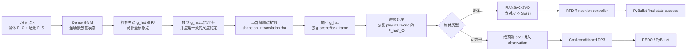
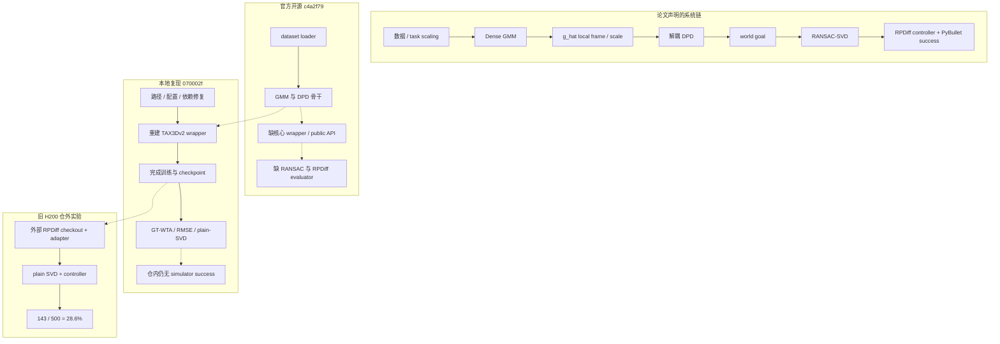
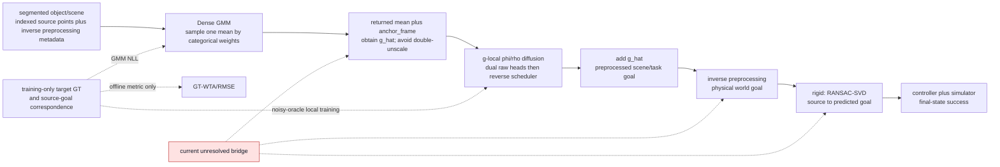

# TAX-DPD：从论文方法到代码实现——复现链路、关键断点与失败归因

> 用途：项目组内部调研分享 / 论文与代码走读
>
> 日期：2026-08-15
>
> 主要依据：[论文 PDF](2604.11793v1.pdf)、
> [完整技术审计](TECHNICAL_ARCHITECTURE_AND_REPRODUCTION_AUDIT_2026-08-14.md)、
> 官方仓库快照 `c4a2f79`、本地复现提交 `070002f`，以及
> [复现过程记录](codex-history.md)
>
> **文档关系：** 本文是上述技术审计母版的内部分享摘编。它可以压缩、重排或省略
> 细节，但不应包含母版中不存在的技术事实、论文数字或证据判断；若两者表述发生
> 冲突，以技术审计母版及其一手证据链为准。

## 0. 这个问题现在是否已经能够充分回答？

**可以，但要限定“充分”的含义。**

现有材料已经足以回答以下调研和分享问题：

1. TAX-DPD 论文提出了什么问题，完整方法链是什么；
2. 论文组件在公开仓库中分别对应哪些代码；
3. 官方发布、本地补全和论文链路之间断在什么位置；
4. 为什么当前复现结果明显低于论文，以及哪些因素应优先排查；
5. 当前 `28.6%` 能证明什么、不能证明什么；
6. 本次补全工作应如何客观评价。

现有材料仍**不能**回答：

- 本地重建的 wrapper 是否与作者内部实现逐行或数值等价；
- `28.6%` 与论文 `95%` 之间的差距分别有多少来自 GMM、坐标尺度、RANSAC、
  数据或控制器；
- 在缺少官方任务数据、split、controller 配置和未发布参数时，怎样认证为
  exact reproduction（严格复现）。

因此，这份文档可以作为“理解论文、走读代码、解释复现失败”的分享稿，但不能
替代缺失的一手实现，也不把尚未做过的 A/B 实验写成确定归因。

本文沿用三类证据标签：

- **[事实]**：可由论文 PDF、Git 历史或当前源码直接复核；
- **[强推断]**：代码链路能够支持，但仍需冻结变量后的实验确认影响大小；
- **[待验证]**：依赖已丢失的仓外 adapter、数据或官方未公开实现。

## 1. 三句话结论

1. **TAX-DPD 不是单独一个扩散网络，而是一条系统链。** 它由
   `Dense GMM 全局选址 -> 局部解耦点扩散 -> 目标点云 -> 刚体配准 -> 外部执行`
   组成。
2. **官方仓库公开了主要网络骨干，却缺少最关键的连接层。** 缺失的是负责
   `GMM -> g_hat -> local frame/scale -> DPD -> world goal` 的核心 wrapper，以及
   论文成功率依赖的 RPDiff controller、PyBullet evaluator 和 RANSAC-SVD。
3. **本地工作属于投入充分的 best-effort reimplementation（尽力重实现）。**
   根据现有复现过程记录，模型训练和仓外仿真曾经串联运行；但
   `143/500 = 28.6%` 不是论文 Multi-MedRack `95%` 的同任务、同数据、同协议
   复现结果，且对应 adapter、配置和逐 trial 产物目前未随仓库归档。

**部署边界补充：** 论文定义的 predictor 推理不读取目标 GT，但端到端仿真不是
无特权感知—执行闭环。RPDiff 公开环境的仿真分割和 DEDO 每步读取的完整 cloth
mesh/mask 都是运行时特权；TAX-DPD PDF 另直接确认调用外部 RPDiff insertion
controller。该 controller 的任务真值、直接物体控制和接触重试细节只在 RPDiff
公开机制中得到确认，TAX-DPD 私有实验是否逐项沿用仍因 exact config 缺失而不能断言。

## 2. 论文到底在解决什么问题？

### 2.1 输入和输出

论文把物体放置写成 goal prediction（目标构型预测）问题。

输入为已经分割好的两组点云：

- `P_O ∈ R^(N_O × 3)`：被移动物体的点云；
- `P_S ∈ R^(N_S × 3)`：承载物或任务场景的点云。

输出不是一个直接回归的刚体位姿，而是目标物体的逐点目标点云：

```text
P_hat*_O ~ f(P_O, P_S)
```

输入物体的第 `i` 个点与预测目标点云的第 `i` 个点保持对应。对于刚体，可以再从
这些对应点恢复三维刚体变换；对于可变形物体，目标点云本身也能描述形变后的目标
构型。

### 2.2 为什么不直接预测 SE(3)？

**SE(3)**（Special Euclidean Group in 3D，三维特殊欧氏群）表示三维旋转和平移。
对一个固定物体，它是很自然的刚体目标表示；但对一类几何差异很大的杯子、书本或
连接器，统一定义稳定的物体参考坐标系并不容易。

论文的核心判断是：

- 点空间预测能够直接利用细粒度几何；
- 逐点目标不需要为不同物体强行规定同一个 canonical pose（规范位姿）；
- 在存在未见几何变化时，点扩散可能比直接在 SE(3) 上扩散更准确。

论文 Table II（PDF p6）给出的针对性结果是：固定几何 OneMug 上，点扩散与
SE(3) 扩散成功率接近，为 `0.98/0.97`；换成多种未见杯子和 rack 的 ManyMugs 后，
两者为 `0.95/0.89`。这个结果支持“点空间的主要收益来自跨几何泛化”，而不只是
换了一种等价输出格式。

### 2.3 真正的困难：全场景覆盖和毫米级精修冲突

扩散模型通常希望输入处于稳定、接近单位尺度的数值范围。物体放置却同时存在两个
尺度：

- **场景尺度**：需要覆盖多个 rack、peg、书架空位等相距很远的放置模式；
- **物体尺度**：最终插入、挂接或堆叠可能要求毫米级位置和约 1--2 度角度精度。

若按整个场景归一化，小物体的局部几何会被压得很小；若只按物体尺度归一化，模型
又要在很大的数值范围中寻找所有全局模式。TAX-DPD 因此把问题拆成“先选区域，再做
局部精修”。

## 3. 论文的完整方法链

首次出现的主要缩写如下：

**表 1：主要缩写、基本原理及其在 TAX-DPD 链路中的作用**

| 缩写 | 全称与中文 | 核心原理 | 在 TAX-DPD 中的作用或边界 |
|---|---|---|---|
| GMM | Gaussian Mixture Model，高斯混合模型 | 用多个带权概率分量的和表达多峰分布，避免把多个合法解平均成无效解 | Dense GMM 令每个场景点产生一个候选分量，用于全局粗目标选择；它不预测最终姿态或路径 |
| DPD | Disentangled Point Diffusion，解耦点扩散 | 分别扩散零均值形状 `phi` 与局部平移 `rho`，再相加恢复目标点云 | 在 GMM 选定的局部区域内完成旋转后几何/形变与精细平移预测 |
| DDPM | Denoising Diffusion Probabilistic Model，去噪扩散概率模型 | 学习逆转逐步高斯加噪过程，从随机噪声生成多样样本 | 为局部 `phi/rho` 提供 100 步训练与反向采样框架 |
| DiT | Diffusion Transformer，扩散 Transformer | 把扩散时间步条件注入 Transformer 去噪器，并通过注意力混合 token | 混合 object/scene token，由 shape/frame head 输出局部目标构型 |
| NLL | Negative Log-Likelihood，负对数似然 | 惩罚真值在预测概率分布下的低似然 | 用目标物体质心监督 Dense GMM 的权重和候选均值 |
| FPS | Farthest Point Sampling，最远点采样 | 反复选择离已选集合最远的点，以固定预算覆盖几何范围 | 将物体和场景点云下采样到网络要求的固定点数 |
| RANSAC | Random Sample Consensus，随机采样一致性 | 用多个最小样本拟合模型，再以最大内点集合抵抗离群点 | 过滤扩散预测中错误的逐点 correspondence |
| SVD | Singular Value Decomposition，奇异值分解 | 给出对应点最小二乘刚体配准的闭式解 | 在 RANSAC 内拟合候选和最终 SE(3) |
| RPDiff | Relational Pose Diffusion，关系位姿扩散 | 在 SE(3) 关系位姿空间做生成式扩散，并配套任务与执行环境 | 既是对比 baseline，也提供刚体任务/示范和外部 controller/评分；这些角色不能混为一谈 |
| DEDO | Dynamic Environments with Deformable Objects，可变形物体动态环境 | 用 PyBullet soft-body 环境提供可变形任务 | 提供布料实验后端；发布 rollout 还直接读取仿真 mesh/mask |
| DP3 | 3D Diffusion Policy，三维扩散策略 | 以三维观测为条件生成一段低层动作序列 | 可变形实验中执行 TAX-DPD 预测的 goal，不属于 TAX-DPD predictor 本体 |
| GT | Ground Truth，真值 | 由示范或仿真器提供监督/评分参考 | 训练和离线评分可用；正式 predictor 与 sample selector 不得读取 |
| WTA | Winner-Take-All，胜者全得 | 从多个候选中保留某个指标最优者 | 当前仓内用 GT 选样本，只适合离线覆盖诊断，不是无真值部署接口 |



**图 1：论文声明的 TAX-DPD 目标预测、刚体配准和外部执行数据流**

这张图需要抓住四个边界：

1. **Dense GMM 负责全局模态选择，DPD 负责局部精修。**
2. **`g_hat ∈ R³` 和 `rho ∈ R³` 都是三维平移量。** 论文称其为 frame，但它们
   不是带旋转的完整 SE(3) 坐标架；刚体旋转主要由零均值 `phi` 的点几何承载。
   加回 `g_hat` 只恢复 scene/task frame，之后还需逆预处理才能到 physical world。
3. **RPDiff controller、DP3 和 PyBullet 不属于 TAX-DPD 神经网络。** 它们是下游
   执行和评分层。
4. **TAX-DPD 的输入假定已经完成分割。** 实机论文使用 D405、ZEDX-Mini、IGEV
   双目深度和人工 3D 包围盒得到点云，但这些感知代码不在当前仓库。

### 3.1 第一阶段：Dense GMM 全局初始化

一般的 GMM 用多个高斯分量的加权和表示一个可能有多个峰值的连续概率分布：

```text
p(g | P_O, P_S) = sum_i w_i * Normal(g; m_i, sigma^2 I)
sum_i w_i = 1,  w_i >= 0
```

其中 `w_i` 是第 `i` 个混合分量/候选的权重，`m_i` 是其中心；多个相邻分量可能共同
形成同一个概率模态，并非“一个分量等于一个语义挂点”。它与单一均值回归的关键区别
是：如果场景中左右各有一个合法挂钩，单一回归容易给出两者中间的无效位置；GMM 可以
在左右两个区域分别保留概率峰，并通过采样选择其中一个。

传统的无条件 GMM 常用 Expectation-Maximization（EM，期望最大化）反复估计分量；
TAX-DPD 不是对每个新场景运行 EM，而是用神经网络根据 `(P_O, P_S)` 一次性预测条件
混合参数，再通过反向传播训练。这更接近 conditional mixture-density network（条件
混合密度网络）。

TAX-DPD 将这一思想做成 **Dense GMM（稠密高斯混合模型）**：不是预先规定固定数量
的语义挂点，而是让每个场景点都产生一个候选分量。直观上，它很像“场景点 heatmap
（热力图）+ offset voting（偏移投票）”：权重回答“这个场景点锚定的候选应占多大
混合权重”，残差回答“真正的物体中心离这个场景点还有多远”。

这里的 Dense 指“沿场景点逐点稠密地产生分量”，不表示使用 full covariance（完整
协方差矩阵）。分量协方差仍是固定的各向同性 `sigma^2 I`。

对于每个场景点 `p_i ∈ P_S`，网络输出：

- `w_i`：第 `i` 个候选分量的混合权重；多个相邻候选可共同形成同一个概率模态；
- `r_i ∈ R³`：从 `p_i` 指向该分量均值的残差；
- 分量均值 `m_i = p_i + r_i`；残差允许中心位于表面之外，例如挂钩入口附近的
  空中位置。

训练目标是目标物体真值点云的质心：

```text
mu = mean(P*_O)
L_GMM = -log sum_i [w_i * Normal(mu; m_i, sigma^2 I)]
```

这个 NLL（负对数似然）同时要求两件事：至少有候选均值靠近真值 `mu`，并且网络要
给这些候选较高权重。跨训练示范出现多个合法区域时，不同分量可以分别吸收不同区域的
概率质量；固定 `sigma` 则控制“离真值多远仍算同一候选附近”的惩罚尺度。

推理时，论文按 `{w_i}` 从离散均值集合 `{p_i + r_i}` 中分类采样一个粗参考点
`g_hat`。这点比名称本身更具体：论文和仓内 `eval_gmm.py` 都是先按权重选择分量，
再直接取该分量均值，并没有继续从 `Normal(m_i, sigma^2 I)` 添加一次随机偏移。GMM
网络只需要一次前向，不进行 100 步迭代去噪。

论文的 GMM 负对数似然中使用固定方差，但没有公开固定 `sigma` 的数值；仓库配置
中的 `var: 0.1` 只能视为代码实现选择，不能写成论文明确参数。

仓内 GMM 配置中的 `learn_sigma=True` 也容易误读：这是复用 DiT 输出形状时的网络
配置约束，不代表 GMM covariance 被学习。`gmm_predictor.py` 只取 logit 和 residual
通道，方差输出被忽略；代码中的有效 mixture variance 由 loss 外部配置的 base `var`
及其尺度换算决定，而不是由网络预测。

在完整链路中，GMM 只负责把“整个场景中有很多相距很远的合法区域”压缩成一个局部
参考点 `g_hat`：

- 它解决全局多模态和 mode selection（模态选择）；
- 它为局部 DPD 建立数值尺度较稳定的坐标原点；
- 它不负责预测最终旋转、毫米级接触构型、碰撞安全或机器人路径；
- 若把它绕过，局部扩散器就不得不同时学习全场景搜索和局部精修，失去论文两阶段
  设计的主要意义。

### 3.2 第二阶段：局部解耦点扩散

把真值目标点云表达在 `g_hat` 的局部坐标后，论文分解为：

```text
phi_0 = P*_(O, local) - mean(P*_(O, local))
rho_0 = mean(P*_(O, local))
P*_(O, local) = phi_0 + rho_0
```

- `phi` 是零均值 shape（形状）点集：刚体时主要表示旋转后的几何，可变形时也
  表示形变；
- `rho` 是三维局部质心/平移，用加法广播到所有物体点。

两者使用同一 DDPM 时间表，但分别加噪、分别由 shape head 和 frame head 去噪。
shape 分支还加入旋转噪声：旋转轴在单位球面上采样，旋转角度服从零均值高斯分布，
角度标准差 `sigma_rot = 45°`。这不是“每次固定旋转 45°”。

局部去噪器使用三组 PointNet++ 特征：

1. reconstruction embedding：当前目标物体估计与场景联合编码；
2. object embedding：初始零均值物体编码；
3. deformation embedding：当前 shape 与初始 shape 的逐点差异。

这些特征进入修改后的 DiT。论文公开配置为 5 个 DiT blocks、每 block 4 个 attention
heads、hidden size 128；部署逆扩散共 100 步，因此 PointNet++ 和 DiT 会在每个反向
步骤重复调用。

### 3.3 训练链和推理链并不相同

这是理解论文和审计代码时最容易漏掉的地方。

**表 2：Dense GMM 与局部 DPD 在训练、部署和离线分析阶段的真值边界**

| 阶段 | GMM | 局部 DPD 使用的参考点 | 是否允许目标真值 |
|---|---|---|---|
| GMM 训练 | 训练 `f_global` | 不涉及局部 DPD | 允许，用 `mu` 计算 NLL |
| 局部 DPD 训练 | **不调用 GMM** | 在任务归一化空间中使用 `g_train ~ N(mu, I)` | 允许，用于构造 noisy oracle |
| 部署推理 | 一次前向并采 `g_hat` | 必须使用真实 GMM 的 `g_hat` | 不允许 |
| 离线覆盖分析 | 可重复独立采样 | 生成 `K` 个候选 | 真值只用于事后评分 |

局部训练不用 GMM，是为了避免 GMM 选到与当前示范不同的另一个合法 mode，迫使
局部模型处理大范围跨 mode 平移。推理时若仍不接 GMM，则两阶段方法就退化了。

论文称正式 TAX-DPD 评测不使用 RPDiff 的 heuristic local crop（启发式局部裁剪）
或 classifier reranking（分类器重排）。这不应被泛化成“所有实验严格只采一个
样本”：Book/Shelf coverage/precision 分析明确使用 `K = 4, 8, ..., 256`。正确边界
是：**论文正式 TAX-DPD 协议不使用 GT-WTA 或 learned reranker 挑样本；其中
GT-WTA 是不可部署的 oracle。** 不读取真值的 learned reranker 原则上可以部署，但
会改变论文方法和评测协议；分布分析可以抽多个独立候选并在事后评分。

### 3.4 刚体后处理和外部执行

网络通过 PointNet++ 和 attention 联合建模点集，但输出维持逐点对应且没有显式
刚体约束，因此预测中仍可能出现局部不一致或离群对应。论文 Appendix III-E
（PDF p12--13）采用 RANSAC-SVD：

1. 每轮随机取三对对应点；
2. 用 SVD 估计候选 SE(3)；
3. 用距离阈值 `tau` 统计内点；
4. 选择最大内点集，并用所有内点重新估计最终变换。

论文没有公开 RANSAC 迭代数 `N` 和阈值 `tau`。最终刚体变换再交给 RPDiff
insertion controller，在 PyBullet 中执行并按 final simulator state 判成功。

### 3.5 RPDiff 和 DEDO 分别扮演什么角色？

RPDiff 在刚体实验中有四个容易混淆的角色：

1. 五个 PyBullet placement benchmark/task suite；
2. 一个在 SE(3) 上扩散的对比 baseline；
3. TAX-DPD 和其他方法预测目标之后共用的 insertion controller；
4. final simulator state success 的执行/评分环境。

论文 Table I 中 RPDiff `0.88` 是引用 RPDiff 原论文的成功率，并不是 TAX-DPD 作者
在完全相同 evaluator 中重新跑出的所有基线数字；RPDiff without classifier 也只给
平均值 `0.83`。

DEDO 则是可变形 cloth hanging 旁支。TAX-DPD goal predictor 可以不改输出形式地预测
可变形目标点云，但完整执行仍需单独训练 goal-conditioned DP3：训练 DP3 时用真值
`P*_O` 作条件，评测时换成 TAX-DPD 预测的 `P_hat*_O`。因此“无需修改 TAX-DPD
架构”不等于“不需要额外执行策略”。

### 3.6 主要组件有哪些替代方案，为什么选择当前设计？

下面覆盖论文方法链中的主要算法决策，不把 PyTorch、Lightning 或 Hydra 这类工程
框架算作论文组件。“论文明确”表示正文或消融直接支持；“工程解释”表示设计合理，
但论文没有做同条件对照，不能写成已被实验证明优于所有替代方案。

**表 3：TAX-DPD 主要组件、常见替代方案和当前设计的选择依据**

| 组件或设计决策 | 常见同类替代 | 选择当前方案的主要原因 | 证据边界 |
|---|---|---|---|
| Dense GMM 全局初始化 | 单点回归、体素/点 heatmap、Hough voting、全场景扩散、固定候选检测器、VLM 选区 | 一次前向即可表达多峰；候选锚点位置随场景几何变化，分量数严格等于场景点数 `N_S`；残差允许目标中心离开表面 | 两尺度动机、参数化和去 GMM 消融为论文明确；“为何优于 heatmap/Hough/VLM/检测器”属于工程解释，论文未做这些对照 |
| 目标点云输出 | 直接回归或扩散 SE(3)、关键点姿态、occupancy/implicit field、逐点 flow | 保留细粒度几何和输入—输出点对应；避免跨物体统一 canonical frame（规范坐标系）；同一输出还能表示可变形目标 | Table II 的 point vs. SE(3) 和 DEDO 扩展为论文明确 |
| GMM 后的局部 DPD | 在完整场景上做单阶段点扩散、TAX3D 式 flow、确定性回归、局部能量优化 | 把全局模态选择与毫米级局部精修分离，缓解场景尺度与物体尺度冲突 | 两阶段动机、完整模型和去 GMM/去解耦消融为论文明确 |
| `phi/rho` 形状—平移解耦 | 对完整目标点云联合扩散、直接扩散旋转和平移、刚体 SE(3) diffusion | `phi` 专注旋转后几何/形变，`rho` 专注局部平移，减少一个点空间过程同时承担两类统计结构 | 去解耦从 95% 降至 61% 为论文明确；“更易优化”属于机制解释 |
| reconstruction/object/deformation embeddings | object/scene 分别编码后拼接、仅联合编码、纯 cross-attention、手工几何描述子 | 联合重建编码直接观察当前 object–scene 几何；object 保留初始形状；deformation 显式表示当前与初始形状差异 | 架构为论文明确；reconstruction/deformation 都有消融，object embedding 未单独隔离 |
| PointNet++ 点云编码 | pointwise MLP、Point Transformer/PointNeXt、DGCNN、稀疏体素 CNN、隐式表面网络 | 可直接处理无序点集，并通过分层邻域聚合捕获局部几何；与 FPS 点预算和现有扩散骨干容易组合 | 采用 PointNet++ 和 MLP ablation（78% vs. 完整模型 97%）为论文事实；分层邻域/易组合是工程解释，未与其他强点云骨干比较 |
| DiT + DDPM 去噪 | 点云 U-Net、MLP denoiser、score SDE、DDIM、consistency model、flow matching | Transformer 便于 object/scene token mixing 和时间步条件化；DDPM 提供成熟的多模态采样目标 | 采用 DiT/DDPM 为论文事实；token mixing、成熟度等是工程解释，没有 backbone/generator 的同条件对照 |
| shape rotation noise | 仅做 z 轴数据增强、SO(3)-equivariant 网络、显式姿态监督、SE(3) diffusion | 在 shape forward process 中直接制造整体刚体旋转误差，迫使去噪器学习姿态恢复 | 论文公式与 95%→73% 消融直接支持 |
| FPS 与 task scaling | 随机采样、voxel grid、importance sampling、固定全局尺度 | FPS 在固定点数下保留空间覆盖；task-specific scaling 试图让不同任务的噪声和邻域落入稳定数值范围 | 论文明确采用；覆盖/稳定范围是通用工程原理，具体 scale 统计未公开，替代采样无消融 |
| RANSAC-SVD | 全点 Kabsch/SVD、ICP、鲁棒 M-estimator、TEASER++、学习式 registration | 已有逐点对应时，三点最小集 + 内点共识可过滤扩散产生的错误 correspondence；实现成本通常较低 | 网络联合建模点集，但逐点输出没有显式刚体一致性约束；论文以 outlier 为采用 RANSAC 的动机。“成本低”属工程解释，`N/tau` 未公开且仓内缺实现 |
| RPDiff controller / goal-conditioned DP3 | 完整机械臂 motion planning + 力控、视觉伺服、模型预测控制、其他模仿学习策略 | 刚体沿用既有 benchmark controller 便于统一执行；可变形体的固定 offset 不可靠，因此用目标条件策略执行 | TAX-DPD PDF 只直接确认采用这些外部执行器；“便于评分”属工程解释，RPDiff 特权细节来自其公开机制且 exact TAX-DPD config 未归档，DEDO mesh 特权可由当前代码直接确认 |

### 3.7 官方实验链是否使用了仿真“超级权限”？

**有，但必须按阶段回答。** TAX-DPD 神经网络在论文部署定义中并不读取目标真值
`P*_O`；它真正的模型输入是已经分开的 `P_O/P_S`。问题在于这些点云在仿真中怎样
产生，以及模型输出之后怎样执行：论文调用了仓外 RPDiff 数据和 insertion controller，
其中存在真机不能无条件直接读取的 simulator state（仿真器内部状态）。

这里把“超级权限”限定为：**运行时动作或模型输入依赖仿真器内部的精确状态，而真机
若没有额外感知、标定或力觉就无法取得。** 训练标签和离线评分使用真值是常规做法，
不能因为出现 GT 就一律判定为不公平。

证据强度也需分层：TAX-DPD PDF 直接确认“采用 RPDiff insertion controller”和
“按 final simulator state 判成功”；杯把轴、正确侧、直接 reset/position-control、
contact-force 回退和最多 10 次重试等细节来自 RPDiff 公开附录。由于 TAX-DPD 实际
使用的 RPDiff commit/config 没有归档，这些资料对 **RPDiff 公开机制本身** 是强证据，
对 **TAX-DPD 私有实验逐项沿用该机制** 则只是中等到中强证据，不能当作私有运行代码
逐行一致的证明。

**表 4：TAX-DPD 论文及其外部执行链中的特权信息、正常真值和可部署先验**

| 信息或机制 | 所在阶段 | 分类 | 对论文结果和真机迁移的含义 |
|---|---|---|---|
| 目标点云 `P*_O`、目标质心和逐点 correspondence | GMM/DPD 训练 | training-only GT，正常监督 | 训练可以使用；正式预测若读取则泄漏，但论文方法定义并不要求部署读取 |
| 已分离的 object `P_O` 与 scene `P_S` | TAX-DPD 模型入口 | 仿真中通常是感知 oracle；模型前提 | RPDiff 公开仿真链用 PyBullet segmentation；TAX-DPD exact adapter 未归档。真机必须用实例分割、人工 crop 或其他感知替代 |
| 精确相机位姿 | 点云生成 | 标定后可部署的 prior | 本身不是超级权限；若利用 scene truth 自动选择最佳视角，则成为 simulator shortcut |
| `eval_rigid.py` 用 GT 做 WTA 和误差选择 | 仓内离线诊断 | evaluation oracle | 不能作为正式执行 sample selector；没有证据证明论文 simulator success 或丢失的仓外 adapter 使用了同一 WTA |
| 杯把轴、rack 正确接近侧、shelf/cabinet opening yaw | RPDiff 公开 pre-placement 机制 | task-specific runtime privilege | 需要从观测估计，或作为已标定 fixture 配置显式提供；不能归功于 TAX-DPD 感知 |
| 直接 reset 并 position-control 被操作物体 | RPDiff 公开执行机制 | execution oracle | 绕过机械臂 IK、可达性、夹爪和持物扫掠碰撞，不能代表完整真机 pick-place |
| simulator contact force、回退和最多 10 次随机重试 | RPDiff 公开插入机制 | runtime privilege，可由真实传感器替代 | 真机需要力/触觉/视觉反馈和安全控制；若 TAX-DPD 沿用该 controller，系统成功率包含这一外部纠错能力 |
| final simulator state success | RPDiff/DEDO 评分 | evaluation-only GT | 用于离线判分合理；若反向参与候选选择或控制才会构成部署泄漏 |
| 每一步读取完整 cloth mesh，并用 PyBullet mask 取得 rigid anchor PCD | DEDO/DP3 rollout observation | runtime simulator privilege | `tax3d_env.py:317--320,503--523` 表明每步 `get_obs()` 直接取 mesh；`:242--245,423--487,508--521` 生成带仿真 mask 的 anchor；`dedo_runner.py:308--339` 将它们送入 DP3。普通相机无法直接得到同等完整 mesh/mask |
| gripper/robot proprioceptive state | DEDO/DP3 rollout observation | 原则上可部署的本体状态，不单独算超级权限 | 仿真中由引擎给出；真机可由编码器与 FK 获得。应审计坐标和噪声，但不能与完整 mesh/mask 混为一类 |
| DP3 训练时使用真值 goal，expert 读取 mesh anchors/goal/cloth width | DEDO 示范和策略训练 | training-only privilege | 评测时 goal 换成 TAX-DPD 预测；使用仿真 expert 生成示范本身正常，但不证明可部署感知 |
| true loop vertex IDs、完整 mesh 和 goal positions 判挂布成功 | DEDO 评分 | evaluation-only GT | `tax3d_env.py:330--345` 组合 pre/post checks，`tax3d_proccloth_env.py:373--417` 计算具体几何判据；若不反馈动作选择，不属于 predictor 输入泄漏 |
| 双 capture poses 和手工 geometry-specific 3D boxes | NIST 真机感知 | 可执行但任务特定的 shortcut | 不是仿真超级权限，却不是通用自动分割；换对象、相机或工作区通常需要重调 |

由 TAX-DPD PDF **直接确认**的刚体仿真链是：

```text
预分离/仿真生成的 object-scene 点云
  + TAX-DPD 目标构型预测
  + RANSAC-SVD
  + RPDiff insertion controller
  + final simulator state scoring
```

若作者实际使用的 controller 与 RPDiff 公开附录机制一致，则其中的
`RPDiff insertion controller` 还会展开为真值/任务先验辅助 pre-placement、直接
物体 position-control、contact-force 回退和最多 10 次重试。由于 exact commit/config
未归档，这一层应标为继承机制的中等到中强证据，而不是 TAX-DPD 私有代码事实。

它有力证明了在该 benchmark 条件下的目标预测与系统组合效果，但不是“从普通 RGB-D
自动感知，到真实机械臂无特权闭环执行”的证明。另一个重要边界是：官方 TAX-DPD
仓库没有提交完整 RPDiff controller/evaluator，因此执行特权的判断来自 TAX-DPD 论文
对 RPDiff 的引用和 RPDiff 已公开机制，无法对作者实际运行的私有 adapter 逐行核验。

## 4. 论文结果提供了什么归因线索？

论文 Table I（PDF p5）的刚体结果为：

**表 5：论文在五个 RPDiff 刚体任务上的 simulator success**

| 方法 | EasyRack | MedRack | Multi-MedRack | Book/Shelf | Can/Cabinet | 平均 |
|---|---:|---:|---:|---:|---:|---:|
| TAX3D | 0.84 | 0.46 | 0.32 | 0.38 | 0.42 | 0.48 |
| RPDiff | 0.92 | 0.83 | 0.86 | 0.94 | 0.85 | 0.88 |
| TAX-DPD | 1.00 | 0.97 | 0.95 | 0.99 | 0.95 | 0.97 |

对当前复现最有用的是 Multi-MedRack 单任务消融：

**表 6：论文 Multi-MedRack/ManyMugs 相关消融给出的排查线索**

| 设置 | 成功率 | 相对完整模型 |
|---|---:|---:|
| 完整 TAX-DPD | 0.95 | -- |
| 去掉 GMM | 0.74 | -21 个百分点 |
| 去掉解耦设计 | 0.61 | -34 个百分点 |
| 去掉旋转噪声 | 0.73 | -22 个百分点 |
| 改用 SE(3) diffusion | 0.89 | -6 个百分点 |

论文平均结果中，去掉 GMM 为 `0.83`，去掉解耦设计为 `0.72`。这些数字说明 GMM、
解耦和旋转噪声都重要，但不能把它们直接当成本地失败的百分点分解：本地使用的任务、
数据和执行协议并未确认相同。

其他实验用于说明方法适用范围：

- 实机四项成功率为 `100%/80%/85%/90%`，每项 20 trials；
- DEDO HangProcCloth 上，TAX3D 到 TAX-DPD 的 success 为 `0.50 -> 0.78`，
  coverage RMSE 为 `0.87 -> 0.50`，precision RMSE 为 `1.34 -> 0.58`。

论文主表和附录分组表中的部分实机平移/旋转误差不能按成功/失败样本数准确加权
复原。因此分享时以成功率和论文原表数值为主，不自行合成新的误差统计。

## 5. 当前仓库的技术栈和组织方式

### 5.1 核心技术栈

**表 7：当前仓库的主要工程技术栈及职责**

| 层 | 技术 | 作用 |
|---|---|---|
| 训练框架 | PyTorch、Lightning | 网络、优化、checkpoint 和训练循环 |
| 点云网络 | PointNet++、PyTorch Geometric | FPS、邻域聚合和逐点特征 |
| 扩散骨干 | 仓内 DDPM 变体、DiT | shape/frame 加噪与反向去噪 |
| 几何变换 | PyTorch3D、SciPy Rotation | 点云变换、旋转和 SE(3) |
| 配置系统 | Hydra、OmegaConf | dataset/model/training/inference 配置组合 |
| 仿真 | PyBullet | 论文刚体 RPDiff 和可变形 DEDO；RPDiff 本体未纳入仓库 |

### 5.2 论文组件与代码文件映射

**表 8：论文方法和执行链到当前仓库文件的对应关系**

| 链路 | 论文组件 | 当前代码位置 | 当前状态 |
|---|---|---|---|
| D0 | RPDiff `.npz` 示范和 split | [`rigid.py`](../src/non_rigid/datasets/rigid.py)、[`preprocess_rpdiff.py`](../scripts/preprocess_rpdiff.py) | loader 存在；数据、split 和 mesh 在仓外 |
| M1 | Dense GMM | [`gmm_predictor.py`](../src/non_rigid/models/gmm_predictor.py)、[`train_gmm.py`](../scripts/train_gmm.py) | 模型和训练器存在，可独立训练 |
| M2 | `g_hat`、local frame 和 scale | 原本应由 `tax3d_v2.py` wrapper 连接 | 官方文件缺失；本地只做近似重建 |
| M3 | shape/frame DPD | [`encoders.py`](../src/non_rigid/models/encoders.py)、[`dit/`](../src/non_rigid/models/dit/)、[`tax3d_v2.py`](../src/non_rigid/models/tax3d_v2.py) | 骨干存在；wrapper 语义不可认证 |
| M4 | local-to-world 目标恢复 | [`tax3dv2_server.py`](../scripts/tax3dv2_server.py) 暗示预期 API | public `update_batch_frames/predict` contract 未恢复 |
| R1 | RANSAC-SVD | [`rigid_metrics.py`](../src/non_rigid/metrics/rigid_metrics.py) | 只有全点 plain SVD，没有 RANSAC |
| X1 | RPDiff controller/PyBullet | 当前仓库无对应 package/evaluator | 只在旧 H200 仓外 adapter 中运行过 |
| E1 | simulator success | [`eval_rigid.py`](../scripts/eval_rigid.py) | 仅离线 WTA/RMSE/SVD 诊断，不启动 simulator |

### 5.3 RPDiff batch 中最重要的信息

[`rigid.py`](../src/non_rigid/datasets/rigid.py) 主要产生：

**表 9：RPDiff dataset batch 中与训练、坐标恢复和真值诊断有关的字段**

| 字段 | 含义 |
|---|---|
| `pc_action` | 初始 child/object 点云 |
| `pc_anchor` | parent/scene 点云 |
| `pc` | 目标 child 点云，即训练真值 |
| `flow` | `pc - pc_action` 的逐点位移 |
| `noisy_goal` | 真值目标质心加噪，用于模拟训练期 GMM 参考点 |
| `T_goal2world` / `T_action2world` | scene augmentation 后的坐标还原 metadata |

关键问题不是 batch 没有目标，而是正式部署不得依赖 `pc`，并且 `noisy_goal` 必须先
通过正确 wrapper 变成局部坐标，而不能只是存在于字典中。

### 5.4 当前代码实际怎样运行？

GMM 阶段：

```text
train_gmm.py
  -> create_datamodule()
  -> FrameGMMPredictor
  -> GMMLoss
  -> 单独保存 GMM checkpoint
```

局部扩散阶段：

```text
train.py
  -> RPDiffDataset
  -> create_model()
  -> 本地重建 TAX3Dv2FixedFrameModule / MuFrameModule
  -> DiT + diffusion losses
```

当前刚体离线评测：

```text
eval_rigid.py
  -> TAX3Dv2 private _predict_wta()
  -> 读取 GT pc 挑 winner
  -> RMSE / plain SVD 诊断
  -> 不创建 RPDiff env，不执行 controller
```

因此“GMM checkpoint 能加载”“PyBullet 在依赖列表里”“脚本名叫 eval_rigid”都不能
证明论文端到端链已经接通。

## 6. 论文链、官方发布、本地补全和仓外实验的 gap



**图 2：论文、官方开源、本地重建和仓外 H200 评测之间的实现缺口**

问题不是简单“少了几个文件”，而是缺少两个系统契约：

1. **模型内部契约**：`GMM -> g_hat -> local frame/scale -> DPD -> world goal`；
2. **模型外部契约**：`world goal -> robust SE(3) -> controller -> final-state success`。

第一段决定论文方法是否真的实现，第二段决定论文成功率是否可重放和可比较。

### 6.1 缺失的 contract 到底是什么？

这里的 contract（接口契约）不是“函数能不能被调用”，而是两个组件是否同时同意
点顺序、变量含义、坐标系、单位/尺度、随机采样规则和真值可见阶段。TAX-DPD 最容易
出现的错误正是：张量形状完全正确，但 `g_hat`、点云和 RANSAC 阈值不在同一 frame
或尺度；或者本应只用于离线评分的 GT 被拿来选正式执行样本。

论文局部表示的核心代数可以压缩成六行。设 `P*_scene` 是预处理后的目标点云，
`g_hat` 与它处于同一 frame/scale：

```text
mu                 = mean(P*_scene)
phi_0              = P*_scene - 1 mu^T
rho_0              = mu - g_hat
P*_(g-local)       = phi_0 + 1 rho_0^T
P_hat*_scene       = P_hat*_(g-local) + 1 g_hat^T
P_hat*_world       = A_preprocess^{-1}(P_hat*_scene)
```

`+g_hat` 只从 `g-local` 回到当前 scene/task frame；随后仍要撤销 scene centering、
数据增强和可能的 task scaling 才到物理 simulator/world frame。另一个容易误解的点是：
`H={phi | mean(phi)=0}` 与 `rho∈R³` 合起来只是完整有序点云的一种重参数化，不是
论文证明的“数据流形”。对固定刚体，刚体一致的候选位于源点云的 `SE(3)` orbit
（群轨道），任务有效目标是其中满足接触等约束的子集；RANSAC-SVD 需要源点云和
逐点对应后才能拟合该变换。



**图 2A：分享视角下的 TAX-DPD contract 链；虚线明确训练真值和离线 GT-WTA 的作用范围**

**表 9A：论文期望、官方调用点与本地补全之间最关键的 contract**

| 边界 | 论文/官方期望 | 当前复现状态 | 为什么影响结论 |
|---|---|---|---|
| 数据与预处理 | 初始/目标物体保持逐点对应；共同 FPS/增强；task scale、scene centering 可逆 | loader 与同索引 FPS 存在，也保存 scene 逆变换；exact task scale、数据、split 和资产不完整 | 数据不等同或 inverse preprocessing 不闭环时，success 不能与论文直接比较 |
| GMM -> `g_hat` | 每个 scene point 预测权重和 residual；按权重采一个 `p_i+r_i`；恢复正确 anchor frame/scale 语义后交给 local DPD | GMM 可单独训练；当前 tracked `forward()` 的 returned `means/anchor_frame` 已 unscale，应以 `means[i]+anchor_frame` 回 scene，不能再逆尺度；TAX3Dv2 eval 又绕过 GMM | 两阶段方法在当前主评测中没有真正串起来，且缺失 wrapper 仍需说明 `pc_scale` 的后续用途 |
| `g_hat` -> local DPD | `phi/rho` 在同一局部坐标中合成；object conditioning 去质心且保持公共坐标轴/点顺序；训练 noisy oracle，推理真实 GMM | fixed wrapper 直接用 scene-frame `pc` 且忽略 `noisy_goal`；mu wrapper 才减/加该字段，但只是本地重建语义；conditioning 直接用 raw `pc_action` | frame 或条件分布错位可以在 loss 正常时持续破坏目标构型 |
| raw head -> 最终 sample | `learn_sigma=True` 时 shape/frame raw head 各有 6 通道：当前默认前三为 epsilon，若切 `START_X` 才是 x0/位置；后三是映射到 log-variance 的 raw 参数，不是已计算方差；scheduler 最终才产生 3D sample | backbone/scheduler 存在，`TAX3Dv2Network.forward` 是依据它们重建 | 在 raw head 层要求 `[N,3]` 会把正确实现误判为错误，也会掩盖 scheduler 接线问题 |
| public deployment API | 官方 caller 期望 `update_batch_frames()`、`predict()` 以及 `pred_T/pred_frame_world/point.pred_world`；正式选择不得读 GT | 当前只有 private `_predict_wta()`，它读取 `batch["pc"]` 按 point RMSE 选 winner | 离线 oracle 指标不是可部署 one-shot predictor |
| scene -> world -> execution | `+g_hat` 后再做逆预处理；刚体用 source-to-goal RANSAC-SVD；固定 controller、资产、seed 和 success predicate | public world schema、RANSAC 和仓内 RPDiff evaluator 均缺；28.6% 来自未归档仓外 adapter | 当前 checkout 不能重放论文协议，也不能量化 wrapper、RANSAC 或 controller 各自贡献 |

分享时可以把最低验证门概括成三个 invariant（不变量）：

1. **无 GT 部署：** 删除 `pc/flow`、真值构造的 `noisy_goal`、真实目标 pose/centroid
   和 oracle-only 字段后，public predictor 仍能给出可执行结果；允许保留或重算由
   observation 产生的 `T_preprocess2world`（当前字段名 `T_goal2world` 容易误导）；
2. **frame round-trip：** 共同平移/旋转/缩放输入后，local 几何和恢复到 physical world
   的结果满足预期等变关系；
3. **rigid direction 与单位：** 用已知 `SE(3)` 和可控 outlier 检查 source/target 方向、
   correspondence、RANSAC 阈值单位及内点 SVD refit。

因此，本地工作可合理称为“恢复了可训练网络和离线诊断的 best-effort
reconstruction”，但尚不能称为恢复了官方端到端 deployment contract。

## 7. 复现失败的主要因素

### 7.1 总览

**表 10：复现失败因素的优先级、链路位置、证据强度和实现难度**

| 优先级 | 因素 | 链路位置 | 证据强度 | 重要性 | 实现难度 |
|---|---|---|---|---|---|
| P0-1 | 官方核心 wrapper/API 缺失 | M1--M4 | 强 | 决定性 | 高；严格等价被阻断 |
| P0-2 | GMM 未进入当前 TAX3Dv2 主推理链 | M1--M4 | 强 | 决定性 | 高，依赖 P0-1 |
| P0-3 | 任务、数据、split 和 protocol 不同/缺失 | D0、X1、E1 | 强 | 决定数值可比性 | 工程中等；材料缺失阻断 |
| P1-1 | local scale 与 object frame 语义不符 | D1、M2--M4 | 中强 | 高 | 高，通常需要重训 |
| P1-3 | 缺少无 GT 部署接口；离线评测使用 GT-WTA | M4、E1 | 强 | 结果可信度高 | 指标低；完整 API 中高 |
| P1-2 | 仓内缺 RANSAC；仓外 plain-SVD 仅见于过程记录 | R1 | 仓内缺失强；仓外实现待验证 | 方法忠实度中高 | 算法中低；系统验证中高 |
| P1-4 | controller、资产和 success predicate 未归档，无法确认对齐 | X1、E1 | 未归档为强；实际等价性待验证 | 成功率可比性决定性 | 中到高；严格等价阻断 |

这里的“证据强”通常表示实现差异确实存在，不代表它对成功率的具体百分点已经通过
A/B 实验证明。P0/P1 编号沿用技术审计母版；分享时为先澄清 oracle 指标再讨论
registration，将 P1-3 放在 P1-2 前讲，不改变其优先级定义。

### 7.2 P0-1：官方缺失的不是薄外壳，而是核心坐标契约

官方 `script_utils.py`、`tax3dv2_server.py` 和可视化脚本调用了当时未发布的
`tax3d_v2.py`、`update_batch_frames()` 和 public `predict()`。server 还期待
`pred_T`、`pred_frame_world`、`pred_world` 和扩散中间结果。

**代码锚点：** `scripts/tax3dv2_server.py:380--386` 调用缺失的 frame 更新与预测
接口，`:470--473` 读取其 world-frame 输出；本地重建文件
`src/non_rigid/models/tax3d_v2.py:303--353` 和 `:382--453` 只提供依赖 GT 的
private validation/offline `_predict_wta()`，没有恢复上述 public contract。该断点位于
`M1 Dense GMM -> M2 local frame/scale -> M3 DPD -> M4 world goal` 的连接层。

这层 wrapper 必须统一回答：

- 输入点云当前位于哪个 frame；
- task scale 在何时应用和逆变换；
- GMM 输出是 anchor-relative 还是 world-relative；
- `g_hat` 怎样成为局部原点；
- fixed/mu 两种扩散参数化怎样解释 reference；
- 多个样本怎样展开 batch；
- 局部输出怎样恢复 world goal 和 SE(3)。

这些约定错了，网络依然可能正常反向传播、loss 下降、输出 shape 正确，但最终世界
坐标会产生系统性平移、旋转或尺度错误。

本地新增的 `tax3d_v2.py` 是合理且必要的工程补全，但没有官方 wrapper/checkpoint
作为参照，因此只能称 reimplementation，不能认证为原实现。

**实现复杂度：高。** 写出一个“能跑”的 wrapper 并不困难，难的是同时保证 batch
展开、GMM 采样坐标、fixed/mu 参数化、task scale、local-to-world 逆变换和输出
schema 全部一致。缺少官方实现和 reference tensors 时，严格等价验证目前被阻断。

### 7.3 P0-2：GMM 虽然训练了，但没有进入当前主评测

[`gmm_predictor.py`](../src/non_rigid/models/gmm_predictor.py) 和
[`train_gmm.py`](../scripts/train_gmm.py) 可以独立训练 GMM；dataset 也会生成
`noisy_goal`。但 [`eval_rigid.py`](../scripts/eval_rigid.py) 的分支顺序是：

```text
if model.name == "tax3dv2":
    调用 _predict_wta()
elif gmm_model is not None:
    update_batch_frames(..., gmm_model=...)
```

因此对 TAX3Dv2 来说，后面的 GMM 分支不可达。fixed wrapper 的 `_get_x_start()` 又
直接返回 `batch["pc"]`，`_predict_wta()` 也不读取 `noisy_goal`。

**代码锚点：** GMM 的前向和 scale metadata 位于
`src/non_rigid/models/gmm_predictor.py:40--115`；训练期模拟参考点位于
`src/non_rigid/datasets/rigid.py:260--266`；主评测的不可达分支位于
`scripts/eval_rigid.py:222--245`；fixed-frame WTA 位于
`src/non_rigid/models/tax3d_v2.py:303--353`。断点横跨 M1--M4，而不是单独少载了
一个 checkpoint。

**[事实]** 当前主评测加载 GMM checkpoint 不等于 GMM 参与了预测。

**[强推断]** local diffuser 因此重新承担了“全场景选哪个 mode”和“局部毫米精修”
两项任务，违背论文刻意拆分的核心设计。

论文 Multi-MedRack 去掉 GMM 从 `95%` 降到 `74%`，说明 GMM 很重要；但本地
`28.6%` 还远低于 `74%`，所以不能把全部差距只归因于 GMM。

**实现复杂度：高。** GMM 分类采样本身是中等工作量；真正困难的是依赖 P0-1 恢复
正确 local/world contract，并确认局部模型训练时模拟的 `noisy_goal` 分布与部署期
GMM 误差相容。frame/scale 语义改变后通常还需要重新训练或至少系统性微调。

### 7.4 P0-3：`95% - 28.6%` 不是同协议复现误差

本地长跑 checkpoint 使用 `mug_on_rack_multi_large_proc_gen_demos`，发布训练脚本
将其称为 Hard-Multi；论文报告的是 Mug/Multi-MedRack。产生 28.6% 的外部 evaluator
和 YAML 没有提交，当前也没有：

- exact demonstrations 和 split manifest；
- held-out mesh ID/hash；
- 数据生成 seed；
- RPDiff commit；
- controller 参数和 success predicate；
- 可重放的 100/500-trial 配置。

**代码锚点：** `configs/dataset/rpdiff.yaml:6--14` 仍指向作者机器上的数据和资产
绝对路径；`src/non_rigid/datasets/rigid.py:47--69` 从仓外 `split_info` 读取文件名，
仓库没有内置可核验的 task/mesh manifest。这个问题位于 D0 数据入口以及 X1/E1
执行评测出口，决定论文数字与本地数字是否可比。

任务名相似不代表 rack 数、peg 几何、初始姿态、物体尺度、有效放置集合和控制协议
相同。即使模型代码完全正确，不同任务上的成功率也不能验证论文 Table I。

**实现复杂度：工程上中等，材料层面可能阻断。** 编写 manifest、固定 seed 和归档
配置不难；困难在于取得论文实际 demonstrations、held-out mesh、RPDiff commit 与
controller/predicate。没有这些一手材料，无法通过代码工作补出严格同协议评测。

### 7.5 P1-1：尺度和 object embedding 没有闭环

论文 Appendix II-A（PDF p11）要求基于 task-specific statistics（任务统计量）对
object/scene 做自适应归一化。当前代码中：

- `rigid.py` 主要做共同 SE(3) 增强和 scene centering，没有实现论文描述的任务统计
  坐标缩放；
- GMM predictor 自己有一套 max-radius scaling，并返回 `pc_scale`；
- 这套 scale metadata 没有进入本地重建的 local wrapper；
- `model.object_scale=3.0` 主要改变 PointNet++ radius，不等于把输入坐标归一化到 3；
- `JointFeatureEncoder` 直接把 raw `x0` 送入 object/action encoder，而论文 object
  embedding 使用初始零均值物体。

**代码锚点：** `src/non_rigid/datasets/rigid.py:231--239` 只做 scene centering；
`src/non_rigid/models/gmm_predictor.py:44--61` 有独立的 max-radius scaling；
`src/non_rigid/models/encoders.py:27--38` 表明 `object_scale` 主要修改 PointNet++ 邻域
半径，`:179--199` 则直接编码 `x0`。该问题位于 D1 预处理、M2 局部化和 M3 特征
编码之间。

这会让 DDPM 噪声、`rho` 平移目标和 PointNet++ 邻域处于不一致的数值尺度，也可能
把本应由 `g_hat/rho` 表达的位置泄漏进 shape/object 特征。修复数学变换并不难，难点
是官方没有公开精确 task statistics 和部署 inverse-scale contract；修正数值范围后，
现有 checkpoint 通常还需要重训或至少 finetune。

**实现复杂度：高。** 局部公式的代码量不大，但必须做 frame round-trip、scale
equivariance（尺度等变性）和 world-distance 校验，并重新建立训练/推理一致性；其
成本主要来自契约验证和重训，而非几行归一化代码。

### 7.6 P1-3：当前 WTA 是离线 oracle，不是部署接口

**WTA**（Winner-Take-All，胜者全得）在这里指生成多个样本，再利用真值 RMSE 选
最好的那个。`TAX3Dv2FixedFrameModule._predict_wta()` 会读取 `batch["pc"]`；
`eval_rigid.py` 又分别按 RMSE、translation、rotation 选择三个 winner。

**代码锚点：** `src/non_rigid/models/tax3d_v2.py:308--353` 使用真值点云选择 RMSE
winner；`scripts/eval_rigid.py:264--277` 又分别选择三类 winner；
`src/non_rigid/metrics/rigid_metrics.py:55--64` 计算的是质心差与配准旋转角。该问题
位于 M4 候选输出到 E1 离线报告之间。

因此当前离线表中的三个最优数字可能来自三个不同样本，不能组成一个真实可执行的
SE(3)。此外 `rigid_metrics.py` 的 `return_magnitude=True` 平移量是未考虑旋转的质心
差，而不是相对真值 transform 的完整 translation error。

这些问题不会直接改变已经由仓外 simulator 给出的 success 布尔值，却会误导失败
归因。仓外 adapter 是否误用了 GT-WTA，因为代码已丢失，只能标为 **[待验证]**。

**实现复杂度：分两层。** 修正离线指标和保证三项指标使用同一个样本，难度低；
恢复无需 `batch["pc"]` 的正式 public prediction API，难度中高，并依赖 P0-1/P0-2。

### 7.7 P1-2：plain SVD 与论文 RANSAC-SVD 不同，但贡献尚未量化

当前 RPDiff 离线评测路径只调用对全部对应点做一次 Procrustes/Kabsch SVD 的
`svd_estimation(..., return_magnitude=True)` 来计算 GT 诊断指标，并没有形成可执行
的 R1 变换。仓库在实机脚本中另有 plain-SVD 拟合，但 tracked tree 中仍没有论文的
RANSAC-SVD，也没有仓内 RPDiff adapter。论文明确使用三点采样、内点计数和内点
重拟合。

**代码锚点：** `scripts/eval_rigid.py:268--277` 调用
`src/non_rigid/metrics/rigid_metrics.py:6--75` 计算离线误差；
`scripts/tax3d_real_world.py:44--79` 是另一处 plain-SVD 拟合。两处均未见随机最小集、
内点阈值或内点重拟合。过程记录称仓外 `tax_dpd_external` adapter 也使用 plain SVD，
但该实现未提交。该断点位于 R1 `world goal -> SE(3)`。

少量错误 correspondence 可能把全点 SVD 的旋转拉偏，进而改变 mug 的 approach
axis；但现有离线旋转误差和少量 identity/inverse-SVD 诊断都不能证明 RANSAC 单独
能补回多少成功率。

正确验证方法是冻结同一批预测点云、trial seed 和 controller，只替换
plain SVD/RANSAC-SVD，报告内点率、joint pose error 和 simulator success。

**实现复杂度：算法中低，系统验证中高。** 标准 RANSAC-SVD 容易实现，但论文没有
公开迭代数 `N` 和阈值 `tau`；要判断成功率贡献，还必须恢复相同 controller、trial
和 success predicate 做端到端 A/B。

### 7.8 P1-4：模型之后的 controller 和 success 仍是黑盒

当前仓库的 `eval_rigid.py` 不创建 RPDiff environment；`viz_rpdiff.py` 只是从作者
机器上的硬编码目录加载图片和结果做叠图。官方和本地仓库都没有 RPDiff package、
controller、mesh split 和 simulator evaluator。

**代码锚点：** `scripts/eval_rigid.py:199--293` 只遍历 dataloader 并计算点云/SVD
指标；`scripts/viz_rpdiff.py:97--104` 读取硬编码的外部 RPDiff 结果和截图，PyBullet
不在这里启动或推进仿真。X1 controller 与 E1 simulator-state success 均不在当前
tracked tree 中。

根据 `codex-history.md`，旧 H200 上的 `tax_dpd_external` adapter 曾把预测 goal
转成 SE(3)，接入 RPDiff PyBullet 并得到 `143/500`。但 adapter、commit 和 YAML
没有提交，所以这个数同时混合了：

```text
predictor
  + point-to-SE(3) adapter
  + controller offset / approach axis
  + mesh 与初始化
  + success predicate
```

在没有先用 GT/oracle pose 跑同一 controller 之前，不能判断 28.6% 是 predictor
本身失败，还是 evaluator/controller 的上界就不正确。

**实现复杂度：中到高。** 若能找回既有 adapter，归档并重放当前 28.6% 的工作量
中等；若要严格对齐论文，则还依赖外部 RPDiff 版本、资产、控制器参数和判据，材料
缺失会使等价复现被阻断。

### 7.9 次要但需要固定的因素

这些因素不是当前首要解释，但会妨碍严格重放：

- 论文 batch 为 16，部分发布配置/命令为 32；
- 遮挡增强是否属于论文正式协议未公开；
- 本次记录中的 GMM run 应选择 validation 最优的 epoch-200 checkpoint，而非已
  过拟合的 epoch 1000；这不是 TAX-DPD 的通用超参数；
- PyG、PyTorch3D、Gym 0.21 和 CUDA ABI 容易造成安装/算子漂移；
- 测试没有覆盖 frame round-trip、scale equivariance、无 GT 推理、RANSAC 和
  simulator contract；
- fixed diffusion sampler 会丢弃显式传入的初始 latent，影响可控采样和确定性诊断。

完整 11 项证据和实现难度见
[技术审计 §7](TECHNICAL_ARCHITECTURE_AND_REPRODUCTION_AUDIT_2026-08-14.md#7-复现失败因素按优先级和证据强度排序)。

## 8. 应该怎样理解当前 28.6%？

### 8.1 依据现有过程记录，它支持什么结论

下面四点来自 `codex-history.md` 中的 H200 运行记录；由于 checkpoint、adapter、配置
和逐 trial 结果没有完整归档到当前 checkout，应理解为**有详细过程记录、但尚不能
在本仓库独立重放的证据**：

- 本地重建模型曾完成长时间训练并保存 checkpoint；
- 点云预测曾经过 point-to-pose adapter 进入外部 RPDiff；
- controller 和 PyBullet 记录为实际运行过 500 trials；
- 该 TAX-DPD-like 系统在当时仓外设置下记录为 `143/500 = 28.6%`，明显未达到高
  成功率。

### 8.2 它不能证明什么

- 不能证明使用了论文同一 Multi-MedRack 数据和 held-out split；
- 不能证明完整 GMM-to-local 链已经执行；
- 不能证明 local frame/scale 与论文一致；
- 不能证明使用了论文 RANSAC-SVD；
- 不能证明 controller 和 success predicate 等价；
- 不能证明离线 RMSE、旋转和平移来自 simulator 实际执行的同一个样本；
- 不能把 `95% - 28.6% = 66.4` 个百分点拆给某一个代码错误。

最准确的表述是：

> 根据现有过程记录，当前成果是在公开及外部 RPDiff 数据上训练、并接入仓外仿真
> 的 TAX-DPD-like best-effort reimplementation；它不是论文 Table I 的严格复现，
> 且当前 checkout 尚不能独立重放该 28.6%。

## 9. 现有补全是否已经尽力？

根据 `HANDOFF.md` 和 `codex-history.md`，复现者完成了：

- H200/Pixi/PyG/PyTorch3D 环境修复和 GPU smoke；
- 约 24 GiB RPDiff demonstrations 与物体描述同步；
- GMM 训练、checkpoint resume 与 epoch-200 model selection；
- fixed-frame 扩散约 20,000 epoch / 2,000,000 steps 长跑；
- 5、100、500-trial 仓外 PyBullet 评测；
- 多轮 frame、rotation、SVD、初始化和可视化诊断。

公平评价应分三个维度：

**表 11：对现有补全工作的工程投入、可重放性和论文忠实度评价**

| 维度 | 评价 | 原因 |
|---|---|---|
| 工程执行和诊断广度 | 高 | 环境、数据、长跑、仿真和多轮诊断均有记录 |
| 可重放交付 | 中低 | adapter、配置、数据、权重和结果资产没有随当前 checkout 完整归档 |
| 论文实现忠实度 | 低或不可确认 | wrapper、GMM 接线、scale 和 RANSAC 已见明确差异；任务与 controller 无法确认对齐 |

因此可以说工程上已经进行了相当充分的尽力补全；不能说算法链已经恢复完整，也不能
用增加 epoch 或 trials 代替缺失的 contract 验证。

## 10. 下一步怎样把问题真正定位清楚？

建议按阶段门推进，而不是先继续重训：

1. **取得/固定不可替代材料**：官方 wrapper、任务 manifest、RPDiff commit、
   evaluator YAML、mesh split、RANSAC `N/tau` 和 success predicate；
2. **建立无 GT public prediction API**：删除 `batch["pc"]` 后仍能从 `P_O/P_S`
   完成 GMM、local DPD、world goal 和 SE(3) 输出；
3. **先验证 oracle simulator**：分别测试 teleport-to-goal、oracle controller、
   release-and-settle 三个上界；
4. **做全局/局部四格分解**：

   ```text
   oracle global + oracle local
   oracle global + learned local
   learned global + oracle local
   learned global + learned local
   ```

5. **验证 frame 和 scale**：做整体平移/旋转/缩放的 round-trip 与 equivariance
   测试，并记录 train-time noisy oracle 和真实 GMM error distribution；
6. **冻结预测做 registration A/B**：只替换 plain SVD/RANSAC-SVD；
7. **对齐任务后再重训**：固定 exact split、batch、augmentation、steps、checkpoint
   选择和 controller，再运行多 seed 正式实验。

只有先通过第 1--6 步，新的训练结果才有清晰归因价值。

## 11. 建议的 15--20 分钟分享顺序

**表 12：建议的内部分享时间分配和每部分需要回答的问题**

| 时间 | 内容 | 要回答的问题 |
|---:|---|---|
| 1 分钟 | 三句话结论 | 这次复现到底完成到哪一步？ |
| 3 分钟 | 问题动机与 Dense GMM | GMM 为什么不会把多个合法位置平均掉？ |
| 4 分钟 | 数据流、组件替代与选择理由 | 训练、推理、刚体/可变形执行分别怎么走？ |
| 3 分钟 | 论文组件到代码文件映射 | 公开代码有哪些，缺哪些？ |
| 4 分钟 | P0/P1 失败因素 | 当前结果为什么不能达到或验证 95%？ |
| 3 分钟 | 仿真特权与 28.6% 边界 | 哪些是正常 GT，哪些是运行时超级权限？ |
| 1 分钟 | 下一步验证门 | 先做哪些实验最有信息量？ |

分享结束时建议用下面这句话收束：

> TAX-DPD 的论文贡献是把场景级多模态覆盖和物体级精细几何分开建模；当前复现的
> 主要问题不是训练不够久，而是连接这两阶段并进入可比较仿真的关键契约没有公开、
> 也尚未被可靠重建。论文端到端仿真还依赖模型外的特权感知/执行状态。现有过程记录
> 表明 best-effort 系统曾经运行，但当前交付仍不能独立重放该结果，也不能验证论文
> Table I。

## 12. 来源和阅读导航

- 论文问题定义与方法主链：PDF p2--5；
- RPDiff 仿真、Table I 和基线说明：PDF p5--6；
- 实机结果：PDF p7；
- DEDO/DP3：PDF p10--11；
- 训练预处理和超参数：PDF p11--12；
- RANSAC-SVD：PDF p12--13；
- 实机感知、数据收集和执行判据：PDF p13--14；
- RPDiff 真值辅助 pre-placement、直接物体控制和接触重试：
  [RPDiff 论文](https://arxiv.org/abs/2307.04751) Appendix A6.4.1；
- DEDO 每步完整 mesh observation 及策略消费：
  [`tax3d_env.py`](../third_party/dedo/dedo/envs/tax3d_env.py) `:317--320,503--523`，
  [`dedo_runner.py`](../third_party/3D-Diffusion-Policy/3D-Diffusion-Policy/diffusion_policy_3d/env_runner/dedo_runner.py)
  `:308--339`；
- 仿真特权、真机感知与执行边界的展开审计：
  [taxdpd_perception_and_execution_audit.zh-CN.md](taxdpd_perception_and_execution_audit.zh-CN.md)；
- 完整源码证据、硬件、依赖、资产和 P2 细节：
  [TECHNICAL_ARCHITECTURE_AND_REPRODUCTION_AUDIT_2026-08-14.md](TECHNICAL_ARCHITECTURE_AND_REPRODUCTION_AUDIT_2026-08-14.md)。

论文仍未公开的复现关键参数包括：Dense-GMM 固定 `sigma`、task scale 的精确统计量
和公式、部署 FPS/逆尺度/world-frame contract、Book/Shelf coverage 距离阈值、
DEDO coverage/precision 的 `K/M`、RANSAC `N/tau`、RPDiff exact controller/config/
predicate/mesh split，以及 optimizer 名称。仓库中的 AdamW、linear noise schedule
等应标为代码选择，而不是论文已公开事实。
