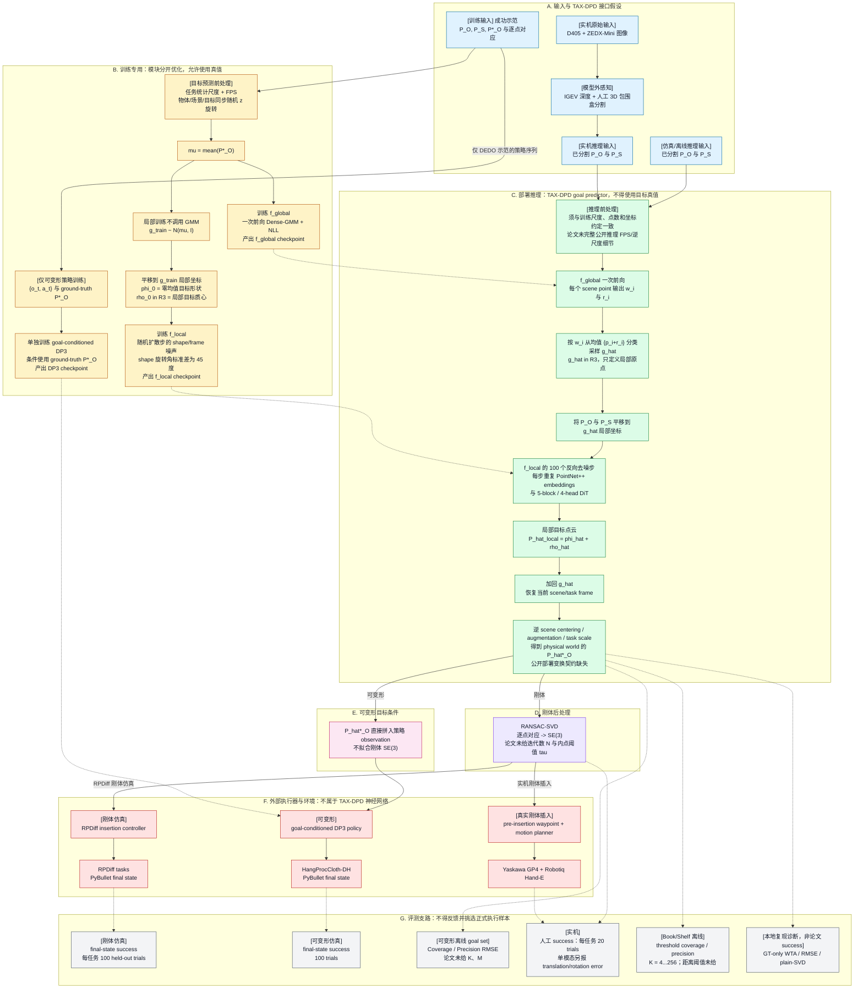
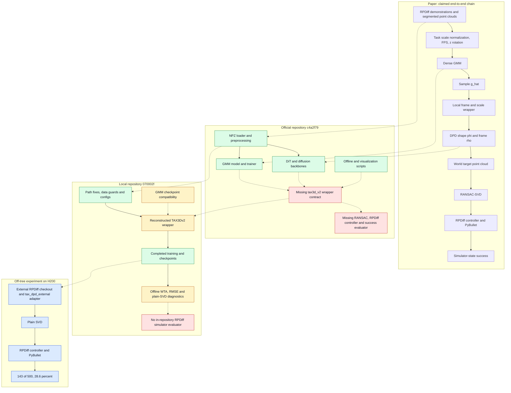
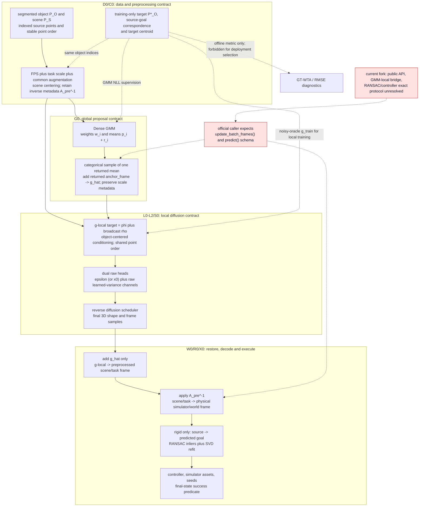
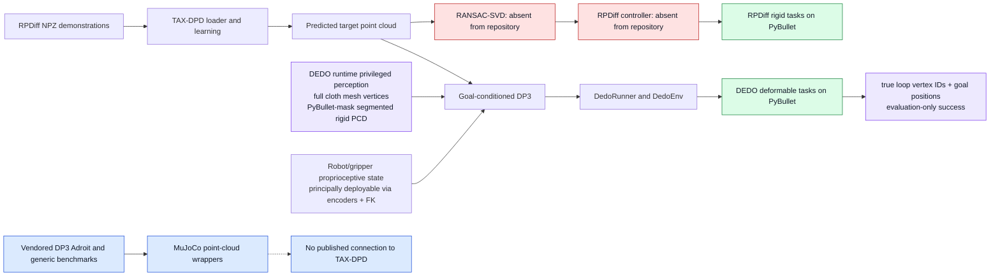
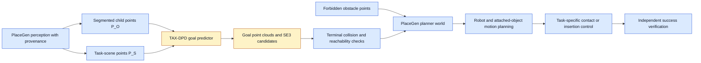

# TAX-DPD（面向任务的跨几何推理与解耦点扩散）技术链路与复现审计

> 审计日期：2026-08-14（Asia/Shanghai）
> 最近内容校准：2026-08-15
> 本地仓库：`/home/bis/BiS.d/Code.d/QIUZHI-tech/TAX-DPD`
> 本地提交：`070002f3959cc7ba463425801004c646ed06c037`
> 官方上游 HEAD（分支当前提交）：`c4a2f796911bd3cf9b43abef848aaa7651c3043a`
> 论文：[arXiv 2604.11793v1](https://arxiv.org/html/2604.11793v1)
> 项目页：<https://3dgp-icra2026.github.io/>
> 既有实验记录：[REPRODUCTION_STATUS_2026-08-13.md](REPRODUCTION_STATUS_2026-08-13.md)
> PlaceGen 依赖边界参考：[taxdpd_perception_and_execution_audit.zh-CN.md](taxdpd_perception_and_execution_audit.zh-CN.md)
>
> **文档层级：** 本文是信息母版；
> [内部分享讲解稿](TAX_DPD_PAPER_CODE_REPRODUCTION_WALKTHROUGH_2026-08-15.zh-CN.md)
> 只能从本文选择、压缩和重组内容，不应成为任何技术事实、数字或证据边界的唯一来源。

## 0. 结论先行

1. **这台电脑不适合论文级复现。** 宿主机有 NVIDIA GeForce MX350
   图形处理器（Graphics Processing Unit，GPU），但只有 2 GiB 显存；中央处理器
   （Central Processing Unit，CPU）为 4 核 8 线程 i5-1035G1，内存 15 GiB，
   审计时磁盘仅余约 58 GiB。项目入口硬编码使用 CUDA（NVIDIA 的 GPU 并行计算
   平台），已知训练配置使用 batch size（批大小）8--32，验证又要做 10--20 个
   Winner-Take-All（WTA，胜者全得）样本和 100 步扩散。它可以用于代码阅读和
   轻量 CPU 冒烟检查，不能合理承担正式训练、完整 Relational Pose Diffusion
   （RPDiff，关系位姿扩散）仿真评测或论文五任务复现。

2. **当前上游发布本身不可独立运行。** 截至审计日，官方 `main` 仍停在
   `c4a2f79`。代码导入了未发布的 `tax3d.py`、`tax3d_v2.py`、
   `real_world.py` 和 `vis_utils.py`；README 中安装、训练、评测和预训练权重
   仍全部标为未发布。官方 [issue #1](https://github.com/lyuxinghe/TAX-DPD/issues/1)
   仍未得到作者答复。

3. **本地结果是 best-effort reimplementation（尽力重实现），不是严格复现。**
   当前核心 `src/non_rigid/models/tax3d_v2.py` 是后续重建的 wrapper（模型接口
   封装）；论文所需的 Gaussian Mixture Model（GMM，高斯混合模型）到局部坐标、尺度归一化、
   公开部署推理、local-to-world（局部坐标到世界坐标）变换，以及
   Random Sample Consensus–Singular Value Decomposition（RANSAC-SVD，随机采样
   一致性过滤后做奇异值分解）后处理，没有形成等价的端到端实现。

4. **已有 28.6% 与论文 95% 不是同任务同协议的可比数字。** 产生该 checkpoint
   的训练数据是 `mug_on_rack_multi_large_proc_gen_demos`，作者自己的脚本称其为
   `Mug_Rack_Hard_Multi`；同一脚本另把 `mug_rack_med_multi` 标作
   `Mug_Rack_Med_Multi`，后者才是与论文 `Mug/Multi-MedRack` 命名相符的候选
   数据。产生 28.6% 的仓外 evaluator/config 没有提交，连实际 trial 的 mesh class
   和 split 也无法在本机复核；因此更不能证明两边任务等价。

5. **最优先应修复/取得的是接口契约，不是继续堆训练轮数。** 应先取得官方
   `tax3d_v2.py`、精确任务数据和仿真协议，或按论文重新实现并逐段验证
   `稠密 GMM -> 局部坐标 -> 解耦点扩散 -> RANSAC-SVD -> 控制器`。

6. **本复现仓库没有改写官方的仿真器、物理求解器、控制器或物体资产。**
   本地提交相对官方 `c4a2f79` 只改/增 21 个文件；`third_party/dedo/`、
   `third_party/3D-Diffusion-Policy/`、DEDO 的 728 个数据文件，以及全部
   URDF/OBJ/STL/XML 资产没有差异。本地改动集中在模型 wrapper、训练/离线评测、
   配置、checkpoint 兼容和最小日志可视化。`scripts/eval_rigid.py` 不启动
   PyBullet、不执行控制器，也不计算 simulator success（仿真器成功率）。

7. **RPDiff 在这里有三类职责、四个具体角色，不能混为一谈。** 在论文中，它
   分别是训练示范与刚体任务来源、对比 baseline（基线）、所有方法共用的
   insertion controller（插入控制器），以及 PyBullet 成功评分环境；在官方 TAX-DPD
   仓库中，只发布了 `.npz` 数据加载/预处理、训练配置和离线评测/可视化调用点，
   没有 RPDiff 包、控制器或 simulator evaluator；本复现仓库仍只包含前一类
   接口。产生 28.6% 的 `tax_dpd_external` adapter（适配器）位于 H200 的独立 RPDiff
   checkout 中，未提交到当前仓库。

8. **论文定义的 predictor 不读取目标真值，但端到端仿真包含运行时“超级权限”。**
   TAX-DPD 推理入口只要求已分割 `P_O/P_S`；目标点云、目标质心和 correspondence
   属训练监督。模型外部则不同：RPDiff 的公开环境用 PyBullet segmentation 生成
   仿真点云；TAX-DPD 论文直接确认调用 RPDiff insertion controller，但其实际
   commit/config 未归档。若该私有实验沿用 RPDiff 公开控制机制，则任务方向/物体
   状态、直接物体控制和接触反馈又构成执行特权。vendored DEDO/DP3 rollout 则可由
   当前代码直接确认每步读取完整 cloth mesh vertices 和仿真 mask。前述 segmentation
   与 mesh/mask 属感知 runtime privilege，条件性继承的 RPDiff 机制属执行
   runtime privilege；可由编码器和正运动学获得的 gripper/robot state 不应一并算作
   超级权限。final simulator state 和真实孔洞顶点若只用于判分，则是
   evaluation-only oracle，不能笼统称为 predictor 偷看 GT。

9. **MuJoCo 不是 TAX-DPD 论文实验链的仿真器。** 五个 RPDiff 刚体任务和
   DEDO 可变形任务都使用 PyBullet。MuJoCo 只存在于官方已经 vendored 的
   3D Diffusion Policy 通用 Adroit/Gym 分支；本地 Pixi 将其固定为 2.3.7，且
   本轮做过独立单步冒烟，但这不表示 TAX-DPD 或 RPDiff 已被迁移到 MuJoCo。

10. **有可视化内容，但“网页可见”和“仓库可生成”要分开。** 论文有方法、
   RPDiff、实机和 DEDO 静态图；项目页有 MP4/GIF/PNG；仓库有 GMM Plotly HTML、
   Weights & Biases（W&B）3D 点云和若干扩散可视化脚本。不过完整扩散/server/
   RPDiff 可视化仍依赖缺失 wrapper API（Application Programming Interface，
   应用程序编程接口）、未恢复的 `vis_utils` 接口或作者机器上的外部路径，不能
   开箱重建项目页媒体。

11. **补全者在工程执行上已做了相当充分的 best-effort，但没有达到算法忠实、
    可重放的完整复现。** `docs/codex-history.md` 记录了 H200 环境修复、约
    24 GiB 数据同步、GPU smoke、20,000 epoch/2,000,000 step 训练、5/100/500
    trial 仿真和多轮 frame/rotation 诊断；但完整 GMM-to-local 链、官方 public
    API、RANSAC-SVD、同任务数据/split、oracle（真值上界）simulator 验证和已
    提交 adapter 仍缺失。剩余问题主要是不可辨识的官方契约、数据和 glue（集成
    胶水代码），而不是简单再调参。

### 0.1 现有证据能够回答到什么程度

现有论文 PDF、官方快照、本地提交、复现历史和第三方执行代码已经足以支持内部分享：
可以解释论文问题、完整数据流、组件选择、代码组织、公开链路缺口、仿真特权和失败
因素的优先级。本文后续各节给出完整证据，分享稿仅做主题化摘编。

仍不能由当前材料回答或认证的是：本地 wrapper 与作者内部实现是否数值等价；
`28.6%` 到论文 `95%` 的差距分别有多少来自 GMM、坐标/尺度、registration、数据和
controller；以及在缺少 exact 数据、split、checkpoint、RPDiff config 和未公开参数时
如何认证 exact reproduction（严格复现）。因此“足以调研讲解”不等于“足以完成严格
复现或做百分点归因”。

<!--
12. **作为 PlaceGen 的依赖项，TAX-DPD 应被定位为 goal predictor，而不是感知、
    障碍规避或完整 pick-place 系统。** 它假设输入已经是分离的物体点云 `P_O`
    和场景点云 `P_S`，输出最终目标点云/刚体位姿；RPDiff 的真值辅助接近方向、直接
    物体 position-control、接触回退，以及真机未公开的 motion planner 均在模型
    边界之外。PlaceGen 需要独立承担感知来源、障碍世界、可达/碰撞筛选、运输路径
    和接触闭环，不能从 TAX-DPD 的最终放置成功率推导完整 pick-place（拾取-放置）
    能力已经具备。
-->

本文用以下标签区分结论强度：

- **[事实]** 可由论文、Git 历史、代码或本机命令直接复核；
- **[强推断]** 有完整代码证据链，但仍需官方实现或对照实验最终确认；
- **[待验证]** 当前材料不足，不应写成既定事实。

## 1. 名词与问题定义

**TAX-DPD** 是论文 *Disentangled Point Diffusion for Precise Object Placement*
的模型名，论文将其展开为 **TAsk-specific Cross-Geometry reasoning with
Disentangled Point Diffusion**（面向任务的跨几何推理与解耦点扩散）：其中
`TA` 取自 `TAsk-specific`，`X` 表示 Cross-Geometry，DPD 指
**Disentangled Point Diffusion（解耦点扩散）**。

输入包含：

- 被移动物体的分割点云 `P_O ∈ R^(N_O × 3)`；
- 环境/承载物的场景点云 `P_S ∈ R^(N_S × 3)`。

模型不是直接回归一个刚体位姿，而是从多模态分布中采样目标物体点云
`P_hat*_O`。每个输入物体点与一个预测目标点保持对应。对于刚体，
最后再从这些点对应关系恢复 **SE(3)**（Special Euclidean Group in 3D，三维刚体
旋转和平移群）变换；对可变形物体则可以直接把目标点云交给目标条件策略。

常用缩写：

**表 1：TAX-DPD 方法、代码与评测中常用的缩写、原理和链路作用**

| 缩写/术语 | 全称与中文 | 核心原理 | 在 TAX-DPD 链路中的作用或注意点 |
|---|---|---|---|
| GMM | Gaussian Mixture Model，高斯混合模型 | 用多个带权概率分量的和表达多峰连续分布，避免把多个合法解平均成一个无效解 | Dense GMM 沿每个场景点产生一个候选分量，负责全局粗目标选择；Dense 不表示完整协方差 |
| DPD | Disentangled Point Diffusion，解耦点扩散 | 将目标点云拆成零均值形状 `phi` 与局部平移 `rho`，分别扩散和去噪后再相加 | 在 GMM 选定的局部区域内预测旋转后几何/形变与精细平移 |
| DDPM | Denoising Diffusion Probabilistic Model，去噪扩散概率模型 | 学习逆转逐步高斯加噪过程，从随机噪声生成多样样本 | 为局部 `phi/rho` 提供 100 步训练与反向采样框架 |
| DiT | Diffusion Transformer，扩散 Transformer | 将扩散时间步条件注入 Transformer 去噪器，通过注意力混合 token | 混合 object/scene token，并由 shape/frame head 输出局部目标构型 |
| NLL | Negative Log-Likelihood，负对数似然 | 惩罚真值在预测概率分布下的低似然 | 用目标物体质心监督 Dense GMM 的权重和候选均值 |
| PointNet++ | PointNet++，分层点云网络 | 通过采样、邻域分组和分层特征聚合编码无序点集 | 提取 reconstruction、object 和 deformation 的局部几何特征 |
| RPDiff | Relational Pose Diffusion，关系位姿扩散 | 在 SE(3) 关系位姿空间做生成式扩散，并配套任务与执行环境 | 同时是对比 baseline、刚体任务/数据来源和外部插入控制器；这些角色不能混为一谈 |
| DEDO | Dynamic Environments with Deformable Objects，可变形物体动态环境 | 用 PyBullet soft-body 环境提供布料等可变形任务 | 提供论文可变形评测后端；当前 rollout 还直接读取完整 deformable mesh 顶点 |
| DP3 | 3D Diffusion Policy，三维扩散策略 | 以三维观测为条件生成一段低层动作序列 | 在 DEDO 分支中执行 TAX-DPD 预测的可变形目标点云 |
| SO(3) | Special Orthogonal Group in 3D，三维旋转群 | 由行列式为 1 的正交矩阵表示纯三维旋转 | rotation noise 的旋转轴/矩阵所在空间，不包含平移 |
| SVD | Singular Value Decomposition，奇异值分解 | 分解矩阵并给出对应点最小二乘刚体配准的闭式解 | 在 RANSAC 内拟合候选与最终 SE(3) |
| RANSAC | Random Sample Consensus，随机采样一致性 | 反复用最小样本拟合模型，以最大内点集合抵抗离群点 | 排除扩散预测中错误的逐点 correspondence |
| GT | Ground Truth，真值 | 由示范或仿真器提供的监督/评分参考 | 训练和离线评分可用；正式部署的 predictor 与 sample selector 不得读取 |
| WTA | Winner-Take-All，胜者全得 | 从多个候选中保留某个指标最优者 | 当前仓内用 GT 选样本，只适合离线 coverage/诊断，不是部署接口 |
| RMSE | Root Mean Squared Error，均方根误差 | 对逐点欧氏误差平方求均值再开方 | 衡量预测目标点云和真值目标点云的平均几何误差 |
| FPS | Farthest Point Sampling，最远点采样 | 每次选择离已选集合最远的点，以固定预算覆盖几何范围 | 将物体和场景点云下采样到网络要求的固定点数 |
| PyG | PyTorch Geometric，PyTorch 图/点云学习库 | 提供图和点云批处理及编译算子 | 支撑 PointNet++ 的 FPS、邻域查询等 GPU 运算 |
| NIST | National Institute of Standards and Technology，美国国家标准与技术研究院 | 美国标准与测量机构；此处指其装配测试板任务 | 论文真机插入使用 Assembly Task Board 1 |

## 2. 论文声称的完整方法链

### 2.1 总体数据流



**图 1：TAX-DPD 从输入、分阶段训练和部署推理到外部执行与评测的总体数据流**

图中的作用域边界是必要信息，而不只是配色：

- **A 是输入边界，而不是仓内感知模块。** 仿真从已分割点云开始；论文实机才用
  Intel D405 与 ZEDX-Mini 图像，经 IGEV stereo depth（双目深度估计）及人工设定的
  3D bounding box（包围盒）得到 `P_O/P_S`。采集并非固定全景一次完成：机器人会
  分别移动到调好的 object-capturing pose 和 scene-capturing pose，以近距离观察
  connector 接触面和 socket opening。capture pose 与 geometry-specific box 都是
  真机可执行但任务专用的 shortcut；这些相机、IGEV、主动采集和分割代码均未发布在
  当前仓库。
- **B 仅限训练。** `P*_O`、逐点 correspondence（对应关系）和目标质心 `mu` 都是
  监督。GMM 与局部 DPD 分开优化；训练 DPD 时不在线调用 GMM，而用
  `g_train ~ N(mu, I)` 的 noisy oracle（带噪真值参考点）。可变形 DP3 又是第三个
  独立训练问题，训练条件用真值 goal，而非每步运行 TAX-DPD。
- **C 才是部署 predictor。** Dense GMM 是一次 feed-forward（前馈），并按 `w_i`
  从离散均值 `{p_i+r_i}` 中分类采一个 `g_hat`；PointNet++/DiT 则在 100 个反向
  扩散步中重复调用。`g_hat in R3` 只是局部原点，`rho in R3` 也是局部平移，不是
  含旋转的完整 frame；刚体旋转主要由零均值 `phi` 的点几何承载。
- **D/E 是互斥的材料分支，F 是外部执行。** 刚体才由逐点对应做 RANSAC-SVD；
  可变形物体不拟合 SE(3)。RPDiff controller、goal-conditioned DP3 和实机 motion
  planner 均在 TAX-DPD 神经网络之外，且分别服务于不同实验，不能合并成一个
  “controller”。
- **G 仅限评分。** 论文刚体 PyBullet final-state success、DEDO success 与
  Coverage/Precision RMSE、实机人工 success、本地 GT-only WTA/RMSE/plain-SVD
  是四类不同 protocol。虚线表示 checkpoint 或评测依赖，绝不能把 WTA 真值选择
  回流到 one-shot 部署链。
- **图中缺参是审计结论。** 论文只在 training pre-processing 明确写了 FPS 和任务
  统计尺度；部署时显然必须保持训练坐标约定，但推理 FPS、精确缩放/逆缩放公式及
  public world-frame contract 没有完整公开。图因此没有把本地 wrapper 的猜测画成
  论文既定算法。

这条链路最重要的设计意图是解决两种尺度之间的冲突：按整个场景归一化有利于
覆盖相距很远的多个放置模式，但会损失物体级精度；按小物体归一化有利于精修，
却难以表示全场景多模态分布。论文因此先在场景尺度选择局部区域，再在局部尺度
做高精度预测。

### 2.2 全局放置初始化：Dense GMM

一般 GMM 将条件目标位置写成多个高斯分量的加权和：

```text
p(g | P_O, P_S) = sum_i w_i * Normal(g; m_i, sigma^2 I)
sum_i w_i = 1,  w_i >= 0
```

它相对单点均值回归的价值是保留多峰：当左右两个挂点都合法时，单点 MSE 可能回归到
两者中间的无效位置，而 GMM 可保留两个概率峰。传统 GMM 常用
Expectation-Maximization（EM，期望最大化）迭代拟合；TAX-DPD 则用条件神经网络从
`(P_O, P_S)` 一次前向预测全部 `w_i/m_i`，再用反向传播训练，更接近 conditional
mixture-density network（条件混合密度网络）。
论文部署采样是先按 `w_i` 选择分量、再直接取其均值，并不继续添加高斯 jitter；
仓内 `scripts/eval_gmm.py:135-137` 也以 `torch.multinomial` 采索引后直接索引
`means`，为该语义提供代码证据。

给定每个场景点 `p_i`，前馈网络预测：

- mixing weight `w_i`：第 `i` 个候选分量的混合权重；多个相邻候选可共同形成
  同一个概率模态，不能把一个分量直接等同于一个语义挂点；
- residual `r_i ∈ R³`：高斯均值相对场景点的偏移；
- 第 `i` 个分量的均值为 `p_i + r_i`。

模型用固定方差训练负对数似然，目标是成功示范中目标物体的质心：

```text
mu = mean(P*_O)
L_GMM = -log sum_i [w_i * Normal(mu; m_i, sigma^2 I)]
```

该损失要求至少有候选中心靠近 `mu`，并把较高混合权重分给这些候选；跨示范出现
多个合法区域时，不同分量可分别承载概率质量。推理时先按 `w_i` 采分量，再得到粗
局部参考点 `g_hat`。
代码侧最接近的实现是
`src/non_rigid/models/gmm_predictor.py::FrameGMMPredictor` 和
`scripts/train_gmm.py`。

这里的 fixed variance（固定方差）还需要区分论文和源码：论文没有公开
`sigma` 的具体数值；仓内 `learn_sigma=True` 只是复用 DiT 输出形状的配置约束，
`FrameGMMPredictor` 实际忽略方差通道。`GMMLoss` 使用配置给出的 base `var`，再按
点云尺度做换算，因此有效 mixture variance 由外部配置和尺度处理决定，不是网络学习。
`configs/train_gmm.yaml:29` 的默认 base `var: 0.1` 是发布代码选择，不能写成论文参数。

在完整链中，GMM 的职责仅是表达场景级多模态、选择一个粗放置区域并给局部 DPD
建立参考原点。它不预测最终旋转、毫米级接触构型、碰撞安全或机器人路径；这些分别
由 local DPD、RANSAC-SVD 和模型外执行器承担。

### 2.3 局部配置精修：解耦点扩散

记变换到 `g_hat` 局部坐标的目标点云为 `P*_(O,local)`，论文把它分成：

```text
phi_0 = P*_(O,local) - mean(P*_(O,local))
rho_0 = mean(P*_(O,local))
P*_(O,local) = phi_0 + rho_0
```

- `phi` 是零均值 shape（形状）点集。对刚体，它主要承载旋转后的几何；
  对可变形物体，它也承载形变。
- `rho ∈ R³` 是局部 frame/translation（物体框架/平移），加法时
  广播到所有物体点。

二者采用同一 100-step DDPM schedule（扩散时间表），但各自加独立高斯噪声、
由两个输出头分别去噪。shape 分支还加入从 SO(3) 随机旋转构造的结构化噪声，
其旋转轴在单位球面均匀采样，旋转角满足零均值高斯分布
`theta ~ N(0, sigma_rot^2)`，`sigma_rot=45°`；这不是每次固定旋转 45 度。

去噪器使用三类 PointNet++ embedding（嵌入）：

1. **reconstruction embedding**：把当前目标物体估计和场景合在一起编码，以
   看清接触、间隙和插入关系；
2. **object embedding**：单独编码零均值初始物体，保留物体自身几何；
3. **deformation embedding**：编码当前 shape 与初始零均值物体之间的逐点位移，
   显式表示旋转或形变。

三者混成 object tokens（物体 token），场景重建特征成为 scene tokens（场景
token），另加一个可学习 frame token。修改后的 DiT 让 object/frame token 对
scene token 做 cross-attention（交叉注意力），再由 shape head 和 frame head
分别解码 `phi` 与 `rho`。

局部模型训练时不在线调用 GMM，而是给真值目标质心加高斯噪声来模拟 GMM 误差；
推理时才必须用 GMM 的真实输出替换这一模拟参考点。这正是当前实现最关键的接口。

**表 2：Dense GMM 与局部 DPD 在训练、部署和离线分析阶段的真值边界**

| 阶段 | GMM 状态 | 局部 DPD 使用的参考点 | 目标真值边界 |
|---|---|---|---|
| GMM 训练 | 单独训练 `f_global` | 不涉及局部 DPD | 允许，用 `mu` 计算 NLL |
| 局部 DPD 训练 | **不在线调用 GMM** | 任务归一化空间中的 `g_train ~ N(mu, I)` | 允许，用于构造 noisy oracle |
| 部署推理 | 一次前向并采 `g_hat` | 必须使用真实 GMM 输出的 `g_hat` | predictor 和候选选择均不允许读取 |
| 离线分布/覆盖分析 | 可重复独立采样 | 生成 `K` 个候选 | 只允许事后评分，不得反馈给正式执行选择 |

局部训练绕过 GMM 不是可在部署中照搬的捷径。它避免 GMM 在训练时选中与当前示范
不同的另一个合法 mode，迫使 local diffuser 处理大范围跨 mode 平移；部署若仍绕过
GMM，两阶段方法就会退化。

论文的正式 TAX-DPD 执行不使用 RPDiff 的 heuristic local crop（启发式局部裁剪）
或 classifier reranking（分类器重排），但这不能泛化为“论文所有分析都只采一个
样本”。Book/Shelf coverage/precision 分布分析明确使用 `K=4, 8, ..., 256`。正确
边界是：论文正式 TAX-DPD 协议不使用 GT-WTA 或 learned reranker 选样本；其中
GT-WTA 是不可部署的 oracle。另行训练、不读真值的 reranker 原则上可以部署，但会
构成对论文方法与评测协议的修改。分布分析可以抽多个独立候选，并只在事后使用真值
度量。

### 2.4 主要组件的替代方案与选择理由

下面的“选择理由”分为两类：有消融或直接对照的属于论文证据；仅由算法性质解释的
属于工程分析，不能写成论文已经证明当前设计优于所有替代方案。分享讲解稿的组件
对照表是本节的压缩版，不包含超出本节证据边界的新结论。

- **Dense GMM：** 可替代为单点回归、点/体素 heatmap、Hough voting、固定候选检测器、
  VLM 选区或直接在完整场景扩散。GMM 的直接优势是一次前向保留多峰，并用
  `m_i=p_i+r_i` 让候选中心离开场景表面；候选锚点位置随几何变化，分量数严格等于
  场景点数 `N_S`。论文 Multi-MedRack 去掉 GMM 从 95% 降到 74%，支持“两阶段全局
  初始化很重要”。论文没有与 heatmap、Hough、VLM 或固定检测器做对照。
- **目标点云而非直接 SE(3)：** 可替代为 SE(3) 回归/扩散、关键点姿态、逐点 flow、
  occupancy（占据表示）或 implicit field（隐式场）。点云输出避免为跨几何物体强行
  规定统一 canonical frame（规范坐标系），又能覆盖可变形目标。论文固定几何
  OneMug 上 point/SE(3) diffusion 为 98%/97%，
  几何多样的 ManyMugs 上为 95%/89%；这直接支持点空间表示的主要收益来自跨几何
  泛化，而不是在固定物体上普遍碾压 SE(3)。
- **局部 DPD 与 `phi/rho` 解耦：** 可替代为完整目标点云联合扩散、全场景单阶段扩散、
  TAX3D 式 flow、确定性回归、局部能量优化，或直接扩散旋转/平移与刚体 SE(3)。
  当前设计把旋转后形状/形变交给 `phi`、局部平移交给 `rho`；去掉解耦在
  Multi-MedRack 从 95% 降到 61%，但论文没有证明它优于所有现代 flow-matching、
  能量优化或刚体生成方法。
- **三类 embedding 与 PointNet++：** 可替代为仅联合编码、object/scene 分别编码、
  纯 cross-attention、手工几何描述子、pointwise MLP、Point Transformer/PointNeXt、
  DGCNN、稀疏体素网络或隐式表面网络。PointNet++ 能直接处理无序点并聚合局部邻域
  是通用工程理由；论文只将其与较弱的 pointwise MLP 做过消融，平均 success 为
  97% 对 78%，没有和其他强点云骨干比较。论文还分别消融了
  reconstruction/deformation embedding；object embedding 没有被单独隔离，因此不能
  给三种 embedding 各自分配确定的成功率贡献。
- **DiT + DDPM：** 可替代为点云 U-Net、MLP denoiser、score SDE、DDIM、
  consistency model 或 flow matching。Transformer 适合混合 object/scene token，
  DDPM 具有成熟的多模态训练与采样目标；这些是合理的架构解释，论文没有提供
  backbone/generator 的同条件 A/B。
- **shape rotation noise：** 可替代为仅做 z 轴旋转增强、SO(3)-equivariant
  （旋转等变）网络、显式姿态监督或 SE(3) diffusion。论文在 shape forward process
  中加入旋转角
  `theta ~ N(0, sigma_rot^2)`、`sigma_rot=45°`，去掉后 Multi-MedRack 从 95% 降到
  73%，直接支持它对姿态恢复的重要性。
- **FPS 与 task-specific scaling：** 可替代为随机/体素/重要性采样和固定全局尺度。
  FPS 保持固定预算下的空间覆盖、任务尺度让扩散噪声落入稳定范围，是通用原理；论文
  没有采样消融，也没有公开完整 scale 统计和部署逆变换公式。
- **RANSAC-SVD：** 可替代为全点 Kabsch/SVD、ICP、鲁棒 M-estimator、TEASER++ 或
  学习式 registration。网络会联合建模点集，但逐点输出没有显式刚体一致性约束；
  论文选择内点共识是为过滤由此产生的错误 correspondence/outlier。效率优势没有被
  论文对照验证，且迭代数 `N` 与阈值 `tau` 未公开。
- **RPDiff controller / goal-conditioned DP3：** 可替代为机械臂 motion planning +
  力控、视觉伺服、模型预测控制或其他模仿学习策略。它们是 TAX-DPD 目标预测之后的
  外部执行选择：论文只确认采用这些执行器，不能据此证明 predictor 自身具有规划、
  碰撞处理或无特权闭环能力。

### 2.5 刚体后处理与执行

逐点扩散的对应关系可能有局部不一致和离群点。论文不是直接对全部点做一次 SVD，
而是：

1. RANSAC 每轮随机采三个点对应；
2. 用 SVD 求候选 SE(3)；
3. 以距离阈值 `tau` 统计内点；
4. 选最大内点集，再用全部内点重估最终变换。

论文 Appendix III-E 未给 RANSAC 迭代次数和 `tau` 的具体数值，这仍是严格复现所缺参数。
仿真中最终变换交给 RPDiff insertion controller（插入控制器），每个任务评测
100 个 held-out trial，并依据最终 PyBullet 状态判成功。

### 2.6 论文训练设置

论文附录 Table V 公开的共同超参为：batch 16、学习率 `1e-4`、warmup（学习率
预热）100 step、weight decay（权重衰减）`1e-5`、20,000 epoch（完整训练数据遍历
轮次）、DiT 5 blocks / 4 attention heads / hidden size 128、扩散 100 steps；该表及
论文正文**没有给 optimizer 名称**。当前仓库的 `scripts/train_gmm.py` 和 Lightning
训练模块使用 AdamW（将权重衰减与梯度更新解耦的 Adam 优化器），这是源码事实，
不应写成论文已公开参数。类似地，`configs/model/tax3dv2.yaml:43` 与
`df_cross.yaml:41` 选择 linear diffusion noise schedule（线性扩散噪声时间表），
也是仓库配置事实而非论文公开超参。Multi-MedRack、Book/Shelf 使用 512 个物体点和 1024 个
场景点；Can/Cabinet 使用 256/1024。论文还声明按任务统计在每个 batch 做自适应
尺度归一化、训练时用 FPS 降采样，并给物体/场景/目标同时施加相同的随机 z 轴旋转。

### 2.7 论文定量结果与可用于归因的边界

#### RPDiff 刚体任务

论文 Table I 的完整结果如下。RPDiff `0.88` 是 TAX-DPD 论文直接引用 RPDiff 原论文
报告的成功率，并非作者在本文 evaluator 中重新跑出的逐任务基线；RPDiff without
classifier-based reranking 也只报告平均 `0.83`，没有公开五个任务的逐项数字。

**表 3：论文在五个 RPDiff 刚体任务上的完整成功率与消融结果**

| 方法 | EasyRack | MedRack | Multi-MedRack | Book/Shelf | Can/Cabinet | 平均 |
|---|---:|---:|---:|---:|---:|---:|
| TAX3D | 0.84 | 0.46 | 0.32 | 0.38 | 0.42 | 0.48 |
| RPDiff，无 classifier reranking | -- | -- | -- | -- | -- | 0.83 |
| RPDiff | 0.92 | 0.83 | 0.86 | 0.94 | 0.85 | 0.88 |
| TAX-DPD，无 disentangled point diffusion | 0.97 | 0.74 | 0.61 | 0.53 | 0.77 | 0.72 |
| TAX-DPD，MLP encodings | 0.99 | 0.84 | 0.81 | 0.61 | 0.64 | 0.78 |
| TAX-DPD，无 GMM | 1.00 | 0.87 | 0.74 | 0.75 | 0.79 | 0.83 |
| TAX-DPD，无 reconstruction embedding | 0.98 | 0.91 | 0.80 | 0.78 | 0.83 | 0.86 |
| TAX-DPD，无 rotation noise | 0.94 | 0.85 | 0.73 | 0.96 | 0.91 | 0.88 |
| TAX-DPD，无 deformation embedding | 0.98 | 0.94 | 0.88 | 0.95 | 0.80 | 0.91 |
| TAX-DPD，SE(3) diffusion | 0.97 | 0.92 | 0.89 | 0.96 | 0.91 | 0.93 |
| 完整 TAX-DPD | 1.00 | 0.97 | 0.95 | 0.99 | 0.95 | 0.97 |

对当前 Multi-MedRack 归因最直接的行是：完整 `0.95`、无 GMM `0.74`、无解耦
`0.61`、无 rotation noise `0.73`、SE(3) diffusion `0.89`。这些数字证明组件重要，
却不能直接把本地 `95%-28.6%` 的差距拆分给各组件，因为本地任务、split、wrapper、
registration 和 controller 均未确认与论文一致。

论文另做了固定几何 OneMug 与跨几何 ManyMugs 对照：point/SE(3) diffusion 在
OneMug 为 `0.98/0.97`，在 ManyMugs 为 `0.95/0.89`。这支持“点空间的主要收益来自
跨几何泛化”，而不是声称其在固定几何上普遍显著优于 SE(3)。

#### NIST 真机插入

**表 4：论文 NIST 真机插入任务的成功率与总体位姿误差**

| 设置 | 任务 | 方法 | 成功率 | 平移误差（mm） | 旋转误差（度） |
|---|---|---|---:|---:|---:|
| 单模态 | Waterproof | TAX-Pose | 80%（16/20） | 1.04 | 1.64 |
| 单模态 | Waterproof | TAX-DPD | 100%（20/20） | 0.72 | 1.18 |
| 单模态 | DSUB-25 | TAX-Pose | 80%（16/20） | 0.93 | 3.16 |
| 单模态 | DSUB-25 | TAX-DPD | 80%（16/20） | 1.00 | 1.36 |
| 单模态 | SSD | TAX-Pose | 0%（0/20） | 16.18 | 13.81 |
| 单模态 | SSD | TAX-DPD | 85%（17/20） | 2.75 | 2.77 |
| 多模态 | Waterproof | TAX-DPD | 90%（18/20） | -- | -- |

多模态 Waterproof 没有唯一 canonical target pose，因此论文不报告平移/旋转误差。
附录还把单模态 success/failure 分组报告；即使使用 Table III 已给出的成功/失败数量
对 Table VII 分组均值加权，也不能可靠复原 Table III 的总体误差，论文没有解释两表
统计口径差异。因此本文保留原表数字，不自行合成新的总体误差。

#### DEDO 可变形挂布

**表 5：论文在修改版 DEDO HangProcCloth 任务上的完整成功率与误差消融**

| 方法 | Success Rate | Coverage RMSE | Precision RMSE |
|---|---:|---:|---:|
| TAX3D | 0.50 | 0.87 | 1.34 |
| TAX-DPD，无 disentangled point diffusion | 0.73 | 0.82 | 1.16 |
| TAX-DPD，MLP encodings | 0.76 | 0.96 | 1.04 |
| TAX-DPD，无 GMM | 0.69 | 0.88 | 0.96 |
| TAX-DPD，无 reconstruction embedding | 0.75 | 0.82 | 0.81 |
| TAX-DPD，无 rotation noise | 0.64 | 0.64 | 0.95 |
| TAX-DPD，无 deformation embedding | 0.71 | 0.96 | 0.95 |
| 完整 TAX-DPD | 0.78 | 0.50 | 0.58 |

这里的 success 来自“预测 goal + 单独训练的 goal-conditioned DP3 + DEDO 终态判据”，
不是 TAX-DPD predictor 单独完成布料控制。Coverage/Precision RMSE 的定义需要预测
集合大小 `K` 和真值集合大小 `M`，论文在 DEDO 表中没有公开两者的具体取值。

### 2.8 论文、官方发布与本地补全的数据流 gap

下图不是把“文件存在”等同于“功能可运行”。绿色表示当前相应仓库中存在的实现，
黄色表示本地重建或近似，红色表示发布链路的缺口，蓝色表示 H200 上曾使用但没有
进入当前仓库的外部实现；跨分区虚线只表示来源/近似映射，不表示存在完整的可执行
连接。



**图 2：论文声明、官方发布、本地补全与 H200 仓外实验之间的数据流缺口**

图中最值得注意的不是单个缺文件，而是两段契约同时缺失：

1. 官方公开了 GMM、DiT 和 diffusion backbone（扩散骨干），却没有公开负责
   `GMM -> g_hat -> local frame/scale -> DPD -> world` 的 wrapper；项目页展示了
   这些中间结果，但发布代码不能开箱生成同等链路。
2. 官方 TAX-DPD 仓库没有 `world target -> RANSAC-SVD` 和
   `RPDiff controller -> PyBullet success` 的执行层。本地补全只把训练和离线诊断跑通；真正产生 28.6%
   的执行层是另一仓库上的 off-tree（仓外、未提交）patch，不能从当前 Git
   checkout 重放。

### 2.9 Contract 图谱：论文约束、官方调用点与本地补全

这里的 contract（接口契约）不只是 Python 函数签名，而是相邻阶段必须同时同意的
六类约定：**张量形状与点顺序、变量语义、坐标系、单位/尺度、随机采样规则、以及
真值在何时可见**。只要其中一项错位，代码仍可能维度正确、loss 正常并生成外观合理
的点云，却把错误的坐标或条件分布一路传给执行器。

为避免把“论文描述”“公开源码”“本地猜测”混成同一强度的事实，本节采用四级证据。

**表 5A：TAX-DPD contract 判断所采用的四级证据边界**

| 标记 | 证据来源 | 可以支持的结论 | 不能越界推断的内容 |
|---|---|---|---|
| P（paper-explicit） | 论文正文、公式、附录和表格 | 算法期望的数学语义、训练/推理边界和已公开超参 | 未公开 wrapper 的函数签名、RANSAC 阈值、exact task config |
| C（tracked-code/call-site） | 官方追踪的 backbone、dataset、GMM、server 调用点 | 已发布张量操作，或调用者要求 wrapper 提供的 API/schema | 被调用函数内部的原始实现和作者私有 adapter 行为 |
| R（local-reconstruction） | 当前 fork 新增的 `tax3d_v2.py`、配置修复和离线评测 | 本地 checkpoint 实际接受/产生什么，当前实验确实走了哪条分支 | 与缺失官方 wrapper 数值等价或语义等价 |
| U（unknown/off-tree） | 未归档的 RPDiff checkout、adapter、controller config、数据与资产 | 只能记录历史观测或待取得材料 | 从当前 checkout 独立重放论文 success，或给性能差距分配确定百分点 |

#### 2.9.1 局部表示、刚体有效集合和坐标恢复

设 `P*_scene ∈ R^(N×3)` 是完成 task scaling、数据增强和 scene centering 后、局部
DPD 所在 scene/task 坐标中的真值目标点云；`g_hat ∈ R³` 必须与它处于**同一坐标轴、
同一原点约定和同一尺度**。令 `1` 表示长度为 `N` 的全一向量，则论文局部表示可写成：

```text
mu                 = mean(P*_scene)
phi_0              = P*_scene - 1 mu^T
rho_0              = mu - g_hat
P*_(g-local)       = phi_0 + 1 rho_0^T = P*_scene - 1 g_hat^T
P_hat*_scene       = P_hat*_(g-local) + 1 g_hat^T
P_hat*_world       = A_preprocess^{-1}(P_hat*_scene)
```

这里必须把最后两步拆开：`+ g_hat` 只完成 **g-local -> 当前 scene/task frame** 的
平移恢复；它不自动撤销 scene centering、随机增强或 task scaling。工程中的
`A_preprocess^{-1}` 可能合法地含逆旋转、平移和逆尺度。当前
[`rigid.py`](../src/non_rigid/datasets/rigid.py) `:220-249` 先施加随机 `SE(3)`、再
scene-center，并把 `Translate(scene_center) compose T.inverse()` 保存为
`T_goal2world/T_action2world`，正说明 scene -> physical world 不能一概简化为只加
平移。`T_action2goal` 在当前数据路径为单位阵，只是因为 action/goal 保存了相同的
逆预处理 metadata；它不进入 DPD forward，也不能据此推断 `phi/rho` 重复计数。

令

```text
H = {phi in R^(N×3) | mean(phi) = 0}
C(phi, rho) = phi + 1 rho^T
```

则 `C: H × R³ -> R^(N×3)` 是线性双射；因此 `phi/rho` 是完整有序点云空间的一种
坐标重参数化，不是论文已经证明的“学习到的数据流形”。对给定、非退化的刚体源点云
`P_O`，刚体一致的候选位于它的 `SE(3)` group orbit（群轨道）
`{P_O R^T + 1 t^T | R in SO(3), t in R^3}`，任务有效目标是其中进一步满足接触和
任务约束的子集。一般 orbit 维度至多为 6，去质心后的 shape orbit 至多为 3；只有
几何退化或存在连续 stabilizer（稳定子群）时才降低，离散对称通常只是造成 pose 多解。
RANSAC-SVD 是在**给定源点云和逐点对应**
后对这一刚体集合做鲁棒拟合，不是一个脱离输入的普适 `H × R³ -> SE(3)` 投影。
可变形分支没有统一的 `SE(3)` 投影，其合法目标集合由任务、材质和动力学决定。

还需区分 clean representation 与 noisy diffusion state：`phi_0 ∈ H`，但论文公式中
逐点 iid Gaussian（独立同分布高斯）噪声具有满维支持，单个 `phi_t` 不必严格零均值。
当前 fixed backbone 在 `zero_shape=True` 时会额外把 shape 输出的前三个通道重新
中心化，这是发布代码的实现约束，不能泛化成所有 variant、所有中间状态都天然位于
`H`。

#### 2.9.2 从数据到执行的可测试 contract

下图把训练专用真值、正式部署链和坐标恢复分开。实线是正式数据方向，虚线是训练或
离线诊断才允许的真值支路；红色节点表示当前公开/本地链仍无法认证或重放。



**图 2A：TAX-DPD 从数据、Dense GMM、局部扩散到物理 world 和执行层的 contract；虚线限定训练/离线真值的作用范围**

**表 5B：论文期望、官方调用点和本地复现之间的端到端 contract 对照**

| ID | 边界及必须保持的 contract | 证据 | 当前发布/复现状态 | 最低可接受的 contract test |
|---|---|---|---|---|
| D0 数据与 correspondence | `P_O:[B,N,3]`、`P_S:[B,M,3]`、训练目标 `P*_O:[B,N,3]`；初始物体和目标物体逐点同序；对二者应用同一 object FPS 索引；部署输入须有 object/scene 分离 | P：论文以逐点目标和 correspondence 为前提；C：`rigid.py:160-165` 用 action FPS 索引同步裁目标 | loader 和同索引 FPS 存在；exact 数据、split、资产及部署分割器不在仓内 | 已知索引经加载、FPS、增强后仍配对；删除目标字段后正式 predictor 仍能运行 |
| C0 预处理、frame 与单位 | task-specific scaling、共同增强、scene centering 必须有可逆 metadata；所有送入同一运算的点、`g_hat` 和阈值必须同 frame/scale | P：FPS、task scaling、共同 z 旋转；C：`rigid.py:220-249` 的随机变换、centering 和逆变换 | dataset 有 scene round-trip metadata；论文精确 scale statistics/公式未公开，local wrapper 没有形成统一 scale 闭环 | 合成点云做 `A_preprocess` 后再逆变换，应恢复原点；平移/旋转/缩放前后物理预测一致 |
| G0 Dense GMM | 每个 scene point 一个分量；`mean_i=p_i+r_i`，`w=softmax(logits)`；训练用连续 fixed-variance GMM NLL，论文推理按 `w` 分类采分量并取其 mean；必须携带 anchor frame 和 scale 语义 | P：论文 GMM 参数化与采样；C：`gmm_predictor.py:40-115` 返回 `probs/means/residuals/anchor_frame/pc_scale` | GMM 可独立训练；tracked `forward()` 返回前已把 `means/residuals/anchor_frame` 乘回 `pc_scale`，故当前代码的 scene 恢复是 `means[i] + anchor_frame`，不能再 unscale；`pc_scale` 在缺失 wrapper 中的后续用途未知 | 采样值必须精确等于某个 returned `means[i]`，频率近似 `probs`；加 returned `anchor_frame` 后与 scene frame 对齐，并用 round-trip 防止 double-unscale |
| L0 `g_hat` 局部表示 | `g_hat` 是纯平移参考原点；`phi_0=P*-mean(P*)`、`rho_0=mean(P*)-g_hat`，二者广播合成 `P*-g_hat`；object embedding 应去质心但保持公共坐标轴和点顺序 | P：论文公式与三类 embedding；C：公开 DiT 需要 `y/x0` 条件 | fixed 重建直接以 scene-frame `pc` 为目标且不读 `noisy_goal`；mu 重建才减/加 `noisy_goal`，两者都不是官方 wrapper 语义证据；共同 `_model_kwargs` 直接传 raw `pc_action` | `mean(phi_0)=0` 且合成精确恢复 local target；整体平移输入和 `g_hat` 后 local 几何不变、scene 输出同步平移 |
| L1 diffusion state 与 raw head | shape/frame 使用同一 timestep/schedule、各自 Gaussian corruption，rotation perturbation 只进入 shape；需区分 raw head、scheduler 的 `pred_xstart` 和最终 3D sample | P：共享 schedule、双过程和 rotation noise；C：`learn_sigma=True` 时两个 raw head 各 6 通道，默认 `ModelMeanType.EPSILON` | backbone 和 scheduler 存在；本地 `TAX3Dv2Network.forward(xr_t,xs_t,t,y,x0)->(xr_out,xs_out)` 是依据它们重建；fixed `zero_shape` 只中心化 raw shape 前三通道 | raw head 应为 `[B,6,1]`/`[B,6,N]`；当前默认前三通道是 epsilon，若切到 `START_X` 才是 x0，后三是经 `(raw+1)/2` 映射到 log-variance 区间的 raw 参数；scheduler 最终 sample 才是 `[B,3,1]`/`[B,3,N]` |
| L2 conditioning 与 dual head | reconstruction/object/deformation 三类 embedding 使用相容 frame/scale；object 与 frame token 对 scene token cross-attend；shape/frame 分头输出 | P：论文架构和消融；C：公开 DiT/encoder 实现 | 骨干大部分存在；缺失 wrapper 决定如何中心化、拼装条件以及 fixed/mu 的精确语义，本地是 best-effort | 对所有输入作共同平移时 object-centered feature 不变；破坏一个点对应应能被 deformation contract test 检出 |
| S0 训练—推理边界与 public API | local 训练用围绕真值目标质心的 noisy oracle 模拟全局误差；部署只用真实 GMM sample，一次执行选择不得读取 GT；caller 需要 batch/frame 更新、批量 trial 和完整返回 schema | P：训练/推理边界与 one-shot execution；C：`tax3dv2_server.py:380-409` 调 `update_batch_frames()`、`predict()`，后续读取 `pred_T/pred_frame_world/point.pred_world` | 当前类没有这两个 public 方法；private `_predict_wta()` 读取 `batch["pc"]` 选最小 point RMSE；`eval_rigid.py:222-245` 的 TAX3Dv2 分支先命中，GMM 分支不可达 | 删去 `pc/flow`、由真值构造的 `noisy_goal`、真实目标 centroid/pose 和 oracle-only `T_action2goal` 后仍能预测；允许消费或自行生成 observation-derived `T_preprocess2world`（当前命名为 `T_goal2world`）；部署路径无 GT read |
| W0 local -> scene -> world | `+g_hat` 只恢复 scene/task；随后用逆 centering、逆 augmentation 和必要的逆 task scale 到 physical world；返回值必须标明所在 frame | P：论文抽象的局部恢复；C：dataset 逆变换和 server 所需 world schema | local eval 会用 `T_goal2world` 变换预测点；但缺失 public wrapper，没有可认证的 GMM anchor restore、task inverse-scale 与 world schema 闭环 | 合成 `P_world -> preprocess -> local -> scene -> world` round-trip；每个返回 key 带 frame/scale 断言 |
| R0 刚体解码 | 仅刚体分支；以初始 object 为 source、预测 goal 为 target，保持对应关系；RANSAC 阈值单位与点云一致，最大内点集再用 SVD refit | P：Appendix III-E；C/R：仓内只有 plain SVD metric | RANSAC 迭代数和 `tau` 未公开，当前主仓未实现；仓外 adapter 也未归档，不能量化其相对 plain SVD 的贡献 | 用已知 `SE(3)` 加可控 outlier，检查变换方向、内点选择、阈值单位和 refit 误差；与 plain SVD 同批 A/B |
| X0 controller、simulator 与 success | pose/goal 如何进入 controller、approach offset、碰撞/重试、资产版本、seed、trial 数和 final-state predicate 必须固定 | P：论文只说明 RPDiff/DP3 执行和终态判据；U：exact adapter/config 在仓外 | 当前仓无 RPDiff simulator evaluator；`28.6%` 是历史仓外观测，不能从 checkout 重放，也不能判定判据比论文更严或更宽 | 固定资产、seed、controller config 的 golden trials；同时保存 predicted goal、pose、动作轨迹、终态和 predicate 分项 |

#### 2.9.3 官方调用点实际暗示了什么 API

虽然缺失的官方 `tax3d_v2.py` 无法直接审计，追踪在仓内的
[`tax3dv2_server.py`](../scripts/tax3dv2_server.py) 仍给出了调用者侧 contract：

```text
pred_batch = model.update_batch_frames(
    batch, update_labels=True, gmm_model=gmm_model,
    num_gmm_trials=...
)
pred_dict = model.predict(
    pred_batch, num_trials=..., progress=True, full_prediction=True
)

required outputs include:
  pred_T
  pred_frame_world
  point.pred_world
  init_action_world
```

这至少说明原 wrapper 不应只是一个 Lightning training shell；它还应负责 GMM trial
展开、frame/scale 更新、local/scene/world 恢复、刚体或点预测结果组织，以及供可视化
和执行者消费的稳定 schema。调用点能证明这些方法和 key 被期望存在，却不能证明其
内部到底采用 fixed 还是 mu 语义、怎样选择 GMM candidate，或是否使用了作者未发布的
额外 adapter。

#### 2.9.4 当前复现具体补了什么，仍缺什么

当前 [`tax3d_v2.py`](../src/non_rigid/models/tax3d_v2.py) 文件头明确把实现标为
reconstructed（重建），其直接依据是已发布配置、两种 DiT、两套 diffusion 和旧
training-loop 模式，而不是从旧 TAX3D、GMM predictor 或 registration 代码中恢复出
官方 wrapper。它完成了以下有价值的工程闭环：

1. 根据 `frame_type` 实例化 fixed/mu DiT，并重建
   `forward(xr_t, xs_t, t, y, x0) -> (xr_out, xs_out)`；
2. 接通 Lightning training/validation、优化器、diffusion loss 和 checkpoint；
3. fixed 路径直接扩散 `batch["pc"]`，mu 路径把目标减去、预测再加回
   `batch["noisy_goal"]`；
4. 增加 private `_predict_wta()` 供训练日志和离线多样本诊断。

但这些恰好也划出了等价性边界：fixed 路径完全不消费 `noisy_goal`；mu 路径的
减/加规则只是本地解释，不能倒推为官方语义；两者 conditioning 都直接使用 raw
`pc_action`；没有 public `update_batch_frames()/predict()`；`_predict_wta()` 以 GT
point RMSE 选 winner；当前 `eval_rigid.py` 又让 TAX3Dv2 先绕过 GMM。论文所需的
GMM anchor/scale restore、无 GT one-shot 选择、scene/world schema、RANSAC-SVD 和
controller/success protocol 因而仍未闭合。`T_action2goal == I` 只影响未来可选的
transform metric/oracle metadata，不是 DPD forward 的现成失败原因。

所以更准确的评价是：**本地补全已经尽力恢复了可训练的网络与离线诊断 contract，
但没有足够公开信息恢复论文端到端部署 contract。** 它是有证据的 best-effort
reconstruction，不是可认证的官方算法等价实现；继续堆 epoch 无法消除这一不可辨识性。

## 3. 当前仓库的技术栈与组织

### 3.1 技术栈

**表 6：当前仓库的核心技术栈及其用途**

| 层 | 技术 | 仓库用途 |
|---|---|---|
| 语言/运行时 | Python 3.9（Pixi 定义） | 训练、评测、数据处理 |
| 张量与训练 | PyTorch、Lightning | 模型、优化器、checkpoint（模型权重/训练状态快照）和训练循环 |
| 点云网络 | PyTorch Geometric、PyG compiled ops、PointNet++ | FPS、radius/knn、局部点特征 |
| 几何变换 | PyTorch3D、SciPy Rotation | Transform3d、旋转和刚体变换 |
| 配置 | Hydra + OmegaConf | dataset/model/training/inference 配置组合和 Command-Line Interface（CLI，命令行界面）参数覆盖 |
| 扩散 | 仓内 Gaussian diffusion 变体、Diffusers scheduler | shape/frame 扩散与学习率 schedule |
| 实验记录 | Weights & Biases（W&B） | 日志、可视化和模型 artifact |
| 仿真 | PyBullet、RPDiff（未纳入本仓库）、DEDO | 刚体放置与可变形任务 |
| 策略 | vendored 3D Diffusion Policy（DP3） | DEDO 目标条件控制 |
| 环境管理 | 原始 Docker/requirements；复现者新增 Pixi | CUDA/Python/第三方包隔离 |

### 3.2 目录职责

```text
configs/
  dataset/       数据路径、点数、增强、任务名
  model/         TAX3Dv2 / TAX3D-v1 / regression 架构与扩散参数
  training/      学习率、batch、epoch、验证/WTA 设置
  inference/     推理 batch、采样次数
scripts/
  train.py              Lightning 局部扩散训练入口
  train_gmm.py          Dense GMM 独立训练入口
  eval_rigid.py         数据集内 RMSE/SVD 误差；不是 simulator success eval
  preprocess_rpdiff.py  RPDiff NumPy .npz 压缩数组的点云预处理缓存
  tax3dv2_server.py     预期的离线/服务推理接口，但依赖未发布 wrapper API
                        （Application Programming Interface，应用程序编程接口）
src/non_rigid/
  datasets/rigid.py     RPDiff demonstration -> batch dictionary
  models/gmm_predictor.py  Dense GMM
  models/tax3d_v2.py    当前本地重建的 TAX-DPD Lightning wrapper
  models/encoders.py    Joint/Disjoint PointNet++ feature encoders
  models/dit/models.py  frame/shape DiT backbone
  models/dit/diffusion/ 各类 DDPM forward/reverse process
  metrics/              point、flow、rigid 指标
  utils/script_utils.py model/datamodule factory
third_party/
  dedo/                  可变形仿真环境及资产
  3D-Diffusion-Policy/   目标条件控制策略和多个老依赖副本
```

### 3.3 Hydra 配置和对象工厂

`scripts/train.py` 以 `configs/train.yaml` 为根配置。典型命令选择
`dataset=rpdiff model=tax3dv2` 后，Hydra 再动态合入
`configs/training/rpdiff_tax3dv2.yaml` 和 `_logging.yaml`。CLI 的
`model.pred_frame=noisy_goal` 等覆盖优先级最高。

`src/non_rigid/utils/script_utils.py` 是关键工厂：

- `create_datamodule(cfg)` 把 `model.pred_frame`、`noisy_goal_scale` 和
  `action_context_frame` 写入 dataset config，再创建 `RigidDataModule`、
  `DedoDataModule` 等；
- `create_model(cfg)` 根据 `model.name` 选择网络和 Lightning wrapper；
- `tax3dv2 + fixed` 应选择 `TAX3Dv2FixedFrameModule`，`tax3dv2 + mu` 应选择
  `TAX3Dv2MuFrameModule`。

Hydra 默认切换工作目录到 `logs/<job>/<date>/<time>`，Lightning checkpoint
写到该 run 的 `checkpoints/`，W&B artifact 缓存在仓库根的
`wandb_artifacts/`。

### 3.4 RPDiff batch 接口

`RPDiffDataset.__getitem__` 返回的主要字段如下：

**表 7：RPDiff 数据集 batch 的主要字段、形状与语义**

| 字段 | 典型形状 | 语义 |
|---|---:|---|
| `pc_action` | `[N_O, 3]` | 初始被移动物体点云 |
| `pc_anchor` | `[N_S, 3]` | 初始场景/承载物点云 |
| `pc` | `[N_O, 3]` | 与 `pc_action` 逐点对应的真值目标点云 |
| `flow` | `[N_O, 3]` | `pc - pc_action` |
| `seg`, `seg_anchor` | `[N_O]`, `[N_S]` | 物体/场景分割标签 |
| `noisy_goal` | `[3]`，条件存在 | 真值目标质心加噪，模拟 GMM 粗中心 |
| `T_goal2world` | `[4,4]` | scene-centered/augmented goal frame 到 world |
| `T_action2world` | `[4,4]` | scene-centered/augmented action frame 到 world |
| `T_action2goal` | `[4,4]`，本地补入 | 当前构造近似为单位阵，不能直接代表物体真实放置变换 |

数据读取流程为：加载 RPDiff demonstration（示范轨迹）`.npz` -> 可选遮挡 -> FPS/random
downsample -> task-specific goal augmentation -> 同场景 SE(3) 增强 -> 以 object 与
scene 联合均值做 scene centering -> 生成上述 batch。

### 3.5 两阶段训练在代码中的实现

**GMM 阶段：**

`scripts/train_gmm.py` 创建 legacy `df_cross` 网络，再套
`FrameGMMPredictor`。后者分别中心化 object 和 scene，编码 scene point，输出
每点 logit/residual，并以目标物体质心训练 mixture negative log-likelihood
（NLL，混合分布负对数似然）。该分支确实实现了
coordinate scaling，但 checkpoint 路径和下游加载路径目前存在额外 `task_name`
层级不一致。

**局部扩散阶段：**

`scripts/train.py` 创建 `TAX3Dv2Network` 和 frame-specific module。重建的
fixed module 将真值目标点云按均值拆成 `xr_start` 与零均值 `xs_start`，分别加噪；
`TAX3Dv2_FixedFrame_Token_DiT` 用 JointFeatureEncoder、frame token 和 5 个
cross-attention block 预测两分支噪声/方差。训练损失是 frame/shape Mean Squared
Error（MSE，均方误差）加学习
方差的 variational-bound 项。

这条局部训练子链可收敛并保存 checkpoint，但“能优化”不等价于“与论文 wrapper
语义等价”。

### 3.6 是否改动了官方算法基础设施

答案需要按边界拆开：**模型算法层有实质重建和兼容性修改；仿真、控制和资产层
没有改动。** 因此既不能笼统说“完全没改算法”，也不能把当前结果解释为“换了
仿真器导致失败”。

**表 8：本地复现相对官方仓库在模型、训练、仿真与资产层的改动范围**

| 层 | 本地相对官方 `c4a2f79` 的变化 | 性质与影响 |
|---|---|---|
| TAX3Dv2 wrapper | 新增约 453 行 `tax3d_v2.py` | 核心算法接口的 best-effort 重建；frame/scale/GMM 语义无法由官方代码验证 |
| TAX3D-v1 wrapper | 新增约 529 行 `tax3d.py` | 从另一上游来源补入，不是官方该提交原有文件 |
| DiT 注册接口 | 给多个旧类名加到 `DiT_PointCloud_Cross` 的近似 alias（别名） | 是算法兼容近似，不是原作者确认的等价映射 |
| PointNet++ | 兼容 `PointConv -> PointNetConv` 重命名 | 依赖 API 兼容，预期不改变算法意图 |
| 训练/GMM | 本地 checkpoint resume、GMM optimizer/checkpoint、配置兼容 | 工程能力补全；不等于补上 GMM-to-local 推理 |
| 刚体离线评测 | `_predict_wta`、world frame、RMSE/普通 SVD 诊断 | 只做离线几何误差；不是物理执行或论文成功判据 |
| DEDO simulator | `third_party/dedo/` 无 diff | 未改 PyBullet、soft-body、机器人或任务注册 |
| DP3 基础设施 | `third_party/3D-Diffusion-Policy/` 无 diff | 未改其 MuJoCo/PyBullet runner 或策略实现 |
| 物体/机器人资产 | 相关资产列表无 diff | 未替换 mesh、URDF、质量、摩擦或碰撞体 |
| RPDiff simulator | 官方和本地均未收录 | 当前仓库谈不上“修改”；所需环境/控制器从一开始就在仓外 |

逐文件对比显示本地提交只改/增 21 个文件；官方和本地的 DEDO、3D Diffusion
Policy 分别均为 818 和 768 个文件，DEDO `data/` 均为 728 个文件。对
`third_party/` 以及所有 `assets/**`、URDF、OBJ、STL、XML 做 Git diff 均为空。

特别要注意 `scripts/eval_rigid.py` 的名字容易产生误解：它不连接 PyBullet，
不推进 timestep（仿真时间步），不调用 placement/insertion controller，也没有
`touching_surf` 或最终状态 success predicate。新增的 `T_action2goal` 在现有数据
构造中又是单位阵；两者都不是仿真基础设施的更改。

### 3.7 RPDiff 在四个边界中的作用

RPDiff 全称 **Relational Pose Diffusion（关系位姿扩散）**。它在论文里既是一个
学习方法名，也指该方法发布的任务、数据和执行环境；“使用 RPDiff”必须说明具体
使用的是哪一部分。

**表 9：RPDiff 在论文、官方仓库、本地复现和仓外实验中的不同职责边界**

| 边界 | 数据/任务 | 学习方法或 baseline | 执行与成功判据 |
|---|---|---|---|
| 论文 | 提供五个 PyBullet 刚体任务、训练示范、held-out geometry trial | RPDiff 是与 TAX-DPD 比较的 SE(3) diffusion baseline | 方法协议采用 RPDiff insertion controller 与 final-state success；但 RPDiff 数字引用原论文，不能推断作者把所有方法在完全相同 config 中重新运行 |
| 官方 TAX-DPD 仓库 | `.npz` loader、split、点云预处理、配置及离线误差调用点 | 没有收录 RPDiff policy/权重 | 没有 RPDiff Python package、`evaluate_rpdiff.py`、controller、task env 或 success predicate |
| 本复现仓库 | 继续读取公开 RPDiff demonstrations；修改绝对路径、空点云处理和评测配置 | 没有补 RPDiff baseline | 仍无 simulator adapter；`eval_rigid.py` 只做离线点云/SVD 诊断 |
| H200 off-tree 实验 | 另行同步约 23 GiB mug demos 和约 1 GiB `descriptions/objects` | 用重建 TAX3Dv2 替换 RPDiff policy 输出 | 修改独立 `/home/yuchi/projects/rpdiff`，加 `tax_dpd_external` adapter，运行 5/100/500 trial；这些 patch/config/render 未入当前仓库 |

论文刚体执行的准确边界是：

```text
TAX-DPD 预测目标点云
  -> RANSAC-SVD 恢复 SE(3)
  -> RPDiff insertion controller
  -> PyBullet 最终状态
  -> simulator success
```

这里 controller 是所有方法共用的下游执行层，不属于 TAX-DPD 神经网络；也不能
与 RPDiff 自己的 diffusion baseline 或 classifier reranking 混淆。官方
`eval_rigid.py` 明确把 coverage/precision 留给 RPDiff 环境计算，
`viz_rpdiff.py` 则读取作者机器上的独立 RPDiff 路径和预生成截图；其中导入
PyBullet 只是计算相机投影矩阵，并没有连接或推进 simulator。

TAX-DPD PDF 能直接确认的是“调用 RPDiff insertion controller，并按最终仿真状态
评分”。结合 RPDiff 附录和新增的
[感知/执行边界审计](taxdpd_perception_and_execution_audit.zh-CN.md)，还可以确认
RPDiff **公开的** controller 不是一般意义上的机械臂 motion planner：它用任务先验
和 simulator ground truth（仿真真值）构造 pre-placement offset，先直接 reset/控制
物体到入口外，再以 position control 沿直线插入；若过早接触则根据 contact force
后退、施加小平移/物体系旋转后重试，最多 10 次，最后释放物体并从终态判成功。
挂杯的接近轴/正确侧、书架与柜体的开口方向都含任务特定先验。

由于 TAX-DPD 实验实际使用的 RPDiff commit/config 和 adapter 没有归档，不能断言
上述每一个内部步骤与作者私有运行配置逐行一致。若其沿用了该公开机制，论文刚体
成功率就是“目标预测 + 特权辅助 controller + PyBullet 接触重试”的系统结果；无论
内部细节是否完全一致，论文也没有证明 TAX-DPD 网络自身完成了碰撞规划或真机执行。

### 3.8 PyBullet、MuJoCo 与实际执行边界



**图 3：TAX-DPD、RPDiff、DEDO 与 MuJoCo/PyBullet 后端及 DEDO 仿真特权观测的实际连接边界**

**论文主链使用 PyBullet。** 五个 RPDiff 刚体任务是 PyBullet placement
simulation；论文的 `HangProcCloth-DH` 可变形实验也是 PyBullet。DEDO 的实际
proccloth 调用链是：

```text
DedoRunner
  -> DedoEnv
  -> args_postprocess 将 env ID 加 Tax3d 前缀
  -> Tax3dHangProcClothRobot-v0
  -> Tax3dProcClothRobotEnv
  -> Tax3dEnv
  -> pybullet_utils.bullet_client.BulletClient
```

**DEDO rollout 并非普通相机点云闭环。** 每次环境动作后，
`third_party/dedo/dedo/envs/tax3d_env.py:317-320` 都调用 `get_obs()`；其
`:503-523` 直接通过 `get_mesh_data()` 读取完整 cloth mesh vertices 作为
`action_pcd`。刚体 anchor 则在 reset 时由 `:242-245` 保存，来源是
`:423-487` 的 PyBullet depth + segmentation mask，并在 `:508-521` 连同标签返回。
`third_party/3D-Diffusion-Policy/3D-Diffusion-Policy/diffusion_policy_3d/env_runner/dedo_runner.py:308-339`
明确把 action/anchor/goal 点云组合后送入 DP3。这些是 runtime simulator privilege，
因为普通 RGB-D 无法直接取得无遮挡、完整且保持 mesh topology 对应的布料顶点，也
不能直接获得无误的仿真实例 mask。

同一 observation 中的 gripper/agent state 虽然在仿真里由引擎给出，但原则上可以由
机器人编码器与 forward kinematics（FK，正运动学）在真机获得，不应仅因来源是
simulator 就和 mesh/mask 一并判为“超级权限”。`tax3d_env.py:330-345` 组合终止时的
pre/post-release checks，`tax3d_proccloth_env.py:373-417` 再用真实 loop vertex IDs、
完整 mesh 和 goal positions 计算具体几何判据；发布的 runner 没有把这些判分量反馈
给策略选择动作，因此它们属于 evaluation-only oracle，而不是 TAX-DPD predictor 的
输入泄漏。DP3 训练 expert 使用精确 mesh anchors/goal/cloth width 则属于
demonstration-generation supervision。运行时观测、训练监督和终态评分三类信息不能
混为一个“GT”。

该环境通过 `loadSoftBody` 设置质量弹簧、弯曲、阻尼、弹性、摩擦和自碰撞，
再用 `createSoftBodyAnchor` 把布料顶点连接到机器人 link，以
`POSITION_CONTROL` 控制关节。因此 DEDO 不是一个只读 mesh renderer，而是依赖
Bullet soft-body 和 Finite Element Method（FEM，有限元法）风格语义的物理任务。

**MuJoCo 是 vendored DP3 的旁支。** 主项目 `src/`、`configs/`、`scripts/` 和
`tests/` 中没有 TAX-DPD 对 MuJoCo/dm-control API 的调用；相关代码位于
`third_party/3D-Diffusion-Policy/` 的 Adroit、Gym、`mj_envs` 和 VRL3 通用基准，
例如从 Adroit MuJoCo sim 渲染深度再生成点云。`pixi.toml` 增加
`mujoco==2.3.7`/`dm-control` 以及本机 MuJoCo 单步 smoke，只能证明依赖本身可启动，
不能证明 RPDiff、DEDO 或 TAX-DPD 已有 MuJoCo backend（后端）。

还发现一个来自官方上游、不是本地 fork 引入的 DEDO 注册问题：hangbag 经过
`args_postprocess` 后会请求 `Tax3dHangBag-v0`，仓库却只注册
`HangBagTAX3D-v0`。两仓对应文件哈希相同；若使用该 DP3 hangbag 配置，
`gym.make` 会在 rollout（轨迹展开）前直接失败。论文主 DEDO 结果使用 proccloth，
所以这不是 28.6% 刚体结果的原因，但应列入可变形任务复现风险。

### 3.9 官方实验链的特权信息、正常真值与可部署先验

“仿真中使用了真值”并不自动等于不公平。应区分 training-only supervision（仅训练
监督）、runtime privilege（运行时特权）和 evaluation-only oracle（仅评分真值）。
真正阻碍部署的是模型输入或动作决策仍依赖真机无法直接取得的精确仿真状态。

**表 10：TAX-DPD predictor 内外各阶段的特权信息、正常真值与可部署先验**

| 信息或机制 | 所在阶段 | 分类 | 证据边界与真机迁移含义 |
|---|---|---|---|
| 目标点云 `P*_O`、目标质心、逐点 correspondence | GMM/DPD 训练 | training-only GT，正常监督 | 训练可用；正式 predictor 或候选选择若读取则泄漏。论文部署定义不要求读取 |
| 已分离的 `P_O/P_S` | TAX-DPD 模型入口 | 仿真中通常是感知 oracle；同时也是模型前提 | RPDiff 公开仿真链使用 PyBullet segmentation；TAX-DPD exact adapter 未归档。真机需实例分割、人工 crop 或其他感知替代 |
| 精确相机位姿 | 点云生成 | 可标定的 deployable prior | 相机外参本身可部署；若利用 scene truth 自动选最佳视角，则成为 simulator shortcut |
| 仓内 `eval_rigid.py` 用 GT 做 WTA/误差选择 | 本地离线诊断 | evaluation oracle | 不能作为正式执行 sample selector；没有证据证明论文 simulator success 或丢失的仓外 adapter 使用同一 WTA |
| 杯把轴、rack 正确接近侧、shelf/cabinet opening yaw | RPDiff 公开 pre-placement | task-specific runtime privilege | 需从观测估计，或作为已标定 fixture 配置提供；TAX-DPD 私有实验是否逐项沿用为中等到中强证据 |
| 直接 reset/position-control 被操作物体 | RPDiff 公开执行机制 | execution oracle | 绕过机械臂 IK、可达性、夹爪和持物扫掠碰撞；不能代表完整真机 pick-place |
| simulator contact force、回退和最多 10 次随机重试 | RPDiff 公开插入机制 | runtime privilege，可由传感器闭环替代 | 真机需力、触觉或视觉反馈；若 TAX-DPD 沿用该 controller，系统成功率包含外部纠错能力 |
| final simulator state | RPDiff/DEDO 评分 | evaluation-only GT | 离线判分合理；只有在其反馈候选选择或控制时才构成部署泄漏 |
| 每步完整 cloth mesh + PyBullet-mask rigid anchor PCD | DEDO/DP3 rollout | runtime simulator privilege | `tax3d_env.py:317-320,423-487,503-523` 与 `dedo_runner.py:308-339` 可直接确认进入动作计算；普通 RGB-D 不能无条件取得同等 mesh/mask |
| gripper/robot proprioceptive state | DEDO/DP3 rollout | 原则上可部署的本体状态 | 仿真中由引擎给出；真机可由编码器和 FK 获得，应审计噪声/坐标但不与 mesh/mask 混为超级权限 |
| DP3 训练使用真值 goal，expert 读取 mesh anchors/goal/cloth width | DEDO 示范与策略训练 | training-only privilege | 用仿真 expert 生成示范合理；不能据此证明评测感知可部署 |
| true loop vertex IDs、完整 mesh、goal positions | DEDO 终态评分 | evaluation-only GT | `tax3d_env.py:330-345` 与 `tax3d_proccloth_env.py:373-417` 计算成功；发布 runner 未将其反馈给 policy |
| 双 capture poses | NIST 真机感知 | deployable but task-specific prior | 真机确实可执行，但限制工作区、相机和对象泛化 |
| 手工 geometry-specific 3D boxes | NIST 真机感知 | scene-specific shortcut | 不是仿真 oracle，却不是通用自动实例分割；更换对象或相机通常需重调 |
| 机器人运动学与相机标定 | 真机训练/执行 | 正常 deployable prior | 应记录版本和误差，不应因其是精确先验就称为超级权限 |
| 人工判断连接器是否成功插入 | 真机评分 | evaluation oracle | 用于论文离线成功率合理；自动闭环部署需视觉、力或电气连通检测替代 |

因此对用户问题的最短答案是：**TAX-DPD predictor 本身没有目标 GT 泄漏，但官方
端到端实验链不是无特权感知—执行系统。** RPDiff 公开仿真分割和 DEDO mesh/mask
属于感知运行时特权；若 TAX-DPD 沿用公开 RPDiff controller，其真值辅助接近、直接
物体控制与接触重试属于执行运行时特权；终态真值若只判分，则不应误称为 predictor
“偷看答案”。

### 3.10 资产清单、所谓“私有资产”与 MuJoCo 迁移

#### 当前实际拥有的资产

两仓 Git 跟踪的相关几何/描述文件完全相同，共 587 个：OBJ 328、STL 100、
DAE 40、PLY 13、URDF 32、XML 72、NPY 2，没有 `.mjcf` 后缀文件。其中：

- 449 个位于 `third_party/dedo/dedo/data/`，约 348 MiB，主要是 YCB（Yale-CMU-
  Berkeley Object and Model Set，YCB 物体模型集）、机器人、纹理、衣物、袋子和
  sewing（缝纫）资产；
- 136 个位于 vendored 3D Diffusion Policy 的 `third_party/`，主要服务 Gym/
  Adroit/MuJoCo 通用任务；
- 两个 NPY 是 DEDO 顶点数组；
- DEDO 的 13 个 XML 是 OpenRAVE `KinBody` 描述并引用 DAE，**不是 MJCF**
  （MuJoCo Modeling XML Format，MuJoCo 模型 XML 格式）；3D-DP 中的部分 XML
  才是 MuJoCo 场景。

当前 TAX-DPD 仓库和 Original 均没有 RPDiff `descriptions/objects`、mug/rack、
book/shelf、can/cabinet 的精确 task meshes，也没有论文 Table I 的 held-out split。
`configs/dataset/rpdiff.yaml` 和 `rpdiff_fit.yaml` 只硬编码到仓外的
`/home/yuchi/data/rpdiff/...` 或 `/data/lyuxing/...`。`codex-history.md` 证明 H200
实验时另有约 999 MiB 的 `descriptions/objects`，但该路径不是当前 Git 资产，
也不足以证明这些文件是论文作者的“私有资产”。准确表述应是：**论文所用精确
RPDiff 资产/划分未随 TAX-DPD 仓库发布，当前不可做逐资产审计。**

#### 许可不是统一的 MIT

DEDO 根目录代码许可证是 MIT，但内部资产许可混合：YCB 为 Creative Commons
Attribution 4.0（CC BY 4.0，知识共享署名 4.0），Franka
mesh 为 Apache-2.0，Fetch 为 MIT，Stretch 整目录为 CC BY-NC-SA 4.0 且明确未
授予专利/商标权（Attribution-NonCommercial-ShareAlike，署名-非商业性使用-
相同方式共享）；Berkeley garments 和 sewing 文件只有来源/修改 acknowledgement
（致谢说明），不能替代上游授权文本。3D-DP 的个别 Adroit XML 自带 Apache-2.0，
也不能外推到整个 third-party 树。因此迁移或再分发前必须生成逐目录
provenance/license manifest（来源与许可清单），不能把所有资产统称为 TAX-DPD
自有或私有资产，也不能一概套用 DEDO 的 MIT。

#### 迁移到 MuJoCo 的可行边界

**表 11：现有几何和任务资产迁移到 MuJoCo 时的可复用部分与重建要求**

| 资产/语义 | 可复用部分 | 必须重建或校准的部分 |
|---|---|---|
| 刚体 OBJ/STL | 可作为 MJCF `<mesh>` 输入 | 单位/scale、坐标轴、法线、质量/惯量、材质、碰撞凸分解；rack/hook 的非凸接触和插入间隙要单独验证 |
| URDF robot/object | MuJoCo 支持的子集可用于导入原型 | Bullet 的 `contact_cfm`/`contact_erp`、代码中 `changeDynamics`、摩擦/恢复、joint/actuator 映射需转为 MJCF `friction`、`solref`、`solimp` 等语义 |
| DAE/PLY/OpenRAVE XML | 几何可先三角化并转 OBJ/STL | 纹理、法线、层级、scale 和 schema；不能把 `KinBody` XML 当作 MJCF 直接加载 |
| DEDO soft-body OBJ | 可复用拓扑与外观 | Bullet mass-spring/弯曲/阻尼/自碰撞、soft-body anchor、材料和成功判据须用 MuJoCo flex/composite/插件重新建模；必须保持顶点编号，否则 anchor/孔洞索引失效 |
| RPDiff rigid task | 取得实际 mesh 后可迁几何 | controller、reset/randomization、相机/点云坐标、接触参数、motion offset 和 success predicate 都需移植；当前仓库没有所需 mesh |

如果目标是复现论文，应先取得 RPDiff repo、commit、`descriptions/objects`、task
configs/splits，并保持 PyBullet + 原 controller 协议。MuJoCo 迁移应作为独立后端
项目：先做单物体落体/接触、单关节控制、相机点云、真值 placement oracle 和成功
判据的 golden test（黄金对照测试），再接 TAX-DPD。换引擎后即使资产几何相同，
成功率也不再能与论文 PyBullet 数字直接比较。

### 3.11 可视化内容与可复现状态

**表 12：论文、项目页和各代码路径中的可视化内容及其当前可复现性**

| 来源 | 已有内容 | 当前可用性/限制 |
|---|---|---|
| 论文 | [Fig. 2 方法总览](https://arxiv.org/html/2604.11793v1#S3.F2)、[Fig. 3 RPDiff 环境/预测/执行](https://arxiv.org/html/2604.11793v1#S4.F3)、[Fig. 5 实机 rollout](https://arxiv.org/html/2604.11793v1#S5.F5)、[Fig. 6 DEDO](https://arxiv.org/html/2604.11793v1#A1.F6) | 可直接阅读静态图；不是仓库产物 |
| 项目页 | teaser 实机 MP4、system overview、方法 PNG、五个 RPDiff 任务的 GMM PNG 与 shape/frame/composed diffusion GIF、geometry generalization/multimodality、NIST 和 DEDO 视频/GIF | 页面活动媒体主要是 MP4/GIF/PNG；没有活动的交互式 3D viewer。YouTube iframe/carousel/slider 是注释或模板遗留 |
| `train_gmm.py` / `eval_gmm.py` | epoch、loss、top probability、GMM 点云/概率的 Plotly HTML | 有数据、依赖和 checkpoint 时是当前最完整、最容易重跑的仓内可视化 |
| `eval_insertion.py` | 输入、预测、目标的 Plotly HTML | 使用作者硬编码 `.npz` 路径；没有相机、IGEV（论文采用的双目深度估计器）、机器人或 motion planner 执行 |
| `tax3dv2_server.py` | Open3D 多视角 PNG，预期含 world prediction/frame/transform | 依赖缺失 `eval_server.yaml` 和 wrapper 的 `update_batch_frames/predict` 等 API，不能开箱运行 |
| `vis_deform.py` | sampled prediction、diffusion timelapse、multimodality GIF | 依赖未恢复的 `visualize_sampled_predictions`、`visualize_diffusion_timelapse`、`visualize_multimodality` 和 TAX3Dv2 public API |
| `viz_rpdiff.py` | 把扩散轨迹叠加到 PyBullet 环境截图生成 GIF | 硬编码外部 RPDiff checkout/结果路径并保留 `breakpoint()`；PyBullet 只用于投影矩阵，不是在脚本中跑仿真 |
| W&B 日志 | Ground Truth（GT，真值）/预测/场景 XYZRGB（坐标加颜色六通道）的 `wandb.Object3D` | 本地 49 行 `vis_utils.py::get_color()` 恢复这一最小能力，不是完整 `vis_utils` |
| vendored DEDO/DP3 | DEDO README 的大量 GIF/JPG、`DP3.png`、MuJoCo 测试图 | 可直接查看，但属于第三方上游演示/测试，不是 TAX-DPD rigid 结果 |
| H200 off-tree 评测 | 500-trial 输出记录包含逐 trial 渲染图 | `codex-history.md` 只记录外部路径和抽样观察；图片、adapter 和配置均未提交，当前仓库不可重放 |

项目页的代表性活动媒体包括：

- [teaser 实机视频](https://3dgp-icra2026.github.io/static/videos/pull_demo_v2.mp4)；
- [system overview](https://3dgp-icra2026.github.io/static/videos/system_overview.mp4)；
- [完整方法图](https://3dgp-icra2026.github.io/static/images/tax3dv2_method_full.png)；
- [Multi-MedRack GMM 示例](https://3dgp-icra2026.github.io/static/videos/rpdiff/mug_multi_med_rack/gmm/gmm_pred.png)；
- [Multi-MedRack shape/frame/composed diffusion](https://3dgp-icra2026.github.io/static/videos/rpdiff/mug_multi_med_rack/dpd/merged_diff.gif)；
- [DEDO generalization 示例](https://3dgp-icra2026.github.io/static/videos/dedo/hangproccloth-dh/generalization/4_final.gif)。

综上，项目确实有丰富可视化证据，但官方仓库没有收录项目页的一方媒体，也缺少
生成其中关键中间量的完整 API。当前最可靠的策略是把项目页媒体当作行为规范和
验收参考，而不是把“网页能播放”视为“代码已经公开”。

<!--
### 3.12 作为 PlaceGen 依赖项时的正确职责边界

新增参考文档最重要的补充是：TAX-DPD 是 **goal predictor（目标构型预测器）**，
不是从原始彩色-深度（RGB-D）观测到机器人动作的完整系统。训练/推理入口已经假设 manipulated
object 与其余 task scene 被分成 `P_O`、`P_S`；`P_S` 没有 support/allowed-contact/
forbidden-obstacle 的语义通道，网络也不接收机器人状态、attached-object 碰撞体或
连续 swept-volume（扫掠体积）约束。局部 reconstruction embedding 能学习接触
几何相关性，但不是 collision checker。

PlaceGen 中建议保持以下依赖边界：



**图 4：PlaceGen 调用 TAX-DPD 时目标预测、规划、接触执行与成功验证的职责边界**

具体集成约束为：

- `child_points -> P_O`，`parent/task-scene points -> P_S`；输入来源、分割方法、
  相机标定和坐标框架必须随 candidate 记录；
- `obstacle_points` 应留在 PlaceGen 的 planner/candidate-checker 世界中，不应在
  未重训时随意混入 `P_S` 并假设模型理解“禁止接触”；
- 从多个目标点云恢复多个 SE(3) candidate 时应使用真正实现并测试的 robust
  registration，并记录 GMM mode、diffusion seed、inlier/error；正式选择不得读取 GT；
- 自由空间运输、pre-insertion、允许接触的低速进给、backoff/replan 和成功检测是
  独立阶段。RPDiff controller 可作 simulator baseline，但其中的真值方向/contact
  oracle 必须显式标记或替换。

这也解释了为什么把 RPDiff/PyBullet 迁到 MuJoCo 不是 TAX-DPD wrapper 的小改动：
变化发生在 PlaceGen 应负责的执行/物理边界，必须重新验证 controller、contact、
planner world 和 success semantics，而不应污染 goal predictor 的模型契约。
-->

## 4. 论文组件与代码组件的对应关系

**表 13：论文和运行链组件在官方快照与本地复现提交中的实现状态对照**

| 论文/运行组件 | 官方 `c4a2f79` | 当前 `070002f` | 审计结论 |
|---|---|---|---|
| Dense GMM backbone/loss | 有 | 有 | 基本可识别，但完整采样接线缺 wrapper |
| PointNet++ 三类 feature 思路 | 有 `encoders.py` | 有 | 骨干存在 |
| TAX3Dv2 fixed/mu DiT | 有 `dit/models.py` | 有 | 骨干存在 |
| frame/shape diffusion 实现 | 有 | 有 | 多个实验变体和已标注 BUG，调用约定需官方 wrapper 澄清 |
| `tax3d_v2.py` 核心 wrapper | **缺失** | 复现者重建 | 最大不确定性；不是薄封装 |
| `tax3d.py` 基线 wrapper | **缺失** | 从另一上游分支补入 | 来源较可信，但并非该官方提交 |
| GMM -> local frame/scale/world API | 调用点存在、定义缺失 | 未完整重建 | 主链断裂 |
| TAX3Dv2 `update_batch_frames()` / public `predict()` | 调用点存在、定义缺失 | 仍缺 | server、DEDO、insertion 等脚本不能走 TAX3Dv2 |
| RANSAC-SVD | 论文有 | tracked code 无 | 当前外接 adapter 只有普通 SVD |
| RPDiff simulator adapter/controller config | 缺 | 缺；曾在另一台机器 off-tree 修改 | 当前仓库无法重跑 28.6% |
| RPDiff/PyBullet rigid task assets | 缺，只留仓外路径和调用点 | 缺 | Original clone 不能补回 mug/rack、book/shelf、can/cabinet 精确资产 |
| DEDO/PyBullet soft-body simulator | vendored 完整上游 | 未改 | 是论文可变形任务后端；不是 MuJoCo |
| MuJoCo backend for TAX-DPD/RPDiff | 无 | 无；仅 Pixi 依赖和 vendored DP3 旁支 | 本机 MuJoCo smoke 与论文链无关 |
| NIST `RealWorldDataModule` | 缺 | 只会抛 `NotImplementedError` 的 stub | 论文实机链不可复现 |
| `vis_utils.py` | 缺 | 只补 `get_color()` 的最小替代 | 恢复 W&B XYZRGB 日志；完整 diffusion 可视化接口仍缺 |
| 项目页一方媒体 | Git 中无 | Git 中无 | 页面可见 MP4/GIF/PNG，但不能由当前仓库等价生成 |
| exact Table-I demos/splits/meshes | 缺 | 缺 | 同任务比较被阻断 |
| pretrained checkpoints | 缺 | 缺 | 无法核对官方模型行为 |
| 安装/训练/评测说明 | README 标为待发布 | 本地复现者新增 Pixi/HANDOFF | 官方流程仍未知 |

更具体地，官方快照还缺少已被脚本点名的
`configs/eval.yaml`、`configs/eval_rigid.yaml`、`configs/eval_gmm.yaml`、
`configs/eval_server.yaml` 和 `configs/inference/rpdiff_tax3dv2.yaml`。当前 fork
只补了其中的 `eval_rigid.yaml` 和 `rpdiff_tax3dv2.yaml`；通用 eval、GMM eval
和 server 入口仍没有根配置。官方 `scripts/eval_rigid.py` 在实际指标循环中还
保留了 `breakpoint()`，直接运行会停在交互式调试器。这些都是独立于依赖安装的
开箱阻断点。

官方 `tax3dv2_server.py` 反向说明缺失 wrapper 的职责远超一个 Lightning 外壳：
它调用 `update_batch_frames(..., gmm_model=...)` 和 public `predict(...)`，并期待
`pred_T`、`pred_frame_world`、`pred_world`、中间扩散结果等输出。当前重建类只有
training/validation/private `_predict_wta`，因此无法满足这些接口。

## 5. 当前实际信息链的断点

### 5.1 GMM 没有进入 TAX3Dv2 推理

**[事实]** 官方训练示例对刚体 TAX3Dv2 使用
`model.pred_frame=noisy_goal model.noisy_goal_scale=1.0`，默认同时是
`model.frame_type=fixed`。dataset 会生成 `batch["noisy_goal"]`。

**[事实]** 重建的 `TAX3Dv2FixedFrameModule`：

- `_get_x_start` 只返回 `batch["pc"]`；
- `_model_kwargs` 只传 `pc_anchor` 和 `pc_action`；
- `_predict_wta` 完全不读取 `noisy_goal`。

因此当前 checkpoint 的 `fixed + noisy_goal` 配置中，`noisy_goal` 是死字段。

**[事实]** `scripts/eval_rigid.py` 虽能加载 `gmm_model`，循环中先判断
`cfg.model.name == "tax3dv2"` 并直接调用 `_predict_wta`；真正使用 GMM 的逻辑
在后面的 `elif gmm_model is not None`，对 TAX3Dv2 永远到不了。

**[强推断]** 论文核心的“场景级粗模式选择后，在该局部坐标精修”没有在当前
主实验中发生。这比普通超参差异更足以解释大幅性能缺口。

### 5.2 mu/fixed frame 语义未可靠重建

`gaussian_diffusion_mu.py` 把 `noise_r` 克隆为 `pred_ref`，并把它当动态全局参考
框架；当前 mu wrapper 却用随机高斯初始化 `noise_r`，最后再手工加回
`noisy_goal`。训练和反向采样的坐标约定是否等价没有官方参照。

fixed diffusion 的 `p_sample_loop` 在调用 progressive loop 时还明确把调用者
传入的 `noise_r/noise_s` 改为 `None`（源码注释为 `BUG!`）。若官方 wrapper
本应通过初值承载 GMM/reference 信息，该信息也会被丢弃。

### 5.3 论文尺度归一化没有进入重建 local wrapper

论文说按 task statistics 每 batch 自适应缩放。当前：

- dataset 只做 scene centering，没有按 object/scene scale 缩放坐标；
- GMM predictor 自己实现了 max-radius scaling；
- 重建 TAX3Dv2 直接把 raw `pc_action/pc_anchor` 传给网络；
- `model.object_scale=3.0` 在该路径只改变 PointNet++ 的 radius 参数，并没有把
  点云归一化到相同尺度。

这重新引入了论文方法正要解决的 object/scene scale conflict（物体/场景尺度冲突）。

### 5.4 现有推理接口依赖真值

重建 `_predict_wta` 读取 `batch["pc"]` 这一 Ground Truth（GT，真值），用每个
样本对真值的 RMSE 选择 winner。
这是有监督诊断，不是部署接口。论文称 success eval 使用 one-shot sample、没有
classifier reranking（分类器重排）。当前 off-tree simulator adapter 如何填
`pc`、是否只有一个 sample、是否发生 oracle WTA（真值最佳样本选择），代码不在
仓库内，无法审计。

另外，`eval_rigid.py` 的 RMSE winner、translation winner 和 rotation winner
分别独立选择，三个 WTA 数字可能来自三个不同样本，不能解释为一个真实可执行
pose 的联合表现。

该脚本的 translation 指标本身也不是完整 SVD 配准得到的平移量：
`src/non_rigid/metrics/rigid_metrics.py::svd_estimation(..., return_magnitude=True)`
返回 `target_centroid - source_centroid`，没有使用已经求得的
旋转 `R`。同一函数在返回完整变换时才使用正确形式
`target_centroid - R @ source_centroid`。因此现有 `T_err/T_err_WTA` 只能当质心差
诊断，不能当拟合 SE(3) 的 translation magnitude（平移量大小），也不是与真值
变换比较所得的严格平移误差；这不影响已记录的 simulator success，但会削弱
RMSE/位姿误差归因。

另一个只影响可选训练日志的本地补丁是：dataset 把相同的
`T_goal2world` 和 `T_action2world` 相合成 `T_action2goal`，所以结果恒为单位阵，
并不表示物体从初始点集到目标点集的真实刚体变换。若启用
`get_pred_pcd_rigid_errors(..., error_type="demo")`，该字段会使真值位姿指标失真；
当前 RPDiff 配置走 `distractor_min` 且异常被 wrapper 跳过，故它不是 28.6% 的
直接成因。

### 5.5 普通 SVD 代替论文 RANSAC-SVD

当前状态记录中的 simulator adapter 对全部对应点直接 SVD。论文专门说明独立
逐点去噪会产生 outlier，因而用 RANSAC 过滤后再 SVD。已有“禁用旋转”和“反向
SVD”诊断只能排除方向写反等简单错误，不能替代 plain-SVD vs RANSAC-SVD 对照。

## 6. 本机硬件与环境可行性

### 6.1 硬件盘点

**表 14：本机硬件与存储条件及其对 TAX-DPD 复现的影响**

| 项目 | 审计结果 | 对复现的影响 |
|---|---|---|
| CPU | Intel i5-1035G1，4 cores / 8 threads | 可做静态检查；FPS/PointNet++ 数据处理会慢 |
| Random-Access Memory（RAM，随机存取内存） | 15 GiB，审计时约 7.4 GiB available；15 GiB swap | 多 worker、大 batch 和编译 PyTorch3D 容易内存紧张 |
| NVIDIA GPU | GeForce MX350（GP107M/Pascal，compute capability 6.1） | CUDA 能力老、算力低 |
| Video Random-Access Memory（VRAM，显存） | 2 GiB（宿主 `nvidia-smi` 报告 2048 MiB） | 远低于本项目已知 batch 训练所需，主要硬阻断 |
| 驱动 | 宿主机 580.173.02，Driver API CUDA 13.0 | 宿主侧驱动工作；受限沙箱内不可见 `/dev/nvidia*`，故沙箱 `nvidia-smi` 失败 |
| CUDA toolkit | 当前 shell 无 `nvcc` | PyTorch3D/PyG 源码 CUDA 编译不可直接进行 |
| 磁盘 | 约 58 GiB free | 完整公开 RPDiff 原始数据约 74 GiB，另需环境、缓存、预处理和日志，空间不足 |

这里要区分“GPU 被系统识别”和“适合此工作负载”：MX350 能运行某些小 CUDA
程序，不代表能以论文配置训练。当前训练入口还固定 `accelerator="gpu"` 或
`device="cuda:0"`，并未提供受支持的 CPU 模式。

### 6.2 判定

- **正式训练：不支持。** 2 GiB 显存是决定性限制；即使 batch 降到 1，也会
  改变优化条件并把耗时推到不合理范围。
- **完整仿真评测：不支持当前开箱流程。** 除显存外，还缺数据、RPDiff 仓库、
  exact adapter/config/checkpoint 和足够磁盘。
- **CPU 级基础冒烟：有限支持。** 需要单独 CPU 环境，只能验证基础依赖导入、
  显式配置组合和普通 CPU 张量运算，不能导入完整 TAX3Dv2，也不能验证 CUDA
  kernel、速度或成功率。
- **单 checkpoint 小 batch GPU 推理：未验证，不建议作为复现平台。** 还受
  Pascal 与 cu128/PyG wheel 架构兼容和 2 GiB 显存影响。本次审计沙箱屏蔽了
  GPU 设备，因而没有做 GPU 冒烟；这不是宿主驱动故障，宿主 `nvidia-smi` 正常。

### 6.3 环境处理状态

为避免误导，本机没有强行安装并宣称一个不可运行的“完整复现环境”。已执行的
无损检查包括：

- `pixi 0.76.1` 可用；
- `pixi lock --check` 通过，说明 `pixi.toml` 与 `pixi.lock` 一致；
- 没有保留 `.pixi/` CUDA 环境；保留了 Git 忽略的 `.venv/` CPU 审计环境，
  占用约 2.1 GiB，未因此修改 tracked files；
- `.venv` 使用 Python 3.10.12，核心版本为 CPU 版
  `torch/torchvision/torchaudio 2.0.1+cpu/0.15.2+cpu/2.0.2+cpu`、
  `numpy 1.23.5`、`lightning/pytorch-lightning 2.0.3/2.0.3`、
  `hydra-core 1.3.2`、`diffusers 0.26.3`、`pybullet 3.2.6`、
  `mujoco 2.3.7` 和 `dm-control 1.0.14`；
- 对当前已安装包，`pip check` 无 broken requirements；CPU PyTorch 前向/反向、
  MuJoCo 物理引擎单步和 PyBullet DIRECT（无图形界面的直接连接模式）单步均
  通过；显式覆盖
  `dataset=rpdiff model=tax3dv2 training=rpdiff_tax3dv2` 后 Hydra 组合通过；
  设置 `PYTEST_DISABLE_PLUGIN_AUTOLOAD=1` 以隔离宿主 Robot Operating System 2
  （ROS 2，机器人操作系统）插件后，
  `tests/simple_test.py` 通过（1 passed）。这些结果不表示项目全部依赖已满足；
- 有意未安装 PyTorch3D、PyG/`torch-geometric` 及其 compiled ops、`rpad-pyg`、
  `rpad-visualize-3d`、Open3D 和 Gym。因此完整 TAX3Dv2 导入仍会在这些依赖处
  中止，这个 `.venv` 只能用于 CPU 审计和仿真冒烟，**不是完整复现环境**。

另外，默认 `configs/train.yaml` 仍引用仓库中不存在的 `dataset/cifar10` 和
`model/vit`；上面的 Hydra 结果是显式选择现存配置后的检查，不代表默认命令可用。

CPU 审计环境可按下列方式进入并重跑基础测试：

```bash
source .venv/bin/activate
PYTEST_DISABLE_PLUGIN_AUTOLOAD=1 PYTHONPATH="$PWD/src" \
  python -m pytest -q -p no:cacheprovider tests/simple_test.py
```

当前 Pixi 配置是复现者为 Blackwell/H200 类机器增加的 PyTorch 2.7 + CUDA 12.8
方案，不是 MX350 的通用环境。即使在合适机器上，它还有三个手工步骤：PyG
compiled wheels、PyTorch3D 安装和 `rpad-pyg` 的 `PointConv` 兼容补丁；
`gym==0.21.0` 默认跳过，因此 DEDO 也不是开箱即用。

### 6.4 推荐复现主机和安装方式

官方没有给最低硬件规格。基于本地既有记录，已知可行基线是 16 GiB RTX 5060 Ti
和 H200。保守建议：

- NVIDIA GPU 至少 16 GiB VRAM；
- 32 GiB 以上系统内存；
- 单个公开 mug 任务至少预留约 60 GiB，三包和缓存建议预留 150 GiB 以上；
- 驱动、PyTorch、PyG wheels、PyTorch3D 和 GPU compute capability 必须成套匹配。

在 Blackwell/H200 类合适机器上，可从干净仓库执行：

```bash
pixi install --frozen
pixi run post-install
pixi run python -m pip install \
  "git+https://github.com/facebookresearch/pytorch3d.git@stable"
```

随后按 [HANDOFF.md](../HANDOFF.md) 重新应用 `rpad-pyg` 的
`PointConv -> PointNetConv` 兼容补丁，并至少验证：

```bash
pixi run python -c \
  "import torch; print(torch.__version__, torch.cuda.get_device_name(0))"
pixi run python -c \
  "from non_rigid.utils.script_utils import create_model; print('import chain OK')"
```

上述命令只解决依赖，不会补回官方缺失代码、数据、权重和评测协议。

## 7. 复现失败因素：按优先级和证据强度排序

以下 P0、P1、P2 表示从最高到较低的排查优先级，不表示论文中的实验编号。

为避免把“很重要”和“很难实现”混成一个概念，本节分别给出：

- **正确实现的重要性**：该因素是否决定方法语义、论文数值可比性或失败归因；
- **实现复杂度**：完成代码、数据迁移和测试所需的跨模块工作量；
- **严格等价状态**：当前材料是否足以证明与论文内部实现一致。`阻断` 不表示代码
  绝对写不出来，而是缺少官方参数、数据、资产或协议，无法认证为 exact reproduction。

复杂度采用以下尺度：

**表 15：复现问题实现复杂度与严格等价阻断状态的分级标准**

| 等级 | 含义 |
|---|---|
| 低 | 单文件或配置修复，契约明确，可用合成单测验证 |
| 中 | 跨两三个模块，需要真实 batch/小规模仿真验证，但不必重建整条链 |
| 高 | 跨训练与推理、坐标框架或外部 simulator；通常需要 checkpoint/数据和系统级回归 |
| 极高 | 更换物理后端或重建完整感知/控制系统；不属于论文复现的必要修复 |
| 阻断 | 缺失一手实现、参数、资产或 protocol；只能做有标注的 reimplementation |

后文用以下链路编号定位因素：

```text
D0 数据/任务/split
 -> D1 点云预处理、尺度、FPS、增强
 -> M1 Dense GMM
 -> M2 g_hat 局部 frame/scale
 -> M3 shape/frame DPD
 -> M4 local-to-world 目标点云
 -> R1 RANSAC-SVD/SE(3)
 -> X1 controller、simulator 或实机执行
 -> E1 指标、WTA 与 success reporting
```

**表 16：复现失败因素的优先级、链路位置、证据强度、重要性与实现复杂度总览**

| 因素 | 主要链路位置 | 证据强度 | 正确实现的重要性 | 实现复杂度 | 严格等价状态 |
|---|---|---|---|---|---|
| P0-1 核心 wrapper/API 缺失 | M1--M4，并影响 R1/X1 | **强**：官方导入/调用点与缺文件可直接复核 | 决定性 | 高 | 官方实现缺失，阻断 |
| P0-2 GMM 未接入 local refinement | M1 -> M2 -> M3 -> M4 | **强**：当前分支顺序与 wrapper 数据流可直接复核 | 决定性 | 高；依赖 P0-1 | frame/scale 契约缺失，阻断 |
| P0-3 任务、数据、资产与 protocol 不同 | D0、X1、E1 | **强**：任务名、仓外路径与材料缺失可直接复核；性能影响量待验证 | 决定数值可比性 | 有材料时中；当前阻断 | exact Table-I 材料缺失 |
| P1-1 local scale/object frame 不符 | D1、M2、M3、M4 | **中强**：论文—代码差异明确，官方精确 scale contract 未公开 | 高 | 高，通常需重训 | 官方 task statistics 缺失 |
| P1-2 plain SVD 代替 RANSAC-SVD | R1 | **强/待验证**：仓内缺 RANSAC 可确认；仓外 plain-SVD 仅由过程记录支持 | 对方法忠实度中高；对 28.6% 的实际贡献待验证 | 代码中低；系统验证中高 | 官方 `N/tau` 缺失 |
| P1-3 部署推理与 WTA/指标混用 | M4、E1 | **强/待验证**：仓内 GT-WTA 可确认；仓外 adapter 是否复用不可审计 | 高，尤其影响结果可信度 | 指标低；部署 API 中高 | adapter 未提交，部分阻断 |
| P1-4 controller/success 不一致 | X1、E1 | **强/待验证**：未归档事实明确；与论文内部协议是否等价未知 | 对 simulator success 可比性决定性 | 提交现有 adapter 中；严格对齐高 | external RPDiff 版本/配置缺失，阻断 |

### P0：会阻断“严格复现”的因素

#### P0-1 官方核心实现和推理契约缺失

**链路位置：** `M1 Dense GMM -> M2 local frame/scale -> M3 DPD -> M4 world goal`。
它不是一个只负责 Lightning 日志的薄外壳，而是连接论文两阶段模型和所有部署
调用者的核心契约。

**涉及文件和接口：**

- 官方 `src/non_rigid/utils/script_utils.py` 直接导入当时不存在的
  `src/non_rigid/models/tax3d.py`、`tax3d_v2.py` 和
  `src/non_rigid/datasets/real_world.py`；可视化又导入不存在的
  `src/non_rigid/utils/vis_utils.py`。
- `scripts/tax3dv2_server.py:380-386` 反向给出了最完整的预期接口：
  `model.update_batch_frames(..., gmm_model=...)` 应构造 GMM/local/world frames，
  public `model.predict(...)` 应返回 `pred_T`、`pred_frame_world`、`pred_world` 和
  diffusion intermediate results（扩散中间状态）；`:470-473` 随后消费其
  world-frame 输出。
- `scripts/vis_deform.py` 还期待 `get_viz_args()`、world-frame diffusion results
  和完整 `visualize_*` API；DP3/DEDO policy wrapper 也依赖 public prediction。
- 本地 `src/non_rigid/models/tax3d_v2.py` 只重建了训练、validation、
  `predict_step` 和 private `_predict_wta`；fixed/mu 的相关离线 helper 分别位于
  `:303-353` 和 `:382-453`。它没有实现上述 public frame/predict contract。
- 本地 `src/non_rigid/models/dit/models.py` 又把若干缺失的旧类名近似 alias 到
  `DiT_PointCloud_Cross`；其中源码已写明 self-attention -> cross-attention 是
  approximate mapping。这说明缺口不只在函数签名，也可能涉及实际网络变体。

**失败机制：** wrapper 应统一回答以下问题，而当前没有一手答案：输入点云在哪个
frame、何时按 task/object scale 缩放、GMM 样本怎样变为 local reference、DPD
输出怎样加回 reference、Transform3d 使用的行/列向量和变换方向、刚体/可变形分支
分别返回什么，以及训练/推理是否共享相同数值范围。任一约定错一处，网络仍可能
正常收敛、输出形状也正确，却在 world frame 中产生系统性平移、旋转或尺度错误。
这类错误无法通过“loss 在下降”排除。

**正确实现的重要性：决定性。** P0-2、P1-1、P1-3 和下游 simulator adapter 都
依赖这一契约。未先固定 contract，就不能判断后续失败来自网络能力、坐标变换还是
调用方式；继续训练只会把多种误差混在一起。

**实现复杂度：高；严格论文等价被阻断。** 工程上可以重新设计一个自洽 wrapper，
但要同时处理 GMM batch expansion、local/world transforms、scale metadata、
fixed/mu diffusion、checkpoint 兼容、多样本输出和三类下游调用。更困难的是官方
wrapper 和预训练 checkpoint 均未发布，因而即便实现可运行，也只能称
reimplementation，不能证明类名 alias、frame 或输出字典与论文内部代码相同。

**最低验证门：**

1. 写 public API contract test：删除 `batch["pc"]` 后 `predict()` 仍可运行；
2. 用合成点云验证全场景平移/旋转/缩放前后，local 和 world 输出满足定义的
   equivariance（等变性）；
3. 对每个 transform 同时测试 `T`、`T^-1` 和点变换方向，检查 round-trip error；
4. fixed/mu 两个 module 分别验证 train-time target、reverse sample 和 world
   reconstruction 的 frame 一致；
5. server、离线 eval 和 DEDO caller 必须消费同一 public result schema，而不是
   各自调用 private 方法。

#### P0-2 GMM -> local refinement 主链在当前实验中断开

**链路位置：** `M1 Dense GMM -> M2 g_hat local frame/scale -> M3 DPD -> M4 world`。
这是论文解决“全场景多模态覆盖”和“物体尺度精修”冲突的主干，而不是可选增强。

**涉及文件和接口：**

- `src/non_rigid/models/gmm_predictor.py:40-115` 的 `FrameGMMPredictor.forward()` 已能从
  `pc_action/pc_anchor` 输出每个 scene point 的 `probs`、`means`、`residuals`、
  `action_frame`、`anchor_frame` 和 scale metadata；`GMMLoss` 用目标物体质心训练。
- `scripts/train_gmm.py` 能独立训练和保存 GMM；本地又补了 resume/checkpoint
  dictionary 兼容。这只证明全局阶段可单独优化。
- `src/non_rigid/datasets/rigid.py:260-266` 在 `pred_frame == "noisy_goal"` 时用
  `goal_center + Gaussian noise * action_point_scale` 生成 `batch["noisy_goal"]`，
  其用途是训练时模拟 GMM 误差。
- 本地 `src/non_rigid/models/tax3d_v2.py:303-353` 中的
  `TAX3Dv2FixedFrameModule._get_x_start()` 只返回 `batch["pc"]`，
  `_model_kwargs()` 只传 `pc_anchor/pc_action`，`_predict_wta()` 也完全不读取
  `noisy_goal`。因此实际长跑的 `fixed + pred_frame=noisy_goal` 中该字段是死字段。
- `TAX3Dv2MuFrameModule` 会读取 `noisy_goal`，但无该字段时退化成零向量；它仍没有
  接收 `FrameGMMPredictor` 输出的正式 public path。
- `scripts/eval_rigid.py:222-245` 先判断 `cfg.model.name == "tax3dv2"` 并调用
  `_predict_wta`；加载 GMM 后的 `elif gmm_model is not None` 对 TAX3Dv2 永远不可达。
- 相比之下，`scripts/tax3dv2_server.py` 明确尝试通过
  `update_batch_frames(..., gmm_model=...)` 接线，恰好说明缺失 wrapper 原本应在此
  完成 GMM sampling、localization 和 world reconstruction。

**失败机制：** 当前 fixed 模型看到的是 scene-centered raw point clouds，并直接
生成整个目标点云；它没有先由 GMM 选一个 mode/basin（放置模态/局部收敛域），
也没有围绕 `g_hat` 缩小局部数值范围。于是 local diffuser 被迫同时学习“选择哪个
rack/slot”和“毫米级姿态精修”，重新承担论文刻意拆开的全局任务。即使 GMM
checkpoint 已训练并在评测入口加载，也不会改变 TAX3Dv2 输出。

**正确实现的重要性：决定性。** 论文同任务消融中去掉 GMM 从 95% 降到 74%，
说明它不是全部差距的唯一来源，但它定义了完整 TAX-DPD 与 local-only 近似的根本
区别。当前 28.6% 甚至远低于论文 w/o GMM，因此修好后仍需继续排查 local wrapper、
数据和 controller，不能预期仅接一条函数调用就恢复 95%。

**实现复杂度：高，并依赖 P0-1。** 难点不是从 `probs` 做一次 multinomial
sampling，而是必须同时恢复：GMM 坐标/scale -> `g_hat` scene/task frame ->
object/scene local coordinates -> local normalization -> DPD reverse sample -> 恢复
scene/task frame -> inverse scale/augmentation/centering 到 physical world。还要校准训练
使用的 `noisy_goal` error distribution 是否覆盖真实 GMM
误差；若分布差异大，现有 DPD checkpoint 可能需要 finetune 或重训。

**最低验证门：**

1. 固定 DPD noise seed，只移动输入 `g_hat`，检查 local input 和最终 world output
   按 contract 平移，而局部几何不应无故变化；
2. 在同一 validation scene 上记录 GMM centroid error、正确 mode 命中率和真实
   error distribution，与 `noisy_goal_scale` 的训练分布比较；
3. 做四格 oracle 分解：`oracle g + oracle local`、`oracle g + learned local`、
   `learned g + oracle local`、`learned g + learned local`；
4. TAX3Dv2 正式推理路径必须断言实际调用 GMM，并在结果中保存 sampled component、
   `g_hat`、scale 和全部 frame transforms；
5. 删除 GT `batch["pc"]` 后仍能从 GMM 到 world goal 完整运行。

#### P0-3 任务、数据和 protocol 不同

**链路位置：** `D0 数据/任务/split` 同时决定训练分布，并在 `X1/E1` 决定
simulator scene、controller 参数和 success denominator（成功率分母）。它包围整条
pipeline，而不是只影响 dataloader。

**涉及文件、数据和仓外材料：**

- `configs/dataset/rpdiff.yaml:6-14` 默认任务是 `mug_rack_easy_single`，并把
  `data_dir`、`rpdiff_descriptions_path` 写成仓外绝对路径；TAX-DPD tracked tree
  不含 demonstrations、mesh descriptions 或 split 内容。
- `src/non_rigid/datasets/rigid.py:47-69` 从外部 `split_info/train_split.txt`、
  `train_val_split.txt`、`test_split.txt` 读取文件名；`scripts/preprocess_rpdiff.py`
  也按这些 split 生成缓存。仓库没有记录各 split 的 demo hash、mesh ID 或生成 seed。
- `scripts/train.sh` 同时列出 `mug_rack_med_multi` 和
  `mug_on_rack_multi_large_proc_gen_demos`。作者命名把前者对应 Med-Multi、后者对应
  Hard-Multi；H200 长跑实际使用后者，而论文表报告 `Mug/Multi-MedRack`。
- 当前仓库只有 easy/med single 的部分 Hydra command config；论文 Table I 的
  exact 五任务 config、held-out mesh manifest 和 simulator evaluator 均未提交。
- `rpdiff_descriptions_path` 不被当前 TAX-DPD 训练 loader 消费；真正 simulator
  mesh、object IDs 和 controller 配置由 H200 上的 external RPDiff checkout 加载，
  该 checkout/commit/config 现在不在本机仓库。

**失败/不可比机制：** task name 相似不保证 rack 数量、peg 几何、视角、初始姿态、
object scale、mesh split、有效放置集合或 controller offset 相同。训练 demo 变难会
改变模型分布，test mesh 不同会改变 geometry generalization，success predicate 和
重试策略不同又会改变最终分数。因此 `95% - 28.6% = 66.4` 个百分点只能描述两个
记录值，不能解释为同协议复现误差，也不能全部归因于模型代码。

**正确实现的重要性：对论文数值可比性是决定性的。** 即使模型实现完全正确，
不同 task/split/controller 上的成功率也不能验证 Table I。反过来，数据未对齐并不
证明当前 wrapper 没有问题；两类不确定性必须分别消除。

**实现复杂度：有完整材料时中等；当前严格复现被外部材料阻断。** 建 manifest、
校验 split 和接入现有 loader 并不难，难点是官方未发布 exact demos、held-out mesh
清单、生成协议、RPDiff commit 和 controller config。自行生成相似数据属于新实验，
不能认证为论文原任务。

**最低验证门：**

1. 为数据生成不可变 manifest：task/type、每个 split 文件 SHA-256、demo 数量、
   每个 `.npz` 的 keys/shape/hash、parent/child mesh ID 与 mesh hash；
2. 检查 train/val/test 无 demo 重叠，并按 mesh ID 验证 held-out geometry，而不只是
   文件名不同；
3. 固定 RPDiff commit、PyBullet version、camera、initialization、controller、seed、
   settle steps 和 success predicate；
4. 对预处理前后检查 child start/final 使用相同索引并保留 pose metadata；
5. 拿不到 exact Table-I manifest 时，对外只报告“Hard-Multi reimplementation”，
   不把 95% 当作同任务目标线。

### P1：很可能显著降低当前成功率的实现差异

#### P1-1 local scale 和 object embedding 语义不符论文

**链路位置：** `D1 preprocessing -> M2 local frame/scale -> M3 DPD -> M4 inverse
transform`。它同时影响网络输入数值、PointNet++ 邻域和最终 world output。

**涉及文件和现状：**

- `src/non_rigid/datasets/rigid.py:231-239` 计算并使用 scene centering；同一数据路径
  还计算 `action_point_scale/anchor_point_scale`，但
  它们只用于遮挡半径和 `noisy_goal` 噪声；随后只做统一 SE(3) 增强与
  scene centering，没有按论文所述 task statistics 缩放坐标。
- `src/non_rigid/models/gmm_predictor.py:44-61` 的 `FrameGMMPredictor.forward()` 在
  `object_scale/scene_scale` 非空时实现 max-radius scaling，并返回 `pc_scale`；
  这套 metadata 没有进入重建 TAX3Dv2 wrapper。
- `src/non_rigid/models/tax3d_v2.py::_model_kwargs()` 直接把 raw scene-centered
  `pc_action/pc_anchor` 传给 DiT；fixed `_get_x_start()` 也直接使用 `batch["pc"]`。
- `src/non_rigid/utils/script_utils.py::create_model()` 会改写
  `cfg.model.pcd_scale`，但没有变换 batch coordinates。
- `src/non_rigid/models/encoders.py:27-38` 在 `object_scale` 非空时只把
  PointNet++ set-abstraction radius 设为 `0.5 * pcd_scale` 和 `1.0 * pcd_scale`。
  因而命令中的 `model.object_scale=3.0` 主要改变 receptive field（感受野），不等于
  把物体归一化到尺度 3。
- `src/non_rigid/models/encoders.py:179-199` 的 `JointFeatureEncoder.forward()`
  把 raw `x0` 直接送进
  `action_encoder`；只有额外 deformation feature 中的 `shape` 被减去自身均值。
  论文的 object embedding 明确编码初始**零均值物体**。因此当前 object token 还
  可能携带 scene-frame 位置，不能只把差异归为 radius/scale。

**失败机制：** raw scene coordinates 的量纲随 rack/书架/物体大小变化，DDPM
Gaussian noise、PointNet++ radius 和 frame head 的 translation target 却使用固定
数值范围。若训练与推理的 local scale 不同，网络会把同一几何关系视作不同任务；
若只改 encoder radius 而不缩放 target，shape/frame 两个分支的噪声信噪比也与论文
假设不一致；raw object embedding 还会把本应由 `rho/g_hat` 表示的平移泄漏进 shape
特征。漏掉 inverse scale 则会把看似正确的 local prediction 放回错误 world 距离。

**正确实现的重要性：高。** 两尺度设计正是论文核心贡献之一。论文消融没有单独
隔离这个实现错误，不能给出精确百分点，但它可能同时损害 GMM error calibration、
局部精度和 geometry generalization。

**实现复杂度：高。** 数学变换本身不复杂，难点是 task statistics 未公开、
object/scene 哪个尺度作基准不明确、训练/推理/GMM/DPD/metrics 必须共享同一 metadata，
并且修正数值范围后现有 checkpoint 通常不能直接视为等价，需重新训练或至少
finetune。严格 paper-equivalent scaling 仍被参数缺失阻断。

**最低验证门：**

1. batch 显式携带 `scene_center`、`task_scale`、`g_hat` 和正/逆 transform，不靠
   隐含 config 重算；
2. 对单位缩放、2 倍缩放和整体平移的合成输入做 round-trip/equivariance test；
3. 记录 GMM、DPD 输入和 frame target 的数值分布及 DDPM noise-to-signal ratio；
4. 检查 PointNet++ radius 在 normalized coordinates 中对应相同物理邻域；
5. 在相同 split 上重训/finetune，对比 local RMSE、joint SE(3) 和 simulator success，
   不能只比较 training loss。

#### P1-2 普通 SVD 对 outlier 敏感

**链路位置：** `M4 predicted world goal -> R1 rigid registration -> X1 controller`。
它只影响刚体分支，不影响 DEDO 可变形目标点云。

**涉及文件和现状：**

- tracked tree 中没有 RANSAC 实现。`src/non_rigid/metrics/rigid_metrics.py:6-75`
  中的 `svd_estimation()` 是对全部对应点做一次 Kabsch/Procrustes SVD，并只处理
  `det(R) < 0` 的反射修正。
- `scripts/eval_rigid.py:268-277` 调用该函数的 `return_magnitude=True` 分支生成离线诊断；
  它不是 RANSAC，也没有把拟合位姿送进 PyBullet。
- `scripts/tax3d_real_world.py:44-79` 另有一处对全部对应点做 plain-SVD 的
  `rigid_transform_3D()`；它同样没有随机最小集、inlier threshold 或共识重拟合。
- `codex-history.md` 记录的 H200 `tax_dpd_external` adapter 同样从全部预测对应点
  plain SVD 得 SE(3)，但该代码未提交。
- 论文只说明随机取三个 correspondence、按阈值 `tau` 统计 inlier、以最大内点集
  refit；没有公开迭代数 `N`、`tau`、最小内点率或退化样本处理。

**失败机制：** DPD 网络通过 PointNet++ 和 attention 联合建模各点，但输出保持逐点
correspondence，且没有显式刚体约束；少数错误对应仍可能对 covariance 产生很大
杠杆，plain SVD 会让所有 outlier 共同拉偏旋转。挂杯/插书对 approach axis
和角度敏感，即使目标点 RMSE 看似不大，错误旋转也可能使 controller 从错误一侧
接近或提前碰撞。现有 test `R_err_WTA` 约 51.38 度说明值得优先做对照，但它本身
不是同一个 executable sample 的 simulator pose error，不能证明 RANSAC 单独能
补回全部差距。

**正确实现的重要性：对方法忠实度中高，对当前 28.6% 的因果贡献待验证。** 它是
论文明确写出的刚体投影步骤，且实现差异会直接进入 controller；但论文消融没有
隔离 RANSAC。离线 `R_err_WTA` 依赖真值 winner，也不是“离群点导致 SVD 失败”的
证据；历史中的 identity-rotation 与 inverse-SVD 小样本又没有改善成功率。因此
不能把 66.4 个百分点都归因于它，必须做冻结预测点云后的 plain/RANSAC A/B。

**实现复杂度：算法代码中低，可信系统验证中高；严格参数等价被阻断。** 三点最小
集、batched SVD、inlier scoring 和 refit 都是标准算法。真正难点是单位/scale 决定
`tau`、避免共线/重合采样、固定随机性、处理对称物体、多 batch/GPU 一致性，并在
同一 controller trial 上验证。官方 `N/tau` 缺失意味着只能报告 robust
reimplementation 和参数敏感性，不能声称 exact RANSAC-SVD。

**最低验证门：**

1. 无噪声合成点上与 plain SVD 等价，并保证 `det(R)=+1`；
2. 30--50% 合成离群点下恢复已知 SE(3)，显式拒绝共线/重合三点和反射解；
3. 报告 inlier ratio、inlier fit RMSE、joint rotation/translation error，而不是
   为每个指标另选 winner；
4. 冻结同一批 predicted point clouds、trial seed 和 controller，仅切换
   plain/RANSAC，比较 simulator success；
5. 扫描 `N/tau` 并报告敏感性，直到取得官方参数前不选择性只报最好组合。

#### P1-3 部署推理和 WTA/指标不一致

**链路位置：** `M4 sampling/output -> E1 offline metrics`，并可能污染 `X1`，如果
部署 adapter 复用了 GT-only helper。

**涉及文件和现状：**

- `src/non_rigid/models/tax3d_v2.py:308-353` 的 fixed `_predict_wta()` 和 mu 版本
  都先读取 `batch["pc"]`，
  生成 `n` 个 samples，再按与 GT 的 RMSE 选 `pred_actions_wta`。这是 coverage
  diagnostic，不是无标签 deployment API。
- `scripts/eval_rigid.py:264-277` 对 TAX3Dv2 直接调用该 private helper；随后又分别用
  `argmin(rmse)`、`argmin(translation_errs)`、`argmin(rotation_errs)` 选三个 winner。
  表中的 RMSE、T、R 最优值可能来自三种不同 pose。
- `src/non_rigid/metrics/rigid_metrics.py:55-64` 中的
  `svd_estimation(..., return_magnitude=True)` translation 分支返回
  `target_centroid - source_centroid`，没有使用已估计旋转 `R`；完整 transform 分支
  才使用 `target_centroid - R @ source_centroid`。所以 `T_err` 是质心差大小，不是
  joint SE(3) 拟合的平移误差，更不是相对 GT transform 的 error。
- H200 adapter 未提交，无法确认它是否传入 `pc`、选择 WTA winner，还是使用单个
  sample。因此这里只能标 **[待验证]**，不能直接断言 28.6% 存在 GT leakage。

**失败机制：** 若部署用 GT 选样本，会产生 oracle leakage，得到现实中不可用的
上界；若三个指标各选不同样本，则一个看似很好的指标行不代表存在对应的 executable
pose。即使 adapter 实际只用单样本，错误的 translation 定义也会误导失败归因，
例如把旋转引起的质心变化解释成纯平移问题。

**正确实现的重要性：高，主要关系结果可信度。** 它未必降低 simulator success；
oracle selection 反而可能抬高分数。但如果不拆分，无法判断 28.6% 是模型单样本能力、
多样本 coverage 上界还是 adapter 行为，也无法用离线指标指导修复。

**实现复杂度分层：**

- 修正 translation/joint pose metric、强制同一 winner：**低**；
- 增加无 GT 的 `sample()`/`predict()` 并让 eval/report 分开：**中**；
- 恢复论文完整 public deployment API 和 frame/world outputs：**中高到高**，依赖
  P0-1/P0-2；
- 审计现有 28.6%：因 adapter 不在仓库而 **阻断**。

**最低验证门：**

1. 删除 `batch["pc"]` 后，正式 `predict()` 仍返回固定 seed 下可重现的 one-shot
   sample 或未排序 sample set；
2. deployment code 禁止导入/调用 `_predict_wta`，WTA 只能位于显式 offline 模块；
3. 同一 sample index 同时报告 RMSE、rotation、translation 和 simulator outcome；
4. 用已知 SE(3) 合成点云验证 `R/t` 方向、单位和 GT-relative error；
5. 每个 simulator trial 序列化 sample seed、是否选择、selected index 和选择依据，
   确认没有读取 GT。

#### P1-4 simulator/controller/success 判据不一致

**链路位置：** `R1 predicted SE(3) -> X1 controller/PyBullet -> E1 success`。这一段
发生在 TAX-DPD goal predictor 之后；它不改变训练 loss，却决定“预测 pose 是否能被
实际执行”以及最终是否计为成功。goal 很准但 approach（接近方向）或 offset 错了会
失败，goal 很差但判据只要求瞬时接触又可能被计为成功。

**涉及文件、仓库边界和现状：**

- 论文只声明采用 RPDiff insertion controller、每任务 100 个 held-out trials，并按
  最终 simulator state 判成功；论文没有给 controller horizon、pre-placement offset、
  碰撞回退、settle steps、重试时序或 success predicate 的完整配置。
- 当前 tracked `scripts/eval_rigid.py:199-293` 的主循环只生成点云样本并计算 RMSE/普通 SVD
  诊断；源码也注明 coverage/precision 要在 RPDiff 中另算。它没有创建 PyBullet
  environment，也没有调用 controller 或返回 simulator success。
- `scripts/viz_rpdiff.py:97-104` 读取作者机器上的硬编码 RPDiff 结果目录，把
  已保存 diffusion points 叠到 PNG；它是离线叠图脚本，不是 evaluator。仅在
  `pixi.toml`/`pyproject.toml` 声明 `pybullet` 依赖，也不等于包含 RPDiff 仿真器。
- 当前 checkout 没有 `rpdiff` Python package、其 `evaluate_rpdiff.py`、任务 YAML、
  controller、mesh test split 或 success evaluator。原始 TAX-DPD checkout
  `c4a2f79` 也一样，只含 RPDiff 数据/config 接口。
- 产生 `143/500 = 28.6%` 的实现是历史记录中的仓外
  `/home/yuchi/projects/rpdiff/src/rpdiff/eval/evaluate_rpdiff.py` 修改，分支名为
  `tax_dpd_external`；对应 smoke/100/500/diagnostic YAML 也没有提交。本机现在不存在
  该路径，所以无法检查实际 commit、最终参数或从当前 checkout 重放结果。
- `codex-history.md` 表明该 adapter 用 plain SVD 后进入 RPDiff controller，累计值与
  `touching_surf=True` 数一致。接触表面通常比“稳定挂在指定 peg、释放后不掉落、
  几何关系正确”更弱；但若原任务 composite predicate 本来就只剩此项，也可能是
  RPDiff task 定义。缺 adapter/config 时只能标为 **[待验证]**，不能直接认定它是
  错误判据。

**失败/不可辨识机制：** 当前分数把四类变量卷在一起：TAX-DPD 预测、point-to-SE(3)
adapter、RPDiff controller 和 success predicate。controller 使用哪个物体轴作为
approach axis、先退多少距离、何时判碰撞、是否释放并等待稳定，都会放大 frame 或
旋转误差；mesh/split、初始化与 seed 又改变任务难度。没有 oracle（真值）pose 先跑
同一 controller，就无法判断 28.6% 是 predictor 失败还是执行协议自身上界很低。

**正确实现的重要性：对 simulator success 的可比性是决定性的。** 它不证明
TAX-DPD 神经网络本身错误，却决定 Table I 式端到端成功率是否有意义。若 oracle
controller 都低，必须先修 evaluator；若 oracle 高而 learned pose 低，才可把主要
责任定位到 M1--R1。接触判据偏弱还可能高估当前结果，因此这里只看 28.6% 的绝对
高低也不能反推模型误差。

**实现复杂度分层：**

- 把已经存在过的 adapter、YAML、commit ID 和结果 manifest 整理进可重放仓库：
  **中**；
- 在固定 RPDiff 版本/资产上做 oracle/controller/predicate 分层验证：**中高**；
- 从公开材料重建并证明与论文内部 RPDiff commit、controller 和 predicate 严格一致：
  **高且当前阻断**，因为 exact commit/config/mesh split 未发布；
- 把同一任务迁移到 MuJoCo：**极高**，且是新后端验证，不是修复论文 PyBullet
  复现的必要步骤。

**最低验证门：**

1. 提交或归档 RPDiff commit、全部 evaluator patch/YAML、Python/PyBullet version、
   mesh 与 split hash、seed、camera、controller offsets、settle steps 和 predicate；
2. 固定同一物体/场景/初姿/seed，至少重复两次，逐 trial 保存 predictor 输入、
   `T_pred`、pre-contact、controller finish、release/settle 后状态和每个 predicate；
3. 用 demonstration 原始 start/final pose 构造 oracle transform，依次比较
   **teleport 到目标**、**同一 controller 执行 oracle**、**释放并 settle 后 oracle**
   三个上界；先跑至少 20 个 deterministic trials，再扩至论文的 100；
4. 为 success predicate 准备人工可判定的正例和负例，分别检查“只碰到”“正确套入但
   未稳定”“释放后稳定”是否符合预期，并同时报告各子判据而非只报总布尔值；
5. oracle 链通过后，才在完全相同的 trials 上替换为 learned pose，并分别 A/B
   plain/RANSAC、one-shot/GT-only WTA，避免同时改变 controller 与 predictor。

### P2：次要但需要固定的训练与工程因素

P2 表示“通常不是当前大幅差距的首要解释”，不表示可以忽略。下表特别区分
潜在风险、已经规避的风险和只影响旁支的阻断，避免把同一问题重复计数。

**表 17：次要训练与工程风险的证据、链路影响、重要性和最低验证要求**

| 因素 | 文件与链路位置 | 失败机制、证据及当前相关性 | 正确实现的重要性 | 实现复杂度与最低验证 |
|---|---|---|---|---|
| **P2-1 batch 16 vs 32** | `configs/training/rpdiff_tax3dv2.yaml:1-13`；`scripts/train.sh:11-21`；`D0/D1 -> M1/M3` 的优化过程 | 论文 Table V 为 16；发布 config 与 Multi-MedRack/Hard-Multi 示例为 32，部分其他任务命令又为 16。因此这是“论文与发布命令不一致”，不是本地作者任意改参。`RPDiffDataset.__len__()` 还可由 `train_dataset_size` 人工设定；相同 20,000 epoch 下，batch 翻倍会把 optimizer updates 约减半，并改变梯度噪声与 100-step warmup 的相对长度。它可能影响收敛，但没有证据单独解释 66.4 个百分点。 | **中**：决定训练协议可比性，不改变方法定义。 | 改配置 **低**，完整重训成本 **高**。固定 split 后同时报告 epoch、samples seen 和 optimizer steps；做 batch 16 完整复训，或用 gradient accumulation（梯度累积）分开控制有效 batch 与更新次数。 |
| **P2-2 遮挡增强是否属于论文协议未知** | `configs/dataset/rpdiff.yaml:49-66`；`src/non_rigid/datasets/rigid.py:116-153`；`D1` | action/object plane occlusion 概率为 0.8，anchor/scene ball occlusion 也为 0.8，并同步筛掉目标物体对应点。论文只公开共同 z 轴旋转，没有说明是否使用这两种遮挡；“未写”不等于“确认没用”。增强可能提高部分点云鲁棒性，也可能使训练分布偏离论文，因此方向不确定。 | **中低**：对 exact protocol 有影响，对核心两阶段语义无影响。 | 开关代码 **低**，可靠消融需重训，实验成本 **中高**。启动时统计实际命中率、增强前后点数和被拒绝次数；固定 seed/split 做 on/off 对照。 |
| **P2-3 预处理缓存会让遮挡静默失效** | `scripts/preprocess_rpdiff.py:16-18,54-64`；`src/non_rigid/utils/augmentation_utils.py:68-120`；`rigid.py:120-150`；`D0 -> D1` | preprocessor 默认先缓存恰好 512/512 点；增强函数只有在遮挡后点数严格 `> min_num_points` 时才接受结果。若缓存点数等于训练请求点数，任何真正删除点的遮挡都会被静默拒绝。历史记录已将实际缓存扩大到 2048/4096 并抽查，因此这是本轮已规避风险，不宜再列为 28.6% 成因。 | **中**：否则配置写着 0.8，实际却是 0，实验记录会失真。 | **低**。为 `N == min`、`N > min` 写单测；每次训练随机抽 100 个 batch 记录命中率/点数直方图，禁止只凭 YAML 判断增强已生效。 |
| **P2-4 GMM checkpoint 与过拟合选择** | `configs/train_gmm.yaml:18-31`；`scripts/train_gmm.py:65-68,156-178`；`HANDOFF.md:323-340`；`M1` | GMM loop 每 100 epoch 验证并保存快照，却没有 best-checkpoint 或 early stopping（提前停止）。本地 run 的 val loss 在 epoch 200 为 77，之后单调恶化至 epoch 1000 的 200；历史明确同步/使用 `epoch_200.pt`。因此“最后一个权重过拟合”是真风险，但当前 TAX3Dv2 eval 又绕过 GMM（P0-2），不是 28.6% 的直接原因；接通主链后才会生效。 | 接通 GMM 后为 **高**；当前断链状态下为 **无直接作用**。 | 自动选 best **低**，重新评测 **中**。按 held-out NLL 自动保存 best，并比较 epoch 200/1000 的 centroid error、correct-mode recall 和 coverage；不得只用 train loss 选权重。 |
| **P2-5 依赖与二进制接口断裂** | `pixi.toml:11-29,47-85`；`pyproject.toml:14-44`；`src/non_rigid/nets/pn2.py:10-17`；环境入口，先于 `D0` | PyG compiled ops、PyTorch3D、Gym 0.21、旧 NumPy/Numba/OpenCV 与 R-PAD 的 API/ABI（应用/二进制接口）跨年代组合。Pixi post-install 明写 PyTorch3D 仍需手工源码安装，Gym task 也只打印提示；PointConv 又靠 `PointNetConv` alias 兼容新 PyG。依赖失败会阻断运行或造成算子漂移，但 H200 长跑已经通过 GPU smoke，所以不能当作已跑 28.6% 的算法原因。 | 对可重放交付 **高**；对已完成实验的算法归因 **低**。 | **中到高**，取决于 CUDA/显卡代际。从空缓存安装后不能止于 `pip check`：必须跑 PyG radius/FPS、PyTorch3D FPS/transform、模型单 batch forward/backward 和 PyBullet DIRECT step，并固化 lock、driver 与 compute capability。 |
| **P2-6 DEDO hangbag 注册名与实现同时阻断** | `third_party/3D-Diffusion-Policy/.../env/dedo_pc/dedo_pc.py:26-55`；`third_party/dedo/dedo/utils/args.py:180-184`；`third_party/dedo/dedo/__init__.py:59-71`；`.../policy/tax3d.py:35-50`；可变形 `X1` 旁支 | `DedoEnv(task_name="hangbag")` 先设 `HangBag-v0`，`args_postprocess()` 再前缀成未注册的 `Tax3dHangBag-v0`；实际注册名是 `HangBagTAX3D-v0`。即使修正 ID，goal wrapper 对 hangbag 仍直接抛 `NotImplementedError`。这会阻断 hangbag rollout，但论文主可变形结果是 HangProcCloth-DH，且与刚体 28.6% 无关。 | 对 hangbag **阻断性**；对本文主要刚体归因 **无关**。 | ID mapping **低**；补完整 hangbag goal/control **高**。先做 `gym.make("HangBagTAX3D-v0") -> reset -> zero-action step`，再要求策略一回合越过 `predict_action()`，两步不能混为“已修好”。 |
| **P2-7 测试没有覆盖核心 contract** | `tests/simple_test.py:1-2`；`tests/train_test.py:19-93`；横跨 `D1 -> E1` | 一个测试只有 `assert 1 == 1`；另一个主要解析旧 DEDO command configs，真实训练还因缺 `CLOTH_DATASET_PATH` 通常 skip。没有 RPDiff/TAX3Dv2 的 frame round-trip、scale equivariance、GMM sampling、无 GT 部署、RANSAC outlier 或 simulator predicate 测试。这不会自行造成低成功率，却让坐标错误能够“loss 正常、shape 正确”地长期存在。 | **高**：是区分算法问题和 glue 问题的必要证据，不是独立根因。 | 建一套最小 contract suite 为 **中**，外部仿真 golden tests 为 **高**。优先覆盖 P0/P1 每节列出的最低验证门，而不是再增加 config parsing 测试。 |
| **P2-8 translation/WTA 诊断定义错误** | `src/non_rigid/metrics/rigid_metrics.py:32-75`；`scripts/eval_rigid.py:259-277`；`E1` | `return_magnitude=True` 用未旋转的 `target_centroid-source_centroid`，而完整 transform 才用 `target_centroid-R@source_centroid`；RMSE、translation、rotation 又各选不同 winner。它会误导失败归因，但不会改变已由外部 simulator 得出的布尔 success。此项与 P1-3 是同一问题，不能再当一个独立百分点根因。 | 对离线结论可信度 **高**；对当前 simulator outcome **无直接影响**。 | **低**。用已知非零旋转/平移的合成点云验证 GT-relative SE(3) error，并让联合指标共享同一 sample index；若保留旧值，应改名为 centroid displacement。 |
| **P2-9 `T_action2goal` 恒为单位阵** | `src/non_rigid/datasets/rigid.py:238-253`；`D0/E1`，特别是未来 oracle | `T_goal2world` 与 `T_action2world` 被构造成同一个 scene augmentation inverse，二者相合必为 identity，并非 child start -> final 的真实刚体变换。当前训练监督用 `pc/flow`，默认日志又走 `distractor_min`，所以它不是 28.6% 的直接原因；若拿它做 oracle controller 或 `error_type="demo"`，却会把“原地不动”误当真值。 | 对建立 oracle 上界 **高**；对当前 child-goal 训练 **低**。 | 公式修改 **低**，frame 方向验证 **中**。应从原始 start/final child poses 或对应点拟合变换，并以非平凡 SE(3) 断言 `T(action_pc) ~= goal_action_pc`，同时验证 PyTorch3D 行/列向量约定。 |
| **P2-10 预处理把 final parent 写成 start parent** | `scripts/preprocess_rpdiff.py:42-52,60-75`；`rigid.py:90-100`；`D0` 缓存 | preprocessor 虽算出并下采样 `goal_anchor_pc`，保存 `multi_obj_final_pcd["parent"]` 时却写回 `anchor_pc`。当前 loader 读出 `goal_anchor_pc` 后不再使用，静态 rack 常也不动，所以不影响当前以 child goal 为监督的主链；但移动 parent、可视化或 oracle scene-state audit 会得到错误终态。原始 start/final pose 字段仍被缓存，可用于修复。 | 当前主链 **低**；对通用数据真实性/oracle **中高**。 | **低**。改为保存 `goal_anchor_pc`，并对 raw/cache 的 start/final parent centroid、pose 和点索引做 hash/数值对照；旧缓存需重建或显式标版本。 |
| **P2-11 fixed diffusion 丢弃显式初始 latent** | `src/non_rigid/models/tax3d_v2.py:323-338`；`src/non_rigid/models/dit/diffusion/gaussian_diffusion_ddrd_seperate.py:511-529,721-739`；`M3/M4` | wrapper 构造并传入 `noise_r/noise_s`，但 DDPM 与 DDIM 外层都以源码标注的 `# BUG!` 把参数改成 `None` 后调用 progressive loop。默认 `diff_noise_scale=1` 时重新抽样的边际分布近似相同，故没有证据说明它是主成功率原因；但显式 latent、非默认 noise scale、中间轨迹和可重复 A/B 的语义都不成立。mu sampler 又把 `noise_r` 当绝对 `pred_ref`，属于更高风险的 frame 契约问题，但 28.6% 使用 fixed checkpoint。 | fixed 可控采样 **中**；mu/GMM frame 语义 **高且依赖 P0-1**。 | fixed 透传修复 **低**，mu 契约 **高**。单测要求相同显式 latent 不受额外全局 RNG 调用影响、改变 latent 必须改变输出；再验证 mu reference 平移 `Delta` 时 local residual 不变且 world goal 同步平移。 |

### 论文自身给出的归因上限

论文 Multi-MedRack ablation（消融）为：完整模型 95%、去掉 GMM 74%、去掉
解耦设计 61%、去掉旋转噪声 73%。因此：

- 缺 GMM 在论文同任务中对应 21 个百分点，不足单独解释当前表面
  66.4 个百分点；
- 当前 28.6% 连论文 w/o GMM 的 74% 都远低，说明 local wrapper、尺度/坐标、
  任务分布和 simulator pipeline 至少还有一个或多个系统性差异；
- 因任务不同，这只能用于确定排查方向，不能当作严格的数值分解。

### 根据 `codex-history.md` 评价“是否已经尽力”

新增的 [Agent 历史记录](codex-history.md) 足以证明补全者不是只做了一个短跑
或随意调参。可复核的工程投入包括：

- 在 H200 上重建 Pixi/PyG/PyTorch3D/R-PAD 兼容环境，修复旧版 NumPy、
  `knn_cuda`、`PointConv` 等依赖断裂，并完成 GPU smoke；
- 同步约 23--24 GiB mug demonstrations 和约 1 GiB object descriptions，
  校验文件数、checkpoint SHA-256 和数据增强；
- 完成约 20,000 epoch、约 2,000,000 step 的 fixed-frame 训练，补 GMM
  checkpoint resume、评测配置和本地 checkpoint 加载；
- 运行 5、100、500-trial 的外接 PyBullet 评测，得到 143/500 = 28.6%，并保存
  渲染图与 diagnostic `.npz`；
- 做 random/fixed-upright initialization、identity rotation、inverse-SVD、
  transform variant 以及 success/failure 统计，最后把初期“基本对应论文任务”
  的说法收紧为 Hard-Multi-like、不可严格比较。

这些工作支持“**工程执行和诊断广度：高**”。但不能据此称“算法级复现已经尽力
完成”或“已复现论文”，因为仍有不可替代的缺口：

1. 没有先恢复/形式化官方 `tax3d_v2.py` 的 public API contract（特别是 GMM
   frame、local scale、world transform 和返回字段）；重建 wrapper 只覆盖训练/
   validation/private `_predict_wta`。
2. 没有实现论文完整 `GMM -> local frame/scale -> DPD -> world` 链；训练配置中的
   `noisy_goal` 在 fixed 推理路径是死字段，已加载 GMM 在 `eval_rigid.py` 的
   TAX3Dv2 分支被绕过。
3. 没有把 `tax_dpd_external` adapter、RPDiff commit、配置、资产和渲染结果提交
   到当前仓库；因此 28.6% 不能由本 checkout 重放。
4. 没有先用 demonstration GT transform 做 oracle simulator/controller validation；
   没有 RANSAC-SVD 对照；使用 Hard-Multi 数据而非可确认的论文 Multi-MedRack
   split；普通 SVD 也不同于论文描述。
5. 测试没有覆盖 frame/scale/API contract，离线 WTA 又依赖 GT，不能当部署接口。

因此建议用三档结论，而不是二元的“做过/没做过”：

**表 18：本地补全在工程投入、可重放交付和论文忠实度三个维度上的评价**

| 维度 | 评价 | 依据 |
|---|---|---|
| 工程努力 | 高 | 环境、长跑、数据同步、外接仿真和多轮诊断均有记录 |
| 可复现交付 | 中低 | 核心数据/权重/adapter/官方契约不在当前仓库，28.6% 无法从 checkout 重放 |
| 论文实现忠实度 | 低/不可确认 | wrapper、GMM 接线、尺度、RANSAC、任务 split 和 controller 均未对齐 |

最公平的表述是：**补全者已经完成了相当充分的 best-effort reimplementation，
但结果是“在公开/外部 RPDiff 数据上训练并外接仿真的 TAX-DPD-like 实现”，不是
论文 Table I 的完整复现。** 剩余工作主要是补回缺失的官方契约、数据和仿真 glue，
不是继续增加 epoch 或 trial 数量。

## 8. 建议的验证顺序

不要先继续加 epoch 或把 trial 增到 1000。建议按以下顺序建立可证伪的阶段门：

1. **取得不可替代材料。** 请求官方 `tax3d_v2.py`、exact Table-I 数据/split、
   pretrained checkpoint、RPDiff commit、`eval` 配置文件（`.yaml`）、RANSAC
   迭代次数 `N` / 内点阈值 `tau` 和 success predicate（成功判据）。拿不到时，
   应明确把工作命名为 reimplementation。

2. **补 API contract test。** 用合成 batch 检查 public `predict` 必须不读
   `batch["pc"]`，并返回 local goal、world goal、GMM frame、SE(3) 和中间结果；
   `update_batch_frames` 必须有明确的行/列矩阵与 transform direction 约定。

3. **验证 oracle simulator。** 分别建立三层上界：teleport-to-goal（直接设置到目标
   后释放）、release-and-settle（从目标附近释放并等待物理稳定）和把 demonstration
   GT transform 送入同一个正式 controller 的 oracle-controller 测试。若这些上界仍
   低，先修 simulator/task/controller；若高，才继续归因模型。

4. **分段量化全局/局部误差。** 在完全相同 test scenes 上比较：

   ```text
   oracle g + oracle local
   oracle g + learned local
   learned g + oracle local
   learned g + learned local
   ```

   同时记录 GMM centroid error、是否落入正确 mode、local RMSE、joint SE(3)
   error 和 simulator success。

5. **验证 frame 与 scale。** 至少测试：

   - 改变 `noisy_goal` 时 fixed model 的局部输入/输出应按定义变化；
   - 整个场景平移后，local prediction 和最终 world prediction应满足相应等变关系；
   - object/task scale normalization 的数值范围与论文假设一致；
   - train-time noisy oracle 的误差分布覆盖真实 GMM error distribution。

6. **plain SVD vs RANSAC-SVD。** 固定同一预测点云，只替换刚体拟合；报告内点率、
   fit RMSE、旋转/平移误差和 simulator success，而不是只检查变换方向。

7. **去掉 GT sample selector。** 正式 success eval 用单样本，或定义不使用真值的
   选择策略；WTA 只作为离线 coverage/模型能力诊断，并保证所有 joint pose 指标
   使用同一个 winner。

8. **对齐同任务后再训练。** 固定 exact data/split/seed、batch 16、20k epoch、
   task scale、augmentation、checkpoint selection 和 controller，然后至少跑 3 seeds。

只有第 1--7 步通过后，继续大规模训练才有解释价值。

## 9. 可复核命令

```bash
# 本地与官方快照关系
git rev-parse HEAD
git ls-remote https://github.com/lyuxinghe/TAX-DPD.git HEAD refs/heads/main
git diff --name-status c4a2f796911bd3cf9b43abef848aaa7651c3043a..HEAD

# 证明官方快照导入缺失文件
git show c4a2f79:src/non_rigid/utils/script_utils.py | sed -n '1,40p'
git ls-tree -r --name-only c4a2f79 | rg 'tax3d(_v2)?\.py|real_world\.py|vis_utils\.py'

# 主链断点
rg -n 'noisy_goal|_predict_wta|gmm_model|update_batch_frames' \
  src/non_rigid/models/tax3d_v2.py src/non_rigid/datasets/rigid.py \
  scripts/eval_rigid.py scripts/tax3dv2_server.py

# 硬件/磁盘
lscpu
free -h
lspci -nnk | rg -A4 -i 'vga|3d|display'
nvidia-smi --query-gpu=name,driver_version,memory.total,compute_cap \
  --format=csv,noheader
df -h .

# 环境锁一致性（不安装）
pixi lock --check
```

## 10. 来源与审计边界

主要来源：

- 论文 HTML v1：<https://arxiv.org/html/2604.11793v1>，重点为 §IV、§V-A、
  Appendix S2 和 S3；
- 项目页：<https://3dgp-icra2026.github.io/>；
- 官方 GitHub：<https://github.com/lyuxinghe/TAX-DPD>；
- 官方缺失文件 issue：<https://github.com/lyuxinghe/TAX-DPD/issues/1>；
- RPDiff 论文：<https://arxiv.org/abs/2307.04751>，特别是附录中的 PyBullet
  感知，以及 Appendix A6.4.1 的 pre-placement、直线插入、接触回退和终态成功
  判据；
- RPDiff 公共数据下载脚本：
  <https://github.com/anthonysimeonov/rpdiff/blob/master/scripts/dl_train_data.bash>；
- 用户指定的官方克隆 `../TAX-DPD-Original`（完整克隆而非 shallow/浅克隆，
  工作树干净，HEAD 为 `c4a2f79`）；
- 本仓库 Git ancestor `c4a2f79` 与当前 `070002f` 的逐文件对照；
- 本地既有实验记录 `HANDOFF.md` 和
  `docs/REPRODUCTION_STATUS_2026-08-13.md`；
- 用户新增的 [Agent 历史记录](codex-history.md)，用于核对 H200 工程投入、
  off-tree adapter、500-trial 结果和诊断过程；
- 用户新增的
  [TAX-DPD 感知、预测、执行与特权信息审计](taxdpd_perception_and_execution_audit.zh-CN.md)，
  用于交叉检查 PlaceGen 依赖边界；其关于 RPDiff 继承机制再以 RPDiff 论文为一手来源；
- vendored 资产随附的 DEDO MIT、YCB CC BY 4.0、Franka Apache-2.0、Fetch MIT、
  Stretch CC BY-NC-SA 4.0 和各目录 acknowledgement/license 文件。

论文 PDF 的快速定位为：问题定义与方法主链 p2--5；RPDiff 仿真、Table I 和基线
说明 p5--6；实机结果 p7；DEDO/DP3 p10--11；训练预处理和超参数 p11--12；
RANSAC-SVD p12--13；实机感知、数据收集与执行 p13--14。页面号按
`docs/2604.11793v1.pdf` 的论文页码理解。

当前仍未公开、且会阻断严格复现或精确解释的参数/材料至少包括：Dense-GMM 固定
`sigma`；task scale 的统计量、精确公式与部署逆变换；部署 FPS/world-frame contract；
Book/Shelf coverage 距离阈值；DEDO Coverage/Precision 的 `K/M`；RANSAC 迭代数
`N` 与内点阈值 `tau`；RPDiff exact commit/controller/config/success predicate/mesh
split；官方 checkpoint 与完整训练/eval 命令。仓内 AdamW、linear noise schedule
等只能标为代码选择，不能提升为论文已公开参数。

审计限制：

- sibling 官方克隆、官方远端 HEAD 和本仓库 ancestor 均为 `c4a2f79`，因此三者
  对官方快照的核对结论一致；
- 旧 H200 上的 checkpoint、RPDiff fork、adapter patch、数据和日志不在本机，
  本次只能审计 `codex-history.md` 中的历史记录，不能重放 500-trial；
- PlaceGen 文档是本地集成解读，不替代 TAX-DPD/RPDiff 论文和源码；与一手证据
  不一致时以一手证据为准；
- 未取得官方未发布实现，因此关于作者 intended frame convention（预期坐标约定）
  的结论按“事实/强推断/待验证”分级，不把推断冒充官方设计。

最终建议对外表述为：

> 上游开源发布缺少 TAX-DPD 核心 wrapper、数据/权重和正式评测链。本项目已让
> 一个重建的 TAX-DPD-like 模型在公开 RPDiff Hard-Multi 数据上完成训练和外接
> 仿真评测，但该结果不构成论文 Multi-MedRack 的严格复现。

<!--
若未来进入 PlaceGen 集成阶段，建议只把 TAX-DPD 当作接受已分离点云并输出目标
构型的 predictor；感知、障碍世界、路径规划、接触执行和成功验证仍由模型外系统
另行实现和审计。当前以调研学习为主，暂不展开为正文建议。
-->

## 11. 文档派生关系与覆盖规则

[分享讲解稿](TAX_DPD_PAPER_CODE_REPRODUCTION_WALKTHROUGH_2026-08-15.zh-CN.md) 是本文
的内部分享视图，不是平行的第二份事实库。它可以改变叙述顺序、压缩代码锚点、使用
更小的 Mermaid 图或加入时间分配，但任何论文数字、代码事实、仿真特权判断、失败
归因和证据强度都应先在本文出现。

**表 19：内部分享讲解稿各主题在技术审计母版中的来源映射**

| 分享稿主题 | 技术审计母版来源 | 母版覆盖范围 |
|---|---|---|
| 问题定义、为何预测点云、尺度冲突 | §1、§2.1、§2.4 | 输入输出、OneMug/ManyMugs 对照、两尺度动机与替代方案 |
| GMM、DPD、训练/部署真值边界 | §2.1--§2.3 | 公式、NLL、采样、`phi/rho`、训练 mode mismatch、正式执行与离线多样本边界 |
| 组件替代及选择原因 | §2.4 | 论文消融证据与工程解释的逐项边界 |
| 刚体、实机、DEDO 定量结果 | §2.5--§2.7 | RANSAC、完整 Table-I 消融、NIST 与 DEDO 结果 |
| 仿真超级权限、RPDiff/DEDO 角色 | §3.7--§3.9 | 论文直接事实、RPDiff 条件性继承机制、DEDO 代码事实和真值分类 |
| 技术栈、目录、batch、代码映射 | §3.1--§4 | 工程组织、主要接口、实现状态及缺失组件 |
| 论文—官方—本地—仓外 gap | §2.8、§5 | 模型内部与外部契约断点 |
| contract 定义、坐标代数、证据边界和最低验证门 | §2.9、§5、§8 | 六类契约维度、四级证据、`g-local -> scene -> world`、raw head/sampler、public API、无 GT 与 rigid test |
| 失败因素、28.6% 与补全评价 | §7、§8 | P0/P1/P2、复杂度、可比性、best-effort 评价与验证顺序 |
| 来源、未公开参数与阅读导航 | §10 | 一手来源、页面定位、审计限制和缺参清单 |

分享稿中的教学类比、压缩版 Mermaid 和“15--20 分钟顺序”属于 presentation
metadata（展示组织信息）；它们可以只在派生稿中采用不同表达，但其底层技术判断均应
能映射到上表，不构成独立技术结论，也不构成对“本文在技术信息上为超集”的例外。
后续若分享稿新增事实，应先补入本文并建立对应链接，再在分享稿中摘编。
